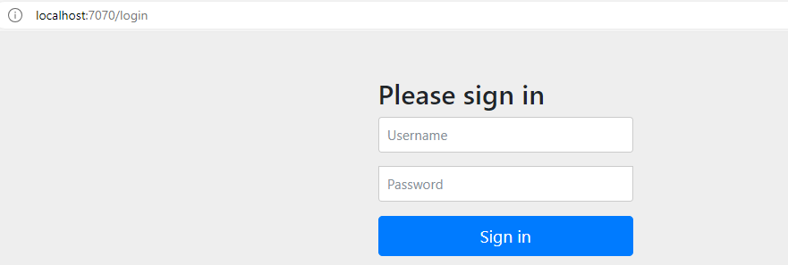

# 스프링 시큐리티
<br><br>
---

### 스프링 시큐리티 활성화하기
* application.yml에 의존성 추가
    ```
    implementation 'org.springframework.boot:spring-boot-starter-security'
    testImplementation 'org.springframework.secuity:spring-security-test'
    ```
* build.gradle에 의존성을 추가만 했을 때 제공되는 보안 구성
    * 모든 HTTP 요청 경로는 인증(authentication)되어야 한다.
    * 어떤 특정 역할이나 권한이 없다.
    * 로그인 페이지가 따로 없다.
    * 스프링 시큐리티의 HTTP 기본 인증을 사용해서 인증된다.
    * 사용자는 하나만 있으며, 이름은 'user'이다. 비밀번호는 암호화해준다.

* 스프링 시큐리티에서 제공하는 HTTP 기본 인증 대화상자
    
    * 기본 계정 : <code>user</code> / <code>콘솔창에 나온 비밀번호</code>
        * console
            ```
            Using generated security password: 4c8d9b06-b1df-41f7-b44c-73a6af835bc3
            ```
<br><br>
---

### 스프링 시큐리티 구성하기
* java : 17, gradle: 8.5, spring boot : 3.2.3 version, spring security : 아마 6.1 이상 => **Spring Security 6.1.0부터는 메서드 체이닝의 사용을 지양하고 람다식을 통해 함수형으로 설정하도록 지향한다.**
    > 출처 : https://velog.io/@woosim34/Spring-Security-6.1.0%EC%97%90%EC%84%9C-is-deprecated-and-marked-for-removal-%EC%98%A4%EB%A5%98
    * SecurityConfig 예시 코드
        ```java
        // SecurityConfig
        import org.springframework.boot.autoconfigure.security.servlet.PathRequest;
        import org.springframework.context.annotation.Bean;
        import org.springframework.context.annotation.Configuration;
        import org.springframework.security.config.annotation.web.builders.HttpSecurity;
        import org.springframework.security.config.annotation.web.configuration.EnableWebSecurity;
        import org.springframework.security.config.annotation.web.configuration.WebSecurityConfiguration;
        import org.springframework.security.web.SecurityFilterChain;

        @EnableWebSecurity
        @Configuration
        @RequiredArgsConstructor
        public class SecurityConfig {

            private final MyUserDetailsService myUserDetailsService;

            @Bean
            public SecurityFilterChain securityFilterChain(HttpSecurity http) throws Exception {
                http
                    .csrf((csrfConfig) -> csrfConfig.disable())
                    .headers((headerConfig) -> 
                        headerConfig.frameOptions(frameOptionsConfig -> frameOptionsConfig.disable())
                    )
                    .authorizeHttpRequests((authorizeRequests) ->
                        authorizeRequests
                            .requestMatchers(PathRequest.toH2Console()).permitAll()
                    )
                    .exceptionHandling((exceptionConfig) -> // 401 403 관련 예외처리
                        exceptionConfig
                            .authenticationEntryPoint(unauthorizedEntryPoint)
                            .accessDeniedHandler(accessDeniedHandler)
                    )
                    .formLogin((formLogin) ->
                        formLogin
                            .loginPage("/login")
                            .usernameParameter("username")
                            .passwordParameter("password")
                            .loginProcessingUrl("/login/login-proc")
                            .defaultSuccessUrl("/", true)
                    )
                    .logout(logoutConfig -> logoutConfig.logoutSuccessUrl("/"))
                    .userDetailsService(myUserDetailsService);
                    
                return http.build();
            }            

            // ==================================================================================================

            private final AuthenticationEntryPoint unauthorizedEntryPoint = (request, response, authException) -> {
                ErrorResponse fail = new ErrorResponse(HttpStatus.UNAUTHORIZED, "Spring security unauthorized...");
                response.setStatus(HttpStatus.UNAUTHORIZED.value());
                String json = new ObjectMapper().writeValueAsString(fail);
                response.setContentType(MediaType.APPLICATION_JSON_VALUE);
                PrintWriter writer = response.getWriter();
                writer.write(json);
                writer.flush();
            };

            private final AccessDeniedHandler accessDeniedHandler = (request, response, accessDeniedException) -> {
                ErrorResponse fail = new ErrorResponse(HttpStatus.FORBIDDEN, "Spring security forbidden...");
                response.setStatus(HttpStatus.FORBIDDEN.value());
                String json = new ObjectMapper().writeValueAsString(fail);
                response.setContentType(MediaType.APPLICATION_JSON_VALUE);
                PrintWriter writer = response.getWriter();
                writer.write(json);
                writer.flush();
            };

            @Bean
            PasswordEncoder passwordEncoder() {
                return new BCryptPasswordEncoder();
            }
            

            @Getter
            @RequiredArgsConstructor
            public class ErrorResponse {

                private final HttpStatus status;
                private final String message;
            }
        }
        ```
        ```java 
        // MyUserDetailsService.java
        @RequiredArgsConstructor
        @Service
        public class MyUserDetailsService implements UserDetailsService {

            private final MemberRepository memberRepository;

            @Override
            public UserDetails loadUserByUsername(String username) throws UsernameNotFoundException {
                Member member = memberRepository.findByUsername(username).orElseThrow(() -> new UsernameNotFoundException("없는 회원 입니다..."));

                return User.builder().username(member.getUsername()).password(member.getPassword()).roles(member.getRole().name()).build();
            }
        }
        ```

* 스프링 시큐리티에서 제공하는 여러 사용자 스토어 구성 방법
    * 인메모리(in-memory) 사용자 스토어
    * JDBC 기반 사용자 스토어
    * LDAP 기반 사용자 스토어
    * 커스텀 사용자 명세 서비스

* 커스텀 사용자에 대한 spring security
    * <code>User</code>
        ```java
        @Entity
        @Data
        @NoArgsConstructor(access=AccessLevel.PRIVATE, force=true)
        @RequiredArgsConstructor
        public class User implements UserDetails { // 스프링 시큐리티의 UserDetails 인터페이스를 구현한다. => 이를 구현한 User 클래스는 기본 사용자 정보를 프레임워크에 제공한다.
            private static final long serialVersionUID = 1L;
            
            @Id
            @GeneratedValue(strategy=GenerationType.AUTO)
            private Long id;
            
            private final String username;
            private final String password;
            private final String fullname;
            private final String street;
            private final String city;
            private final String state;
            private final String zip;
            private final String phoneNumber;
            
            @Override
            public Collection<? extends
                    GrantedAuthority> getAuthorities() { // 해당 사용자에게 부여된 권한을 저장한 컬렉션을 반환한다.
                return Arrays.asList(new
                        SimpleGrantedAuthority("ROLE_USER"));
            }
            
            @Override
            public boolean isAccountNonExpired() {
                return true;
            }
            
            @Override
            public boolean isAccountNonLocked() {
                return true;
            }
            
            @Override
            public boolean isCredentialsNonExpired() {
                return true;
            }
            
            @Override
            public boolean isEnabled() {
                return true;
            }
        }
        ```
    * <code>UserRepositoryUserDetailsService</code> : 사용자 명세 서비스 생성하기
        ```java
        // 사용자 명세 서비스 생성하기
        @Service
        public class UserRepositoryUserDetailsService
                implements UserDetailsService {
            private UserRepository userRepo;

            @Autowired
            public UserRepositoryUserDetailsService(UserRepository userRepo) {
                this.userRepo = userRepo;
            }

            /*
            * user를 찾는 메소드로 이 메소드에서는  절대 null을 반환하지 않는다는 간단한 규칙이 있다.
            * null일 경우 UsernameNotFoundException 발생
            */
            @Override
            public UserDetails loadUserByUsername(String username)
                    throws UsernameNotFoundException {
                User user = userRepo.findByUsername(username);
                if (user != null) {
                    return user;
                }
                throw new UsernameNotFoundException(
                        "User '" + username + "' not found");
            }
        }
        ```
    * <code>Sprgin security</code>
        ```java
        @EnableWebSecurity
        @Configuration
        @RequiredArgsConstructor
        public class SecurityConfig {
            private final UserRepositoryUserDetailsService myUserDetailsService;

            @Bean
            public SecurityFilterChain securityFilterChain(HttpSecurity http) throws Exception {
                http
                        .csrf((csrfConfig) -> csrfConfig.disable())
                        .headers(
                                (headerConfig) -> headerConfig.frameOptions(frameOptionsConfig -> frameOptionsConfig.disable()))
                        .authorizeHttpRequests((authorizeRequests) -> authorizeRequests
                                .requestMatchers(PathRequest.toH2Console()).permitAll())
                                .requestMatchers("/**").permitAll())
                        .formLogin((formLogin) -> formLogin
                                .loginPage("/login")
                                .usernameParameter("username")
                                .passwordParameter("password")
                                .loginProcessingUrl("/login/login-proc")
                                .defaultSuccessUrl("/", true))
                        .logout(logoutConfig -> logoutConfig.logoutSuccessUrl("/"))
                        .userDetailsService(myUserDetailsService);

                return http.build();
            }

            
            @Bean
            PasswordEncoder passwordEncoder() {
                return new BCryptPasswordEncoder();
            }

            // 이 configure은 spring security 6 version 전에 사용되던 메소드로 6 이상의 버전에서는 사용되지 않는다. 
            @Bean
            public void configure(AuthenticationManagerBuilder auth) throws Exception{
                auth
                .userDetailsService(myUserDetailsService)
                .passwordEncoder(passwordEncoder());  // passwordEncoder() 호출 후 반환값을 passwordEncoder()의 인자로 전달하는 것이 x => 실제로는 encoder()에 @Bean 애노테이션이 지정되었으므로, encoder()메서드가 생성한 BCryptPasswordEncoder 인스턴스가 스프링 애플리케이션 컨텍스트에 등록, 관리되며, 이 인스턴스가 애플리케이션 컨텍스트로부터 주입되어 반환된다. 이렇게 함으로써 우리가 원하는 종류의 PasswordENcoder 빈 객체를 스프링의 관리하에 사용할 수 있다.
                                                    // 클래스와 클래스 인스턴스 생성 및 주입의 전 과정을 스프링이 관리하는 @Component 애노테이션과는 의미가 다름.
            }

        }
        ```
    * <code>RegistrationController</code>
        ```java
        @Controller
        @RequestMapping("/register")
        public class RegistrationController {
            @PostMapping
            public String processRegistration(RegistrationForm form) {
                userRepo.save(form.toUser(passwordEncoder));
                return "redirect:/login";
            }
        }
        ```
    * <code>RegistrationForm</code>
        ```java
        @Data
        public class RegistrationForm {
            
            private String username;
            private String password;
            private String fullname;
            private String street;
            private String city;
            private String state;
            private String zip;
            private String phone;
            
            public User toUser(PasswordEncoder passwordEncoder) {
                return new User(
                        username, passwordEncoder.encode(password),
                        fullname, street, city, state, zip, phone);
            }
        }
        ```
    * <code>registration.html</code>
        ```html
        <!DOCTYPE html>
        <html xmlns="http://www.w3.org/1999/xhtml"
            xmlns:th="http://www.thymeleaf.org">
        <head>
            <meta charset="EUC-KR">
            <title>Taco Cloud</title>
        </head>
        
        <body>
            <h1>Register</h1>
            
            <form method="POST" th:action="@{/register}" id="registerForm">
                <label for="username">Username: </label> 
                <input type="text" name="username" /><br /> 
                
                <label for="password">Password: </label> 
                <input type="password" name="password" /><br /> 
                
                <label for="confirm">Confirm password: </label> 
                <input type="password" name="confirm" /><br /> 
                
                <label for="fullname">Full name: </label> 
                <input type="text" name="fullname" /><br />
                
                <label for="street">Street: </label> 
                <input type="text" name="street" /><br />
                
                <label for="city">City: </label> 
                <input type="text" name="city" /><br />
                
                <label for="state">State: </label> 
                <input type="text" name="state" /><br />
                
                <label for="zip">Zip: </label> 
                <input type="text" name="zip" /><br />
                
                <label for="phone">Phone: </label> 
                <input type="text" name="phone" /><br />
                
                <input type="submit" value="Register" />
            </form>
        </body>
        </html>
        ```
<br><br>
---

### 웹 요청 보안 처리하기
* HttpSecurity : 웹 수준에서 보안을 처리하는 방법을 구성함.
    ```java
    public class SecurityConfig {
        
        @Bean
        public SecurityFilterChain filterChain(HttpSecurity http) throws Exception {
            http
                // 1번
                .authorizeHttpRequests(authorizeRequest ->
                    authorizeRequest
                            .requestMatchers("/design","/orders").hasAnyRole("USER")
                            .requestMatchers("/","/**").permitAll()

                // 2번
                .formLogin((formLogin) -> formLogin
                        .loginPage("/login")
                        .loginProcessingUrl("/autentication")
                        .defaultSuccessUrl("/design", true)
                )

                // 3번
                .logout(logoutConfig -> logoutConfig.logoutSuccessUrl("/"))

                // 4번 : 실제 업무용 애플리케이션에서는 비활성화 하지 말기
                // rest api 서버로 실행되는 애플리케이션은 CSRF를 disable해야한다.
                .csrf(Customizer.withDefaults()) // .csrf(csrfConfig -> csrfConfig.disable())

            )
        }
    }
    ```
    1. HTTP 요청 처리를 허용하기 전에 충족되어야 할 특정 보안 조건을 구성함
        * SpEL(Spring Expression Language, 스프링 표현식 언어)를 사용하여 사용 가능
    2. 커스텀 로그인 페이지를 구성함.
    3. 사용자가 애플리케이션의 로그아웃을 할 수 있도록 함.
    4. CSRF 공격으로부터 보호하도록 구성함.
        * CSRF(Cross-Site Request Forgery - 크로스 사이트 요청 위조) : 사용자가 웹사이트에 로그인한 상태에서 악의적인 코드(사이트 간의 요청을 위조하여 공격하는)가 삽입된 페이지를 열면 <u>공격 대상이 되는 사이트에 자동으로 (+은밀하게) 폼이 제출</u>되고 이 사이트는 위조된 공격 명령이 믿을 수 있는 사용자로부터 제출된 것으로 판단하게 되어 공격헤 노출되는 것
            * ex) 자동으로 해당 사용자의 거래 은행 웹사이트 URL(송금을 위한)로 다른 폼을 제출하는 공격자 웹사이트의 폼을 사용자가 볼 수 있다. => 이 경우 사용자는 자신의 계좌에서 돈이 인출되었는지 실제 확인하지 않는 한 공격이 이루어졌다는 것을 모를 수 있다.
        * 이런 공격을 막기 위해 form의 hidden 필드로 CSRF 토큰을 생성할 수 있다. => 이 토큰으로 해당 form이 제출될 때 원래 생성되었던 form과 비교하며, 토큰이 일치하면 해당 요청을 처리가 허용된다.
        * <code><input type="hidden" name="_csrf" th:value="${_csrf.token}"/></code>
<br><br>
---

### 사용자 인지하기
* 사용자가 누구인지 결정하는 방법
    * Principal 객체를 컨트롤러 메서드에 주입
        ```java
        @GetMapping
        public String showDesignForm(Model model, Principal principal) {
            String username = principal.getName();
            User user = userRepo.findByUsername(username);
            ...
        }
        ```
    * Authentication 객체를 컨트롤러 메서드에 주입
    * SecurityContextHolder를 사용해서 보안 컨텍스트 얻기
        ```java
        Authentication authentication = SecurityContextHolder.getContext().getAuthentication();
        User user = (User) authentication.getPricipal();
        ```
        * 장점 : 컨틀롤러 처리 메서드는 물론이고, 애플리케이션의 어디서든 사용할 수 있다.
    * @AuthenticationPriciple 애노테이션을 메서드에 지정
        ```java
        @PostMapping
        public String processOrder(@Valid Order order, Errors errors, @AuthenticationPrincipal User user){
            if(errors.hasErrors()){
                return "orderForm";    
            }

            order.setUser(user);

            log.info("Order submitted: "+ order);
            return "redirect:/";
        }
        ```
        * 장점 : 타입 변환이 필요없고 Authentication과 동일하게 보안 특정 코드만 갖는다.
        
* 각 폼에 로그아웃 버튼 추가하고 사용자 정보 보여주기

## 요약
* 스프링 시큐리티의 자동-구성은 보안의 시작에 있어 좋은 방법이다.
    * 하지만 대부분의 애플리케이션에서는 보안 요구사항을 충족하기 위해 별도의 보안 구성이 필요함.
* 사용자 정보는 여러 종류의 사용자 스토어에 저장되고 관리될 수 있다.
    * ex ) 관계형 DB, LCAP
* 스프링 시큐리티는 자동으로 CSRF 공격을 방어한다.
* 인증된 사용자에 관한 정보는 SecurityContext 객체를 통해 얻거나, @AuthenticationPricipal을 사용해서 컨트롤러에 주입할 수 있다.
* spring 3 + spring security 6.x + jpa 사용
    