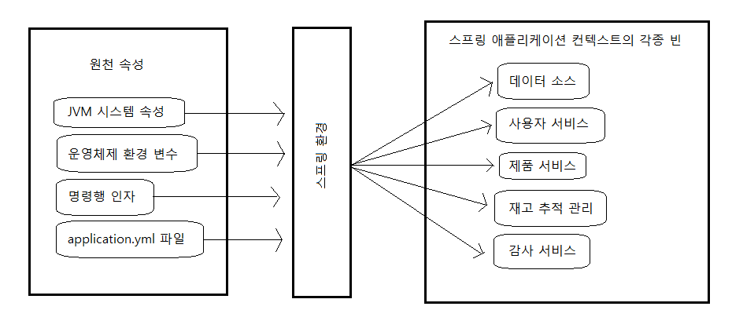

# 구성 속성 사용하기
* 스프링 부트의 자동-구성(autoconfiguration) : 스프링 애플리케이션 개발을 단순화 해준다.
* 스프링 부트의 구성 속성
    * 스프링 애플리케이션 컨텍스트에서의 구성 속성 = 빈의 속성
    * JVM 시스템 속성, 명령행 인자, 환경 변수 등의 여러 원천 속성 중에서 설정 가능
<br><br>
---

### 자동-구성 세부 조정하기
* 스프링의 구성
    *  빈 연결(Bean wiring) : 스프링 애플리케이션 컨텍스트에서 빈으로 생성되는 애플리케이션 컴포넌트 및 상호 간에 주입되는 방법을 선언하는 구성
    * 속성 주입(Property injection) : 스프링 애플리케이션 컨텍스트에서 빈의 속성 값을 설정하는 구성

* 스프링 환경 추상화 이해
    * 스프링 환경 추상화 : 구성 가능한 모든 속성을 한 곳에서 관리하는 개념 = 속성의 근원을 추상화하여 각 속성을 필요로 하는 빈이 스프링 자체에서 해당 속성을 사용할 수 있게 해줌.
        * 원천 속성 : JVM 시스템 속성, 명령행 인자, OS의 환경 변수, 애플리케이션의 속성 구성 파일
        * 원천 속성을 한데 모아 각 스프링 빈에 전달되는 방법
            
    * 스프링 부트에 의해 자동으로 구성되는 빈들은 스프링 환경으로부터 가져온 속성들을 사용해서 구성될 수 있다. 
        * ex 1) application.yml - <code>server.port=9000</code>
        * ex 2) 애플리케이션의 시작 시 명령행 인자 - <code>java -jar aa-SNAPSHOT.jar --server.port=9000</code>
        * ex 3) 운영체제 환경 변수 - <code>export SERVER_PORT=9000</code>

* 데이터 소스 구성하기
    ```
    spring:
        datasource:
            url: jdbc:mysql://localhost/database
            username: name
            password: password
            driver-class-name: com.mysql.cj.jdbc.Driver # url을 보고 스프링부트가 찾을 수 있지만 따로 속성을 설정하는 방법
    ```
    * 이 datasource 빈을 자동-구성할 때 스프링 부트가 이런 속성 설정을 연결 데이터로 사용한다.
    * 또한, 톰캣의 JDBC 커넥션 풀을 classpath에서 자동으로 찾을 수 있다면 DataSource 빈이 그것을 사용함. 하지만 그렇지 않다면 <code>HikariCP</code>, <code>Commons DBCP2</code> 중 하나의 다른 커넥션 풀을 classpath에서 찾아 사용함.
    * 명시적인 소스 구성 대신 JNDI(Java Naming and Directory Interface)로 구성하기
        ```
        spring:
            datasource:
            jndi-name: java:comp/env/jdbc/database
        ```
        * 단, 이 속성을 설정 시 기존의 설정된 다른 데이터 소스 구성 속성은 무시된다.

* 내장 서버 구성하기
    * <code>server.port=0</code> 시 사용 가능한 포트를 무작위로 선택해 시작됨 <br>
    => 자동화된 통한 테스트를 실행할 때 유용함. <br>
    => 마이크로 서비스와 같이 애플리케이션이 시작되는 포트가 중요하지 않을 떄도 유용함.
    * HTTPS 요청 처리를 위한 컨테이너 관련 설정
        1. keytool 명령행 유틸리티를 통해 키스토어(keystore) 생성 : <code>$ keytool -keystore mykeys.jks -genkey -alias tomcat -keyalg RSA</code><br>
        => 이게 실행되면 저장 위치 등의 여러 정보를 입력받는데 무엇보다 우리가 입력한 비밀번호를 잘 기억해두어야 함.
        2. 키스토어 생성이 끝나고, 내장 서버의 HTTPS를 활성화하기 위해 application.yml 파일에 설정
            ```yml
            server:
                port: 8443
                ssl:
                    key-store: file://path/to/mykeys.jks # 키스토어 파일이 생성된 경로
                    # key-store: classpath://path/to/mykeys.jks
                    key-store-password: letmein # 키스토어를 생성할 떄 지정했던 비밀번호
                    key-passowrd: letmein # 키스토어를 생성할 떄 지정했던 비밀번호
            ```

* 로깅 구성하기
    * 기본적으로 스프링 부트는 INFO 레벨로 콘솔에 로그 메세지를 쓰기 위해 Logback을 통해 로깅을 구성함
    * 로깅 구성을 제어할 떄는 classpath의 루트(src/main/resources)에 logback.xml 파일을 생성할 수 있다. 
        ```xml
       <configuration>
            <appender name="STDOUT" class="ch.qos.logback.core.ConsoleAppender">
                <encoder>
                    <pattern>
                        %d{HH:mm:ss.SSS} [%thread] %-5level %logger{36} – %msg%n
                    </pattern>
                </encoder>
            </appender>
            <logger name="root" level="INFO"/>
            <root level="INFO">
                <appender-ref ref="STDOUT"/>
            </root>
        </configuration>
        ```
    * 로깅 수준과 로그를 수록할 파일 설정하기 => application.yml(스프링 부트의 구성 속성) 사용 시 logback.xml 파일을 생성하지 않고 변경 가능
        ```yml
        # 예제 1 : 로깅 수준
        logging:
            level:
                root: WARN
                org:
                    springframework:
                        security: DEBUG

        # 예제 2 : 로깅 수준
        logging:
            level:
                root: WARN
                org.springframework.security: DEBUG

        # 예제 3 : 로그를 수록할 파일 설정 => 해당 path에 대한 쓰기 퍼미션이 있어야한다.
        loggin:
            path: /var/logs/
            file: logText.log # 기본적인 로그 파일의 크기인 10MB가 가득 차게 되면 새로운 로그 파일이 생성되어 로그 항목이 계속 수록된다.(스프링 2.0부터는 날짜별로 로그 파일이 안ㅁ고, 지정일이 지난 로그 파일은 삭제됨) 
            level: 
                root: WARN
                org:
                    springframework:
                        security: DEBUG
        ```

* 다른 속성의 값 가져오기
    ```yml
    greeting:
        welcome: You are using ${spring.application.name}
    ```
<br><br>
---

### 우리의 구성 속성 생성하기
* 구성 속성 = 빈의 속성
* 구성 속성의 올바른 주입 : <code>@ConfigurationProperties</code>
    ```java
    @Component
    @ConfigurationProperties(prefix="taco.orders")
    @Data
    @Validated
    public class OrderProps {
        
        @Min(value=5, message="must be between 5 and 25")
        @Max(value=25, message="must be between 5 and 25")
        private int pageSize = 20;
    }
    ```
    ```yml
    taco:
        orders:
            pageSize: 10
    ```
<br><br>
---

### 프로파일 사용해서 구성하기
* 애플리케이션이 서로 다른 런타임 환경에 배포, 설치될 때는 구성 명세가 다르다 => **스프링 프로파일 사용**
    > 프로파일 : 런타임 시에 활성화되는 프로파일에 따라 서로 다른 빈, 구성 클래스, 구성 속성들이 적용 또는 무시되도록 하는 것
* 특정 프로파일 활성화하기
    1. application-{프로파일 이름}.yml 형식으로 생성
        * <code>application-prod.yml, application-dev.yml</code>
        * 하나의 파일로 분리하기(application.yml)
            ```yml
            logging:
                level:
                    tacos: DEBUG 

            ---  # 이 ---를 기준으로 위로는 모든 프로파일에 적용되는 공통 속성이며, 아래로는 해당 application-prod 만 적용된다.

            spring:
                profiles: prod # 또는 dev
            ``` 
    2. 프로파일 활성화 하기 : application.yml
        ```yml
        spring:
            profiles:
                active: 
                - prod
                - audit
                - ha
        ```
        또는
        <code>java -jar aaa-SNAPSHOT.jar --spring.profiles.active=prod,audit,ha</code>
    > 만약 스프링 애플리케이션을 클라우드 파운드리에 배포할 때는 cloud라는 이름의 프로파일이 자동으로 활성화한다.

* 프로파일을 사용해서 조건별로 빈 생성하기 
    * <code>@Profile</code> 사용
    ```java
    /**
     * @Profile("dev") : 특정 환경에서만 데이터 로드하기
     * 
     * @Profile({"dev", "qa"}) : dev 프로파일이나 qa 프로파일 중 하나가 활성화 될 때 데이터가 로드되어야 할 때
     * 
     * @Profile("!prod") : prod 프로파일이 활성화되지 않을 경우 데이터가 로드되어야 함
     * 
     * @Profile({"!prod","!qa"}) : prod 프로파일과 qa 프로파일이 모두 활성화되지 않을 경우 데이터가 로드되어야 함
    */
    @Bean
    @Profile("dev")
    public CommandLineRunner dataLoader(IngredientRepository repo, UserRepository userRepo, PasswordEncoder encoder){
        ...
    }
    ```

## 요약
* 스프링 빈에 @ConfigurationProperties를 지정하면 여러 가지 원천 속성으로부터 구성 속성 값의 주입을 활성화 할 수 있다.
* 구성 속성 설정 방법 : 명령행 인자, 환경 변수, JVM 시스템 속성, 속성 파일, YAML 파일, 커스텀 속성 등
* 데이터 소스 URL과 로깅 수준의 지정을 포함해서 구성 속성은 스프링의 자동-구성 설정을 변경하는데 사용할 수 있다.
* 스프링 프로파일은 활성화된 프로파일을 기반으로 구성 속성을 설정하기 위해 사용할 수 있다.