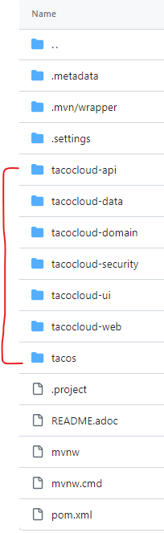

# Rest 서비스 생성하기
* 스프링 MVC : MPA(Multi-Page Application, 다중-페이지 애플리케이션)
* Rest 서비스 - SPA : 프레젠테이션 계층이 백엔드 처리와 거의 독립적
<br><br>
---

### RestController 작성하기
* 스프링 MVC의 HTTP 요청-처리 애노테이션
    * <code>@GetMapping</code> : 리소스 데이터 읽기
    * <code>@PostMapping</code> : 리소스 생성하기
    * <code>@PutMapping</code> : 리소스 변경하기
        * 데이터의 전체를 변경
        * 클라이언트로부터 서버로 데이터를 전송
    * <code>@PatchMapping</code> : 리소스 변경하기
        * 데이터의 일부분 변경 => 하나한 <code>if(객체 != null)</code> 체크 진행 
    * <code>@DeleteMapping</code> : 리소스 삭제하기
        * <code>@ResponseStatus(code=HttpStatus.NO_CONTENT)</code> 설정 가능
    * <code>@RequestMapping</code> : 다목적 요청 처리
* @RestController : @Controller + @ResponseBody : 모든 HTTP 요청 처리 메소드에서 HTTP 응답 몸체에 반환값자체가 return 된다.
    ```java
    return new ResponseEntity<>(객체, HttpStatus.OK);
    return new ResponseEntity<>(null, HttpStatus.NOT_FOUND);
    ```

* produces 설정 : 내가 보내야 하는 타입이 정해져 있다면 정의하기
    * 반환하는 데이터 타입을 정의할 때
    ```java
    @GetMapping(path = "/pets/{petId}", produces = MediaType.APPLICATION_JSON_VALUE) 
    @ResponseBody
    public Pet getPet(@PathVariable String petId) {
        // ...
    }

    // 요청하는 입장에서 특정 타입의 데이터를 원한다면 아래의 내용을 헤더에 추가
    Accept:application/json
    ```
* consumes 속성 : contentType이 해당 값과 일치하는 요청만 처리
    * **들어오는 데이터 타입**을 정의할 때
    ```java
    @PostMapping(comsumes="application/json") // json타입을 받고 싶을때
    public void addPet(@RequestBody Pet pet) {
        ...
    }

    // 해당 uri를 호출하는 쪽에서는 헤더에 보내는 데이터가 json이라는 것을 명시해야 한다.
    Content-Type:application/json
    ```
* consumes VS produces :
    * consumes는 클라이언트가 서버에게 보내는 데이터 타입을 명시한다.
    * produces는 서버가 클라이언트에게 반환하는 데이터 타입을 명시한다.
* CORS 설정 : 다른 도메인의 클라이언트에서 해당 REST API를 사용할 수 있게 해주는 애노테이션
    * <code>@CrossOrigin</code>

* 개발 시 API 테스트 방법
    * curl 사용 : 터미널에서 <code>curl localhost:8080/design/recent</code>
    * HTTPie 사용 : <code>$ http :8080/design/recent</code>
<br><br>
---

### 하이퍼미디어 사용하기
* HATEOAS(Hypermedia As The Engine Of Application State)
    * Rest API를 구현하는 방법으로, API로부터 반환되는 **리소스에 해당 리소스와 관련된 하이퍼링크들**이 포함됨.<br /> 
    => 즉, 클라이언트가 최소한의 API URL만 알면 반환되는 리소스와 관련하여 처리 가능한 다른 API URL(상태 전이)들을 알아내어 사용할 수 있다. (ex) 게시글 조회 후 할 수 있는 다른 행동들의 API(댓글 달기, 다음 게시글 조회 등등)) => 이는 Hypermedia(링크)를 통해 넣는다.
    * 형태 : HAL JSON 형태 (Hypertext Application Language) - JSON, XML 코드 내의 외부 리소스에 대한 링크를 추가하기 위한 특별한 데이터 타입
        * 타입 종류 : <code>application/hal+json</code>, <code>application/hal+xml</code>
        ```json
        {
            "_embedded" : {
                "tacoResourceList" : [
                    {
                        "name": "Veg-Out",
                        "createdAt": "2024-04-22T08:35:00.000+0000",
                        "ingredients": [ // 각 요소는 _links를 포함 -> 이것이 관련 self 링크
                            {
                                "name": "Flour Tortilla", "type": "WRAP",
                                "_links": {
                                    "self": { "href": "http://localhost:8080/ingredients/FLTO" }
                                }
                            },
                            {
                                "name": "Corn Tortilla", "type": "WRAP",
                                "_links": {
                                    "self": { "href": "http://localhost:8080/ingredients/COTO" }
                                }
                            }
                        ]
                    }
                ]
            },
            "_links": {
                "recents": { "href": "http://localhost:8080/design/recent" }
            }
        }
        ```
        ```json
        {
            "data": { // HAL JSON의 리소스 필드
                "id": 1000,
                "name": "게시글 1",
                "content": "HAL JSON을 이용한 예시 JSON"
            },
            "_links": { // HAL JSON의 링크 필드 : 관련 API를 수행할 수 있는 하이퍼링크 포함
                "self": {
                "href": "http://localhost:8080/api/article/1000" // 현재 api 주소
                },
                "profile": {
                "href": "http://localhost:8080/docs#query-article" // 해당 api의 문서
                },
                "next": {
                "href": "http://localhost:8080/api/article/1001" // article 의 다음 api 주소
                },
                "prev": {
                "href": "http://localhost:8080/api/article/999" // article의 이전 api 주소
                }
            }
            }
        ```
    * 장점 
        * API 버전을 명세하지 않아도 된다.
        * 링크 정보를 동적으로 바꿀 수 있다.
        * 링크를 통해서 상태 전이가 쉽게 가능하다. 
    * 출처 : https://wonit.tistory.com/454

* HATEOAS 적용하기
    1. 의존성 추가 : <code>implementation 'org.springframework.boot:spring-boot-starter-hateoas'</code>
    2. 하이퍼링크 추가 : return 값에 List<T>형태가 아닌 Resources 객체를 반환해야 한다.
        * 방법1 : 하드코딩
        ```java
        @GetMapping("/recent")
        public Resources<Resource<Taco>> recentTacos(){
            PageRequest page = PageRequest.of(0, 12, Sort.by("createdAt").descending());

            List<Taco> tacos = tacoRepo.findAll(page).getContent();
            Resource<Resource<Taco>> recentResources = Resources.wrap(tacos);

            recentResources.add(new Link("http://localhost:8080/design/recnet", "recents"));
            return recentResources;
        }
        ```
        * 방법 2 : controllerLinkBuilder라는 스프링 HATEOAS 링크 빌더 사용
        ```java
        Resource<Resource<Taco>> recentResources = Resources.wrap(tacos);
        recentResources.add(
            ControllerLinkBuilder.linkTo(DesignTacoController.class) // 컨트롤러 명시
                                .slash("recent") // 슬래시와 인자로 전달된 값을 URL에 추가한다. => /design/recent
                                .withRel("recents") // 해당 Link의 관계 이름
        );

        // 방법 2-2
        Resource<Resource<Taco>> recentResources = Resources.wrap(tacos);
        recentResources.add(
            linkTo(methodOn(DesignTacoController.class).recentTacos()) // 컨트롤러 이름 + 메소드 이름
                .withRel("recents") // 해당 Link의 관계 이름
        );
        ```
        => 해당 부분 추가 시 결과 : 
            ```JSON
            "_links": {
                "recents": { "href": "http://localhost:8080/design/recent" }
            }
            ```<br /><br />   

* 리소스 어셈블러 생성하기 : 리스트에 포함된 각 data에 대한 링크 추가
    1. 도메인 데이터와 하이퍼링크 리스트를 갖도록 하는 DTO 생성
        ```java
        @Relation(value="taco", collectionRelation="tacos")
        public class TacoResource extends ResourceSupport {

        private static final IngredientResourceAssembler 
                    ingredientAssembler = new IngredientResourceAssembler();
        
        @Getter
        private final String name;

        @Getter
        private final Date createdAt;

        @Getter
        private final List<IngredientResource> ingredients;
        
        public TacoResource(Taco taco) {
            this.name = taco.getName();
            this.createdAt = taco.getCreatedAt();
            this.ingredients = 
                ingredientAssembler.toResources(taco.getIngredients());
        }
        
        }
        ```
    2. Taco 객체를 TacoResource 객체들로 변환하는데 도움을 주기 위한 리소스 어셈블러 클래스 생성
        ```java
        import org.springframework.hateoas.mvc.ResourceAssemblerSupport;

        import tacos.Taco;

        public class TacoResourceAssembler
            extends ResourceAssemblerSupport<Taco, TacoResource> {

            public TacoResourceAssembler() { // DesignTacoController 사용
                super(DesignTacoController.class, TacoResource.class);
            }
            
            @Override
            protected TacoResource instantiateResource(Taco taco) { // 인자로 전달된 객체로 TacoResource 인스턴스를 생성하도록 오버라이드 됨 => Resource 인스턴스만 생성
                return new TacoResource(taco);
            }

            @Override
            public TacoResource toResource(Taco taco) { // 반드시 오버라이드 해야하는 것으로, 넘어오는 Taco 객체로 TacoResource 인스턴스를 생성하면서 Taco.id 값으로 생성되는 self 링크가 URL에 자동 지정된다. => Resource 인스턴스를 생성하면서 링크도 추가함.
                return createResourceWithId(taco.getId(), taco);
            }

        }
        ``` 
    3. TacoResourceAssembler를 사용하는 recentTacos() 적용
        ```java
        @GetMapping(path="/tacos/recent", produces="application/hal+json")
        public ResponseEntity<Resources<TacoResource>> recentTacos() {
            PageRequest page = PageRequest.of(
                                0, 12, Sort.by("createdAt").descending());
            List<Taco> tacos = tacoRepo.findAll(page).getContent();

            List<TacoResource> tacoResources = 
                new TacoResourceAssembler().toResources(tacos);
            Resources<TacoResource> recentResources = 
                    new Resources<TacoResource>(tacoResources);
            
            recentResources.add(
                linkTo(methodOn(RecentTacosController.class).recentTacos())
                    .withRel("recents"));
            return new ResponseEntity<>(recentResources, HttpStatus.OK);
        }
        ```
        => 조회한 타코 리스트를 TacoResourceAssembler의 toResources에 전달하여 <code>Resources&lt;TacoResource&gt;</code>로 전환
        
* embedded 관계 이름 짓기
    ```json
    {
        "_embedded": {
            "tacoResourceList": [ ... ] // Resources 객체가 List<TacoResource>로부터 생성되었다는 것을 나타냄. 만약 TacoResource 클래스의 이름을 다른 것으로 변경한다면 이 필드의 이름도 그에 따라 바뀜으로 인해 변경 전으로 이름을 사용하는 클라이언트 코드가 제대로 실행되지 않을 것이다. 
        }
    }
    ```
    * <code>@Relation</code>을 사용하면 리소스 타입 클래스 이름과 JSON 필드 이름 간의 결합도를 낮출 수 있다.<br />
    => 즉, 스프링 HATEOAS가 결과 JSON의 필드 이름을 짓는 방법을 지정할 수 있다.
        ```java
        @Relation(value="taco", collectionRelation="tacos") // tacos로 지정
        public class TacoResource extends ResourceSupport {
            ...
        }
        ```
        ```json
        // 결과
        {
            "_embedded": {
                "tacos": [ ... ]
            }
        }
        ```
<br><br>
---

### 데이터 기반 서비스 활성화하기
* 스프링 데이터 REST : 의존성만 지정해도 스프링 데이터를 사용중인 프로젝트에서 REST API를 노출시킬 수 있다. => 엔드포인트를 자동으로 제공함
    * 의존성 : <code>implemetation 'org.springframework.boot:spring-boot-starter-data-rest'</code>
    * @RestController 애노테이션이 지정된 모든 클래스들을 이 시점에서 제거하고, 스프링 데이터 REST가 자동 생성한 API의 기본 경로는 <code>spring.data.rest.base-path= /api</code> 속성에 설정한다.
    * 엔드포인트 자동 생성 시 이름 : 해당 엔드포인트와 관련된 엔티티 클래스 이름의 복수형을 사용
        * ex) Ingredient -> /ingredients, Order -> /orders, User -> /users
        * <code>@RestResource</code> : 관계 이름과 경로를 우리가 원하는 것으로 변경할 수 있다.
            ```java
            @Data
            @Entity
            @RestResource(rel="tacos", path="tacos") // 관계이름, api 경로
            public class Taco {
                ...
            }
            ```
    * 페이징과 정렬 기능을 제공(page, size, sort)하며, HATEOAS는 (first,last,next,previous) 페이지의 링크를 요청 응답에 제공한다.
        * <code>$ curl "localhost:8080/api/tacos?sort=createAt,desc&page=0&size=12"</code>


* 커스텀 엔드포인트 추가하는 방법 : @RestContoller 애노테이션이 지정된 빈을 구현하기
    * 고려할 점
        1. 스프링 데이터 REST의 기본 경로로 매핑되지 않는다.
            * 해결방법 : <code>@RepositoryRestController</code> 사용
                ```java
                import org.springframework.data.rest.webmvc.RepositoryRestController;

                /**
                 * * path 맨 앞에 스프링 데이터 REST의 기본 경로가 추가된다.
                 * * @RestController와 달리 return값을 요청 응답의 body에 자동으로 수록하지 않는다. => 즉, 해당 메서드에 @ResponseBody를 지정하거나 해당 메서드에서 응답 데이터를 포함하는 ResponseEntity를 반환해야 한다.
                */
                @RepositoryRestController
                public class RecentTacosController {

                    private TacoRepository tacoRepo;

                    public RecentTacosController(TacoRepository tacoRepo) {
                        this.tacoRepo = tacoRepo;
                    }

                    @GetMapping(path="/tacos/recent", produces="application/hal+json")
                    public ResponseEntity<Resources<TacoResource>> recentTacos() {
                        PageRequest page = PageRequest.of(
                                            0, 12, Sort.by("createdAt").descending());
                        List<Taco> tacos = tacoRepo.findAll(page).getContent();

                        List<TacoResource> tacoResources = 
                            new TacoResourceAssembler().toResources(tacos);
                        Resources<TacoResource> recentResources = 
                                new Resources<TacoResource>(tacoResources);
                        
                        recentResources.add(
                            linkTo(methodOn(RecentTacosController.class).recentTacos())
                                .withRel("recents"));
                        return new ResponseEntity<>(recentResources, HttpStatus.OK);
                    }

                }
                ```
        2. 직접 정의한 엔드포인트는 스프링 데이터 REST 엔드포인트에서 반환되는 리소스의 하이퍼링크에 자동으로 포함되지 않는다.
            * 해결 방법 : 리소스 프로세서 빈을 선언하면 커스텀 엔드포인트를 스프링 데이터 REST가 자동으로 포함시키는 링크 리스트에 해당 링크를 추가할 수 있다.
            * 스프링 데이터 HATEOAS의 <code>ResourceProcessor</code> : API를 통해 리소스가 반환되기 전에 리소스를 조작하는 인터페이스
            ```java
            @Configuration
            public class SpringDataRestConfiguration {

                /**
                 * 익명 내부 클래스로 정의되었고, 스프링 애플리케이션 컨텍스트에 생성되는 빈으로 선언됨. => 따라서 스프링 HATEOAS가 자동으로 이 빈을 찾은 후 해당되는 리소스에 적용함.
                 * 이 경우 컨트롤러에서 PagedResources<Resource<Taco>>가 반환된다면 가장 최근에 생성된 타코들의 링크를 받게 되며, /api/tacos 요청 응답에도 해당 링크들이 포함된다.
                 * 
                */
                @Bean
                public ResourceProcessor<PagedResources<Resource<Taco>>>
                    tacoProcessor(EntityLinks links) {

                    return new ResourceProcessor<PagedResources<Resource<Taco>>>() {
                        @Override
                        public PagedResources<Resource<Taco>> process(
                                            PagedResources<Resource<Taco>> resource) {
                            resource.add(
                                links.linkFor(Taco.class)
                                    .slash("recent")
                                    .withRel("recents"));
                            return resource;
                        }
                    };
                }
            
            }
            ```

> 여러개의 모듈이 하나의 메이븐 프로젝트로 되어있을 때<br>
> * 폴더 구조 <br>
    
>   * tacocloud-api : REST API 처리 클래스와 인터페이스
>   * tacocloud-data : 데이터 저장을 위한 리퍼지토리 인터페이스
>   * tacocloud-domain : 도메인 클래스
>   * tacocloud-security : 보안 관련 클래스
>   * tacocloud-ui : ui 컴포넌트와 모듈
>   * tacocloud-web : 웹 처리 관련 클래스와 인터페이스
>   * tacos : 타코 애플리케이션의 스프링 부트 메인 클래스와 구성 클래스
> * pom.xml 
>   ```xml
>   <?xml version="1.0" encoding="UTF-8"?>
>    <project xmlns="http://maven.apache.org/POM/4.0.0" xmlns:xsi="http://www.w3.org/2001/XMLSchema-instance"
>        xsi:schemaLocation="http://maven.apache.org/POM/4.0.0 http://maven.apache.org/xsd/maven-4.0.0.xsd">
>        <modelVersion>4.0.0</modelVersion>
>
>        <groupId>sia</groupId>
>        <artifactId>taco-cloud-parent</artifactId>
>        <version>0.0.6-SNAPSHOT</version>
>        <packaging>pom</packaging>
>
>        <parent>
>            <groupId>org.springframework.boot</groupId>
>            <artifactId>spring-boot-starter-parent</artifactId>
>            <version>2.0.4.RELEASE</version>
>            <relativePath/>
>        </parent>
>
>        <properties>
>        <maven.compiler.source>1.8</maven.compiler.source>
>        <maven.compiler.target>1.8</maven.compiler.target>
>        <tacocloud.version>${project.version}</tacocloud.version>
>        </properties>
>
>        <modules>
>        <module>tacos</module>
>        <module>tacocloud-api</module>
>        <module>tacocloud-data</module>
>        <module>tacocloud-domain</module>
>        <module>tacocloud-security</module>
>        <module>tacocloud-web</module>
>        <module>tacocloud-ui</module>
>        </modules>
>
>    </project>
>    ```
> * 모듈의 pom.xml
>   ```xml
>   <?xml version="1.0" encoding="UTF-8"?>
>   <project xmlns="http://maven.apache.org/POM/4.0.0" xmlns:xsi="http://www.w3.org/2001/XMLSchema-instance"
>   	xsi:schemaLocation="http://maven.apache.org/POM/4.0.0
>          http://maven.apache.org/xsd/maven-4.0.0.xsd">
>   	<modelVersion>4.0.0</modelVersion>
>
>   	<artifactId>tacocloud-api</artifactId>
>   	<packaging>jar</packaging>
>   
>   	<name>tacocloud-api</name>
>   	<description>Taco Cloud API</description>
>   
>   	<parent>
>   		<groupId>sia</groupId>
>     	<artifactId>taco-cloud-parent</artifactId>
>   		<version>0.0.6-SNAPSHOT</version>
>   	</parent>
>   
>   	<properties>
>   		<project.build.sourceEncoding>UTF-8</project.build.sourceEncoding>
>   		<project.reporting.outputEncoding>UTF-8</project.reporting.outputEncoding>
>   		<java.version>1.8</java.version>
>   	</properties>
>   
>   	<dependencies>
>   		<!-- TacoCloud dependencies -->
>   		<dependency>
>   			<groupId>sia</groupId>
>   			<artifactId>tacocloud-data</artifactId>
>   			<version>${tacocloud.version}</version>
>   		</dependency>
>   		<dependency>
>   			<groupId>sia</groupId>
>   			<artifactId>tacocloud-domain</artifactId>
>   			<version>${tacocloud.version}</version>
>   		</dependency>
>   		<dependency>
>   			<groupId>sia</groupId>
>   			<artifactId>tacocloud-security</artifactId>
>   			<version>${tacocloud.version}</version>
>   		</dependency>
>       ....
>   
>   	</dependencies>
>   
>   </project>
>   ```
> * 프로젝트 전체 모듈을 하나의 애플리케이션으로 빌드하는 방법 : <code>$ ./mvnw clean package</code>

## 요약
* REST 엔드포인트는 스프링 MVC, 브라우저 지향의 컨트롤러와 동일한 프로그래밍 모델을 따르는 컨트롤러로 생성할 수 있다.
* @ResponseBody 를 지정할 수 있으며, ResponseEntity 객체를 반환할 수 있다.
* 스프링 HATEOAS는 스프링 MVC에서 반환되는 리소스의 하이퍼링크를 추가할 수 있다.
* 스프링 데이터 repository는 스프링 데이터 REST를 사용하는 REST API로 자동 노출될 수 있다.