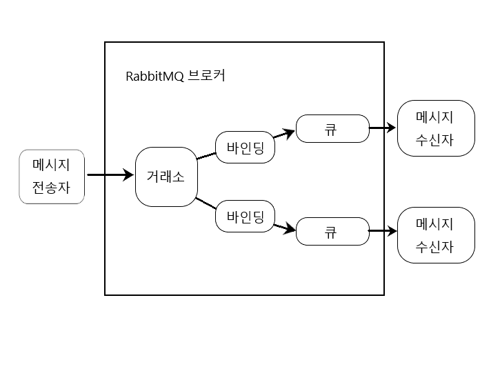
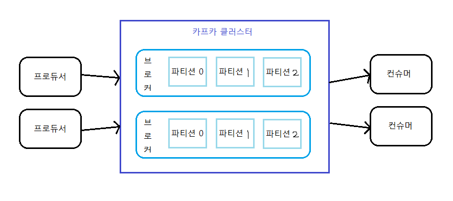

#  비동기 메시지 전송하기
* REST : 동기화 통신
* 비동기 메시징 : 애플리케이션 간에 응답을 기다리지 않고 간접적으로 메시지를 전송하는 방법
    * => 통신하는 애플리케이션 간의 결합도를 낮추고 확장성을 높여준다.
* 스프링이 제공하는 비동기 메시징
    * JMS(Java Message Service)
    * RabbitMQ
    * AMQP(Advanced Message Queueing Protocol)
    * 아파치 카프카(Apache Kafka)
    * 기본적인 메시지 전송과 수신 + 스프링의 메시지 기반 POJO(Plain Old Java Object) 지원 : EJB의 MDB(message-driven bean)와 유사하게 메시지를 수신하는 방법임.

<br><br>
---

### JMS로 메시지 전송하기
* JMS : 2개 이상의 클라이언트 간에 메시지 통신을 위한 공통 API를 정의하는 자바 표준. => 자바로 비동기 메시징을 처리하는 가장 좋은 방법으로 오랫동안 사용중.
    * 스프링은 JmsTemplate이라는 템플릿 기반의 클래스를 통해 JMS를 지원함. + 메시지 기반의 POJO도 지원함.
        * JmsTemplate를 사용하면 프로듀서(producer)가 큐와 토픽에 메시지를 전송하고 컨슈머(comsumer)는 그 메시지들을 받을 수 있다.
        * POJO : 큐나 토픽에 도착하는 메시지에 반응하여 비동기 방식으로 메시지를 수신하는 간단한 자바 객체
    * JMS 지원 = JmsTemplate + POJO
        * 메시지를 전송하고 수신할 수 있으려면 프로듀서와 컨슈머 간에 메시지를 전달해주는 메시지 브로커가 있어야 함.

##### 1. JMS 설정하기
* 의존성 추가
    * ActiveMQ 사용 : <code>implementation 'org.springframework.boot:spring-boot-starter-archtivemq'</code>
    * ActiveMQ Artemis 사용(더 최신 - ActiveMQ를 새롭게 다시 구현한 차세대 브로커) : <code>implementation 'org.springframework.boot:spring-boot-starter-artemis'</code>

* **Artemis 브로커의 위치와 인증 정보 속성** : 기본적으로 스프링은 Artemis 브로커가 localhost의 61616 포트를 리스닝하는 것으로 간주함.
    * 속성
        <table>
            <tr><th>속성</th><th>설명</th></tr>
            <tr><td>spring.artemis.host</td><td>브로커의 호스트</td></tr>
            <tr><td>spring.artemis.port</td><td>브로커의 포트</td></tr>
            <tr><td>spring.artemis.user</td><td>브로커를 사용하기 위한 사용자</td></tr>
            <tr><td>spring.artemis.password</td><td>브로커를 사용하기 위한 사용자 암호</td></tr>
        </table>
    * application.yml
        ```yml
        spring:
            artemis:
                host: artemis.taco.cloud.com
                port: 61617 # default : 61616
                user: tacoweb
                password: password

        ```

* ActiveMQ 사용 시의 속성
    * 속성
        <table>
            <tr><th>속성</th><th>설명</th></tr>
            <tr><td>spring.activemq.broker-url</td><td>브로커의 URL</td></tr>
            <tr><td>spring.activemq.user</td><td>브로커를 사용하기 위한 사용자</td></tr>
            <tr><td>spring.activemq.password</td><td>브로커를 사용하기 위한 사용자 암호</td></tr>
            <tr><td>spring.activemq.in-memory</td><td>인메모리 브로커로 시작할 것이지의 여부(기본값 : true)</td></tr>
        </table>
    * application.yml
        ```yml
        spring:
            activemq:
                broker-url: tcp://activemq.tacocloud.com # 브로커의 이름과 포트를 별개의 속성으로 설정하는 대신, url은 하나로 지정함. + URL은 tcp://URL 형태로 지정해야 함.
                user: tacoweb
                password: password
                in-memory: false
        ```
        => ActiveMQ를 사용할 떄는 스프링이 인메모리 브로커로 시작하지 않도록 spring.activemq.in-memory 속성을 false로 설정해야 한다. ->  왜냐하면 인메모리 브로커가 유용한 것처럼 보일 수 있지만, 같은 애플리케이션에서 메시지를 쓰고 읽을 떄만 유용하므로 사용에 제약이 따르기 때문이다.

* 스프링에 내장된 브로커를 사용하는 대신 Artemis(또는 ActiveMQ) 브로커를 따로 설치하고 시작시킬 수도 있다.

##### 2. JmsTemplate을 사용해서 메시지 전송하기
* JMS 스타터 의존성 설정 시 JmsTemplate은 스프링 부트가 자동-구성함. 
* JmsTempalte의 역할 : 메시지 브로커와의 연결 및 세션을 생성하는 코드이며, 메시지를 전송하는 도중 발생할 수 있는 예외를 처리해주는 코드 => 즉, 우리가 '메시지 전송'에만 집중할 수 있게 해줌.
    * 메시지 전송에 유용한 여러 메서드
        ```java
        // 원시 메시지를 전송한다.
        // : Message 객체를 생성하기 위해 MessageCreator를 필요로 함.
        // : 도착지 지정 방법 : 도착지 매개변수가 없으며, 해당 메시지를 기본 도착지로 전송함. 
        void send(MessageCreator messageCreator) throws JmsException;
        void send(Destination destination, MessageCreator messageCreator) throws JmsException;
        void send(String destinationName, MessageCreator messageCreator) throws JmsException;

        // 객체로부터 변환된 메시지를 전송한다.
        // : Object 타입 객체를 내부적으로 Message 타입으로 변환
        // : 도착지 지정 방법 : 도착지인 Destination 객체를 인자로 받음.
        void convertAndSend(Object message) throws JmsException;
        void convertAndSend(Destination destination, Object message) throws JmsException;
        void convertAndSend(String destinationName, Object message) throws JmsException;

        // 객체로부터 변환되고 전송에 앞서 후처리(post-processing)되는 메시지를 전송한다.
        // : Object 타입 객체를 Message 타입으로 변환함. 하지만 메시지가 전송되기 전에 Message의 커스터마이징을 할 수 있도록 MessagePostProcessor도 인자로 받음.
        // : 도착지 지정 방법 : 도착지인 문자열을 인자로 받음. 
        void convertAndSend(Object message, MessagePostProcessor postProcessor) throws JmsException;
        void convertAndSend(Destination destination, Object messagem MessagePostProcessor postProcessor) throws JmsException;
        void convertAndSend(String destinationName, Object message, MessagePostProcessor postProcessor) throws JmsException;
        ```
        => JMS 메시지의 도착지(destination) = 메시지를 쓰는 곳(큐 또는 토픽)

    * EX 1 ) **Send()**를 사용해서 데이터 전송
        ```java
        // JmsOrderMessagingService.class
        import javax.jms.JMSException;
        import javax.jms.Message;

        import org.springframework.beans.factory.annotation.Autowired;
        import org.springframework.jms.core.JmsTemplate;
        import org.springframework.stereotype.Service;

        import tacos.Order;

        @Service
        public class JmsOrderMessagingService implements OrderMessagingService {

            private JmsTemplate jms;

            @Autowired
            public JmsOrderMessagingService(JmsTemplate jms) {
                this.jms = jms;
            }

            @Override
            public void sendOrder(Order order) {
                jms.send(new MessageCreator(){ // 익명의 내부 클래스를 인자로 전달하여 jms.send()를 호출함
                    @Overrid
                    public Message createMessage(Session session) throws JMSException { // createMessage()를 오버라이딩하여 전달된 Order 객체로부터 새로운 메시지를 생성한다.
                        return session.createObjectMessage(order);
                    }
                })
            }

            // 위의 sendOrder()를 람다형식으로 작성 시
            @Override
            public void sendOrder(Order order){
                jms.send(session -> session.createObjectMessage(order));
            }

            // 기본 도착지가 아닌 다른 곳에 메시지를 전송하고 싶을 때 : send()에 Destination 객체를 매개변수로 도착지를 지정하기 => 다양한 도착지를 구성할 수 있다.
            @Bean
            public Destination orderQueue(){
                return new ActiveMQQueue("tacocloud.order.queue"); // org.apache.activemq.artemis.jms.client 패키지
            }
            private Destination orderQueue;
            @Autowired
            public JmsOrderMessagingService(JmsTemplate jms, Destination orderQueue){
                this.jms = jms;
                this.orderQueue = orderQueue;
            }
            @Override
            public void sendOrder(Order order){
                jms.send(orderQueue, session -> session.createObjectMessage(order));
                // jms.send("tacocloud.order.queue", session -> session.createObjectMessage(order));
            }
        }

        // application.yml
        // jms.send는 메시지의 도착지를 지정하지 않으므로 기본 도착지(큐 또는 토픽) 이름을 속성으로 지정한다.
        spring:
            jms:
                template:
                    default-destination: tacocloud.order.queue

        ```

    * EX 2 ) **convertAndSend()**를 사용해서 데이터 전송 : 전송할 메시지 객체(+ 선택적으로 도착지)만 지정할 수 있다.
        ```java
        @Service
        public class JmsOrderMessagingService implements OrderMessagingService {
            
            ... 

            // convertAndSend()는 MessageCreator을 제공하지 않아도 되서 메시지 전송이 간단하다.
            // => 즉, 전송될 객체를 인자로 직접 전달하면 해당 객체가 Message 객체로 변환되어 전송됨. 
            @Override
            public void sendOrder(Order order){
                jms.convertAndSend("tacocloud.order.queue", order); // order은 Message객체로 자동 변환된 후 전송됨.
            }
        }
        ```

* 메시지 변환기 구현하기
    * MessageConverter를 구현하여 Message객체로 변환할 수 있다.
        ```java
        public interface MessageConverter { // 이 인터페이스는 간단해서 구현하기 쉽지만 우리가 구현하지 않아도 됨(스프링이 편리하게 구현해 준다.)
            Message toMessage(Object object, Session) throws JMSException, MessageConversionException;
            Object fromMessage(Message message);
        }
        ```
    * 공통적인 변환작업을 해주는 스프링 메시지 변환기(org.springframework.jms.support.convert)
        <table>
        <tr><th>메시지 변환기</th><th>하는 일</th></tr>
        <tr><td>MappingJackjson2MessageConverter</td><td>Jackson 2 JSON 라이브러리를 사용해서 메시지를 JSON으로 상호 변환한다.</td></td>
        <tr><td>MarshallingMessageConverter</td><td>JAXB를 사용해서 메시지를 XML로 상호 변환한다.</td></tr>
        <tr><td>MessagingMessageConverter</td><td>수신된 메시지의 MessageConverter를 사용해서 해당 메시지를 Message 객체로 상호 변환한다. 또는 JMS 헤더와 연관된 JmsHeaderMapper를 표준 메시지 헤더로 상호 변환한다.</td></tr>
        <tr><td>SimpleMessageConverter (default)</td><td>문자열을 TextMessage로, byte 배열을 BytesMessage로, Map을 MapMessage로, Serializable 객체를 Object Message로 상호 변환한다.</td></tr>
        </table>

        * 기본적으로 SimpleMessageConverter가 사용되며, 이 때는 전송될 객체가 Serializable 인터페이스를 구현하는 것이여야 한다.
        * 사용 방법 : 해당 변환기의 인스턴스를 빈으로 선언하기
            ```java
            @Bean
            public MappingJackjson2MessageConverter messageConverter(){
                MappingJackjson2MessageConverter messageConverter = new MappingJackjson2MessageConverter();
                messageConverter.setTypeIdPropertyName("_typeId"); // 수신된 메시지의 변환 타입을 수신자가 알아야한다!

                // 유연성을 높이기 위해 실제 타입에 임의의 타입 이름을 매핑시킬 수 있다.
                // => 이 경우 해당 메시지의 _typeId 속성에 전송되는 클래스 이름 대신 order 값이 전송된다.
                Map<String, Class<?>> typeIdMappings = new HashMap<String, Class<?>>();
                typeIdMappings.put("order", Order.class);
                messageConverter.setTypeIdMappings(typeIdMappings);
                return messageConverter;
            }
            ```

* 후처리 메시지
    * 커스텀 헤더를 메시지에 추가하기
        * 방법 1 : send() + setStringProperty() 사용
            ```java
            jms.send("tacocloud.order.queue",
                session -> {
                    Message message = session.createObjectMessage(order);
                    message.setStringProperty("X_ORDER_SOURCE", "WEB");
                }
            )
            ```
        * 방법 2 : convertAndSend() + MessagePostProcessor 사용
            ```java
            // Message 객체가 생성된 후 이 객체에 우리가 필요한 처리를 할 수 있음.
            jms.converAndSend("taco.cloud.order.queue", order, new MessagePostProcessor(){
                @Override
                public Message postProcessMessage(Message message) throws JMSException {
                    message.setStringProperty("X_ORDER_SOURCE", "WEB");
                    return message;
                }
            })

            // 람다로 교체 시
            jms.converAndSend("taco.cloud.order.queue", order, 
                message -> {
                    message.setStringProperty("X_ORDER_SOURCE", "WEB");
                    return message;
                }
            )

            // 메서드 참조를 통한 재사용
            @GetMapping("/convertAndSend/order")
            public String convertAndSendOrder(){
                Order order = buildOrder();
                jms.convertAndSend("tacocloud.order.queue", order, this::addOrderSoure);
                return "Convert and sent order";
            }

            private Message addOrderSource(Message message) throws JMSException {
                message.setStringProperty("X_ORDER_SOURCE", "WEB");
                return message;
            }
            ```

##### 3. JMS 메시지 수신하기
* 메시지를 수신하는 방식
    * **풀 모델(pull model)** : 우리 코드에서 메시지를 요청하고 도착할 때까지 기다리기
        * JMSTemplate의 모든 수신 메서드는 풀 모델을 사용함. => 따라서 수신 메서드 중 하나를 호출하여 메시지를 요청하면 스레드에서 메시지를 수신할 수 있을 때까지 기다린다.
        * 능동적으로 메시지를 요청함
        * 메시지 처리기가 자신의 시간에 맞춰 더 많은 메시지를 요청할 수 있어야 한다면 더 적합한 방법
    * **푸시 모델(push model)** : 메시지가 수신 가능하게 되면 우리 코드로 자동 전달하기
        * => 언제든 메시지가 수신 가능할 때 자동 호출되는 메시지 리스터를 정의한다. 
        * => 일반적으로 푸시 모델이 좋은 선택이지만, 단, 많은 메시지가 너무 빨리 도착한다면 리스너에 과부하가 생길 수 있다.
        * 수동적으로 리스닝함.
        * 수신된 메세지를 빠르게 처리할 수 있을 때 더 적합한 방법

* JmsTemplate을 사용해서 메시지 수신하기 -> 풀 모델
    * JmsTemplate이 브로커로부터 메시지를 가져오는 여러 메서드
        ```java
        // receive() : 원시 메시지를 수신
        Mesaage receive() throws JmsException;
        Message receive(Destination destination) throws JmsException;
        Message receive(String destinationName) throws JmsException;
        
        // receiveAndConvert() : 메시지를 도메인 타입으로 변환하기 위해 구성된 메시지 변환기를 사용
        Object receiveAndConvert() throws JmsException;
        Object receiveAndConvert(Destination destination) throws JmsException;
        Object receiveAndConvert(String destinationName) throws JmsException;
        ```
    * EX 1 ) **receive()**를 사용해서 데이터 수신
        ```java
        // tacocloud.order.queue 도착지로부터 Order 객체를 가져오기
        @Component
        public class JmsOrderReceiver implements OrderReceiver{
            private JmsTemplate jms;
            private MessageConverter converter;

            @Autowired
            public JmsOrderReceiver(JmsTemplate jms, MessageConverter converter) {
                this.jms = jms;
                this.converter = converter;
            }

            public Order receiveOrder(){
                Message message = jms.receive("taco.cloud.order.queue"); // 변환되지 않은 메시지를 반환함.
                return (Order) converter.fromMessage(message); // 수신된 메시지의 type id 속성은 해당 메시지를 Order로 변환하라고 알려줌. 
            }
        }
        ```
        => 메시지의 속성과 헤더를 살펴봐야 할 때는 receive()가 유용

    * EX 2 ) **receiveAndConvert()**를 사용해서 데이터 수신
        * 메시지의 메타데이터는 필요없고 페이로드(payload : 메시지에 적재된 순수한 데이터)만 필요할 때 사용
        ```java
        @Component
        public class JmsOrderReceiver implements OrderReceiver{
            private JmsTemplate jms;

            @Autowired
            public JmsOrderReceiver(JmsTemplate jms) {
                this.jms = jms;
            }

            public Order receiveOrder(){
                return (Order) jms.receiveAndConvert("taco.cloud.order.queue");
            }
        }
        ```

* JMS 리스너(메시지 리스너)를 선언하여 메시지 수신하기 -> 푸시 모델
    * 메시지 리스너 : 메시지가 도착할 떄까지 대기하는 수동적 컴포넌트
    * 사용 방법
        1. <code>@JmsListener</code> 지정 : JMS 메시지에 반응하는 메시지 리스너를 생성하기 위해
            ```java
            @Component
            public class OrderListener{
                private KitchenUI ui;

                @Autowired
                public OrderListener(KitchenUI ui){
                    this.ui = ui;
                }

                // 도착지의 메시지를 '리스닝'하기 위해 @JmsListener 지정
                // => JmsTemplate을 사용하지 않으며 스프링의 프레임워크 코드에서 특정 도착지에 메시지가 도착하면 receiveOrder()이 자동 호출된다.
                // => GetMapping과 같은 느낌
                @JmsListener(destination = "tacocloud.order.queue")
                public void receiveOrder(Order order){
                    ui.displayOrder(order);
                }
            }
            ```
            => 메세지 리스너는 중단 없이 다수의 메세지를 빠르게 처리할 수 있지만, 그만큼 빠르게 처리하지 못하면 병목현상이 생길 수 있다. => 이 때의 해결 방법 : 수신자에게 과부하가 걸리지 않도록 수신자쪽의 인터페이스에 도착하는 메세지에 버퍼링 작업이 있어야 한다. 

* JSM의 단점 : 자바 명세이기 때문에, 자바 애플리케이션에서만 사용할 수 있다.
    * 이런 단점을 해결하는 메시징 시스템 : **RabbitMQ, 카프카** -> 다른 언어와 JVM 외의 다른 플랫폼에서 사용할 수 있음

<br><br>
---

### RabbitMQ와 AMQP 사용하기
* JMS 메시지의 주소 : 수신자가 가져갈 메시지의 도착지 이름
* AMQP 메시지의 주소 : 수신자가 리스닝하는 큐와 분리된 거래소(exchange) 이름과 라우팅 키
    * 거래소과 큐간의 관계 : 
        1. 메시지가 RabbitMQ 브로커에 도착하면 지정된 거래소로 진입 (거래소는 하나 이상의 큐에 메시지를 전달할 책임이 있음.)
        2. 이 때, 거래소 타입 + 거래소와 큐 간의 바인딩 + 라우팅 키 값을 기반으로 처리한다. 
    * 거래소의 종류
        * 기본(default) : 브로커가 자동으로 생성하는 특별한 거래소. 해당 메시지의 라우팅 키와 이름이 같은 큐로 메시지를 전달한다. 모든 큐는 자동으로 기본 거래소와 연결된다.
        * 디렉트(Direct) : 바인딩 키가 해당 메시지의 라우팅 키와 같은 큐에 메시지를 전달한다.
        * 토픽(Topic) : 바인딩 키(와일드카드를 포함하는)가 해당 메시지의 라우팅 키와 일치하는 하나 이상의 큐에 메시지를 전달한다.
        * 팬아웃(Fanout) : 바인딩 키나 라우팅 키에 상관없이 모든 연결된 큐에 메시지를 전달한다.
        * 헤더(Header) : 토픽 거래소와 유사하며, 라우팅 키 대신 메시지 헤더 값을 기반으로 한다는 것만 다름.
        * 데드 레터(Dead letter) : 전달 불가능한 즉, 정의된 어떤 거래소-큐 바인딩과도 일치하지 않는 모든 메시지를 보관하는 잡동사니 거래소.
    * 거래소의 가장 간단한 형태 : 기본 거래소, 팬아웃 거래소 => JMS의 큐 및 토픽과 거의 일치함.    
    * 메시지는 라우팅 키를 갖고 거래소로 전달됨 -> 큐에서 읽혀져 소비됨 : 메시지는 바인딩 정의를 기반으로 거래소로부터 큐로 전달됨.
    * 스프링 애플리케이션에서 메시지를 전송하고 수신하는 방법은 사용하는 거래소 타입과도, 거래소와 큐의 바인딩을 정의하는 방법과도 무관하다.

##### 1. RabbitMQ를 스프링에 추가하기
* 의존성 추가 : <code>implementation 'org.springframework.boot:spring-boot-starter-amqp'</code>
    <br>=> AMQP 추가 시 : AMQP 연결 팩토리와 RabbitTemplate 빈을 생성하는 자동-구성이 수행됨. => 즉, 스프링을 사용해서 RabbitMQ 브로커로부터 메시지를 전송 및 수신할 수 있다.
* RabbitMQ 브로커의 위치와 인증 정보를 구성하는 속성
    <table>
    <tr><th>속성</th><th>설명</th></tr>
    <tr><td>spring.rabbitmq.addresses</td><td>쉼표로 구분된 리스트 형태의 RabbitMQ 브로커 주소</td></tr>
    <tr><td>spring.rabbitmq.host</td><td>브로커의 호스트(기본 : localhost)</td></tr>
    <tr><td>spring.rabbitmq.port</td><td>브로커의 포트(기본 : 5672)</td></tr>
    <tr><td>spring.rabbitmq.username</td><td>브로커를 사용하기 위한 사용자 이름</td></tr>
    <tr><td>spring.rabbitmq.password</td><td>브로커를 사용하기 위한 사용자 암호</td></tr>
    </table>
    
    ```yml
    spring:
        profiles: prod
        rabbitmq:
            host: rabbit.tacocloud.com
            port: 5673
            username: tacoweb
            password: password
    ```

##### 2. RabbitTemplate을 사용해서 메시지 전송하기
* RabbitMQ의 send()와 convertAndSend() : 거래소와 라우팅 키의 형태로 메시지를 전송한다.
    ```java
    // RabbitMQ의 메시지 전송 메서드
    
    //원시 메시지를 전송한다.
    void send(Mesaage message) throws AmqpException;
    void send(String routingKey, Message message) throws AmqpException;
    void send(String exchange, String routingKey, Message message) throws AmqpException;

    // 객체로부터 변환된 메시지를 전송한다.
    void convertAndSend(Object message) throws AmqpException;
    void convertAndSend(String routingKey, Object message) throws AmqpExcpetion;
    void convertAndSend(String exchange, String routingKey, Object message) throws AmqpException;

    // 객체로부터 변환되고 후처리(post-processing)되는 메시지를 전송한다.
    void convertAndSend(Object message, MessagePostProcessor mPP) throws AmqpException;
    void convertAndSend(String routingKey, Object message, MessagePostProcessor mPP) throws AmqpExcpetion;
    void convertAndSend(String exchange, String routingKey, Object message, MessagePostProcessor mPP) throws AmqpException;
    ```
    => 이 메서드들은 Destination 객체 대신, 거래소와 라우팅 키를 지정하는 문자열 값을 인자로 받는다. (해당 인자가 없을 떄는 기본으로 메시지를 전송함.)

    * EX 1 ) **send()**를 사용해서 데이터 전송
        ```java
        import org.springframework.amqp.AmqpException;
        import org.springframework.amqp.core.Message;
        import org.springframework.amqp.core.MessagePostProcessor;
        import org.springframework.amqp.core.MessageProperties;
        import org.springframework.amqp.rabbit.core.RabbitTemplate;
        import org.springframework.beans.factory.annotation.Autowired;
        import org.springframework.stereotype.Service;

        import tacos.Order;

        @Service
        public class RabbitOrderMessagingService
            implements OrderMessagingService {
        
            private RabbitTemplate rabbit;
            
            @Autowired
            public RabbitOrderMessagingService(RabbitTemplate rabbit) {
                this.rabbit = rabbit;
            }
            
            public void sendOrder(Order order) {
                MessageConverter converter = rabbit.getMessageConverter(); // order 객체를 Message 객체로 변환한 후 send()를 호출해야 한다.
                MessageProperties props = new MessageProperties(); // 메시지 속성 설정
                Message message = converter.toMessage(order, props);
                rabbit.send("tacocloud.order", message); // 라우팅 키 : "tacocloud.order", 기본 거래소
            }
        }
        ```
        * 기본 거래소와 기본 바인딩 키 : ""
            ```yml
            # 기본값 변경 방법
            spring:
                rabbitmq:
                    template:
                        exchange: tacocloud.orders
                        routing-key: kitchens.central
            ```

    * EX 2 ) **convertAndSend()**를 사용해서 데이터 전송
        ```java
        public void sendOrder(Order order) {
            rabbit.convertAndSend("tacocloud.order", order);
        }
        ```

* 메시지 변환기 구성하기
    * SimpleMessageConverter(기본) : String, byte 배열, Serializable 타입을 Message 객체로 변환한다.
    * Jackson2JsonMessageConverter : Jackson2JSONProcessor를 사용해서 객체를 JSON으로 상호 변환한다.
    * MarshallingMessageConverter : 스프링 Marshaller와 Unmarshaller를 사용해서 변환한다.
    * SerializerMessageConverter : 스프링의 Serializer와 Deserializer를 사용해서 String과 객체를 변환한다.
    * ContentTypeDelegatingMessageConverter : contentType 헤더를 기반으로 다른 메시지 변환기에 변환을 위임한다.
* 메시지 변환기 변경하기 : MessageConverter 타입의 빈을 구성하면 됨. => 자동으로 기본 메시지 변환기 대신 이 빈을 RabbitTemplate으로 주입함.
    ```java
    @Bean
    public MessageConverter messageConverter(){
        return new Jackson2JsonMessageConverter();
    }
    ```

* 메시지 속성 설정하기
    * 메시지의 일부 헤더를 설정해야 할 때 : Message 객체를 생성할 때 메시지 변환기에서 제공하는 MessageProperties 인스턴스를 통해 헤더를 설정할 수 있음.
    ```java
    // send() 사용 시
    public void sendOrder(Order order){
        MessageConverter converter = rabbit.getMessageConverter();
        MessageProperties props = new MessageProperties();
        props.setHeader("X-ORDER-SOURCE", "WEB");
        Message message = converter.toMessage(order, props);
        rabbit.send("tacocloud.order", message);
    }

    // convertAndSend() 사용 시
    @Override
    public void sendOrder(Order order){
        rabbit.convertAndSend("tacocloud.order.queue", order,
            new MessagePostProcessor(){
                @Override
                public Message postProcessMessage(Message message) throws AmqpException {
                    MessageProperties props = message.getMessageProperties();
                    props.setHeader("X_ORDER_SOURCE", "WEB");
                    return message;
                }
            }
        );
    }

    ```

##### 3. RabbitMQ로부터 메시지 수신하기
* RabbitMQ로 부터 메시지 수신 방법 
    * 방법 1 : RabbitTemplate을 사용해서 큐로부터 메시지 수신하기 (<code>RabbitTemplate.receive()</code>) => 풀 모델 기반
    * 방법 2 : <code>@RabbitListener</code>가 지정된 메서드로 메시지가 푸시(push) 됨.

* 방법 1 : RabbitTemplate을 사용해서 큐로부터 메시지 수신하기
    ```java
    // 메세지를 수신함.
    // => 원시 Message 객체를 수신함.
    Message receive() throws AmqpException;
    Message receive(String queueName) throws AmqpException;
    Message receive(long timeoutMillis) throws AmqpException;
    Message receive(String queueName, long timeoutMillis) throws AmqpException;

    // 메시지로부터 변환된 객체를 수신함.
    // => 메시지를 수신한 후 메세지 변환기를 사용해 수신 메시지를 도메인 객체로 변환하고 반환한다.
    Object receiveAndConvert() throws AmqpException;
    Object receiveAndConvert(String queueName) throws AmqpException;
    Object receiveAndConvert(long timeoutMillis) throws AmqpException;
    Object receiveAndConvert(String queueName, long timeoutMillis) throws AmqpException;

    // 메시지로부터 변환된 타입-안전(type-safe) 객체를 수신함.
    <T> T receiveAndConvert(ParameterizedTypeReference<T> type) throws AmqpException;
    <T> T receiveAndConvert(String queueName, ParameterizedTypeReference<T> type) throws AmqpException;
    <T> T receiveAndConvert(long timeoutMillis, ParameterizedTypeReference<T> type) throws AmqpException;
    <T> T receiveAndConvert(String queueName, long timeoutMillis, ParameterizedTypeReference<T> type) throws AmqpException;
    ```
    => 수신 메서드의 어느 것도 거래소나 라우팅 키를 매개변수로 갖지 않는다. => why? ) 거래소와 라우팅 키는 메시지를 큐로 전달하는 데 사용되지만, 메시지가 큐에 들어가면 메시지의 다음 도착지는 <u>큐로부터 메세지를 소비하는(수신하고 사용하는) 컨슈머(cosumer)이기 때문</u>이다. => 따라서 메세지를 소비하는 애플리케이션은 거래소 및 라우팅 키를 신경 쓸 필요가 없고 큐만 알면 된다.<br>
    => <code>long timoutMillis</code> : 메세지의 수신 타임아웃(1/1000초)으로 메시지가 도착하거나 타임아웃에 걸릴 때까지 receive()와 receiveAndConvert()는 대기하게 된다. 호출된 즉시 receive()가 결과를 반환하며, 만일 수신할 수 있는 메시지가 없으면 null을 반환함.(JmsTemplate과의 차이점) 그래서 null 처리 코드도 필요하다.

    * 적용 방법
    ```java
    import org.springframework.amqp.rabbit.core.RabbitTemplate;
    import org.springframework.context.annotation.Profile;
    import org.springframework.stereotype.Component;

    import tacos.Order;
    import tacos.kitchen.OrderReceiver;

    @Component
    public class RabbitOrderReceiver {
        private RabbitTemplate rabbit;
        private MessageConverter converter;

        public RabbitOrderReceiver(RabbitTemplate rabbit) {
            this.rabbit = rabbit;
            this.converter = rabbit.getMesaageConverter();
        }
        
        // 방법 1 : receive() 사용하기
        public Order receiveOrder() {
            Message message = rabbit.receive("tacocloud.order.queue"); // 해당 큐로부터 주문 데이터를 가져온다. 이 때, 타임아웃 값을 인자로 전달하지 않았으므로 곧바로 Message 객체 또는 null 값이 반환된다.

            return message != null
                ? (Order) converter.fromMessage(message) // MessageConverter로 Order 객체로 변환한다.
                : null;
        }


        // 방법 2 : receiveAndConvert() 사용하기
        public Order receiveOrder() {
            return (Order) rabbit.receiveAndConvert("tacocloud.order.queue");
        }

        // 방법 3 : type-safe 객체 수신하기
        // => 단, ParameterizedTypeReference를 사용하려면 메시지 변환기가 SmartMessageConverter 인터페이스를 구현한 클래스(ex)Jackson2JsonMessageConverter)이어야 한다.
        public Order receiveOrder() {
            return rabbit.receiveAndConvert("tacocloud.order.queue", new ParameterizedTypeReference<Order>() {});
        }
    }
    ```
    => 타임아웃 시간 설정 : 30초 동안 기다리기 
    * <code>Message message = rabbit.receive("tacocloud.order.queue", 30000);</code>
    * ```yml
        spring:
            rabbitmq:
                template:
                    receive-timeout: 30000
        ```

* 방법 2 : 리스너를 사용해서 RabbitMQ 메시지 수신하기
    * <code>@RabbitListener</code> : 메시지가 큐에 도착할 때 메서드가 자동 호출되도록 지정한다.
    ```java
    import org.springframework.amqp.rabbit.annotation.RabbitListener;
    import org.springframework.beans.factory.annotation.Autowired;
    import org.springframework.context.annotation.Profile;
    import org.springframework.stereotype.Component;

    import tacos.Order;
    import tacos.kitchen.KitchenUI;

    @Component
    public class OrderListener {
        private KitchenUI ui;

        @Autowired
        public OrderListener(KitchenUI ui) {
            this.ui = ui;
        }

        @RabbitListener(queues = "tacocloud.order.queue")
        public void receiveOrder(Order order) {
            ui.displayOrder(order);
        }
    }
    ```
<br><br>
---

### 카프가 사용하기
* 특유의 아키텍처 
    
    * 카프카는 높은 확장성을 제공하는 클러스터(cluster)로 실행되도록 설계되었다. 
    * 클러스터의 모든 카프카 인스턴스에 걸쳐 토픽을 파티션으로 분할하여 메시지를 관리함. => 이 경우 클러스터의 각 노드는 한 토픽의 하나 이상의 파티션(토픽 전체 x)의 리더가 된다.
    * 클러스터의 각 노드는 하나 이상의 토픽에 대한 리더로 동작하며, 토픽 데이터를 관리하고 클러스터의 다른 노드로 데이터를 복제한다.
        * 브로커 : 카프카 클러스터는 여러 개의 브로커로 구성되며, 각 브로커는 토픽의 파티션의 리더로 동작함.
    * 카프카의 토픽은 클러스터의 모든 브로커에 걸쳐 복제된다.
    * RabbitMQ : 거래소와 큐를 사용해서 메시지를 처리함. VS 카프카 : 토픽만 사용

##### 1. 카프카 설정하기
* 의존성 추가 : <code>implementation 'org.springframework.kafka:spring-kafka'</code>
    * KafkaTemplate을 주입하고 메시지를 전송, 수신하면 됨.
* 카프카의 편리한 속성
    * KafkaTemplate의 카프카 브로커는 기본적으로 localhost:9092를 리스팅함. (로컬 시 good, but 상용 시 다른 호스트와 포트로 구성하기)
    * 카프카 서버들 설정 속성
        ```yml
        spring:
            kafka:
                bootstrap-servers:
                - kakfka.tacocloud.com:9092
                - kakfka.tacocloud.com:9093
                - kakfka.tacocloud.com:9094
        ```

##### 2. KafkaTemplate을 사용해서 메시지 전송하기
* 전송 메서드
    ```java
    ListenableFuture<SendResult<K,V>> send(String topic, V data);
    ListenableFuture<SendResult<K,V>> send(String topic, K key, V data);
    ListenableFuture<SendResult<K,V>> send(String topic, Integer partition, K key, V data);
    ListenableFuture<SendResult<K,V>> send(String topic, Integer partition, Long timestamp, K key, V data);
    ListenableFuture<SendResult<K,V>> send(ProducerRecord<K, V> record); // ProducerRecord : 모든 선행 매개변수들을 하나의 객체에 담은 타입
    ListenableFuture<SendResult<K,V>> send(Message<?> message); // 도메인 객체를 Message 객체로 변환해야함.
    ListenableFuture<SendResult<K,V>> sendDefault(V data);
    ListenableFuture<SendResult<K,V>> sendDefault(K key, V data);
    ListenableFuture<SendResult<K,V>> sendDefault(Integer partition, K key, V data);
    ListenableFuture<SendResult<K,V>> sendDefault(Integer partition, Long timestamp, K key, V data);
    ```
    * KafkaTemplate은 제네릭 타입을 사용하고, 메시지를 전송할 때 직접 도메인 타입을 처리할 수 있기 때문에 convertAndSend()가 없다.
    * 매개변수
        * <u>메시지가 전송될 토픽</u>
        * 토픽 데이터를 쓰는 파티션
        * 레코드 전송 키
        * 타임스탬프
        * <u>페이로드 (메시지에 적재된 순수한 데이터(ex) Order))</u>

* 사용 
    ```java
    import org.springframework.beans.factory.annotation.Autowired;
    import org.springframework.kafka.core.KafkaTemplate;
    import org.springframework.stereotype.Service;
    import tacos.Order;

    @Service
    public class KafkaOrderMessagingService implements OrderMessagingService {
    
        private KafkaTemplate<String, Order> kafkaTemplate;
        
        @Autowired
        public KafkaOrderMessagingService(
                KafkaTemplate<String, Order> kafkaTemplate) {
            this.kafkaTemplate = kafkaTemplate;
        }
        
        @Override
        public void sendOrder(Order order) {
            kafkaTemplate.send("tacocloud.orders.topic", order); // send()를 사용해서  tacocloud.orders.topic이라는 이름의 토픽으로 Order 객체를 전송한다.
        }
    }
    ```
    * 기본 토픽 설정 후 default로 보내기
        ```yml
        spring:
            kafka:
                template:
                 default-topic: tacocloud.orders.topic
        ```
        ```java
        @Override
        public void sendOrder(Order order) {
            kafkaTemplate.sendDefault(order); // 위에서 설정한 기본 토픽으로 전송 
        }
        ```

##### 3. 카프카 리스너 작성하기
* 스프링을 사용해서 카프카 토픽의 메시지를 가져오는 유일한 방법 : 메시지 리스터 작성하기 ( kafkaTemplate은 수신 메서드를 일체 제공하지 않는다.)
* 카프카의 메시지 리스터 : <code>@KafkaListener</code> 애노테이션이 지정된 메서드에 정의됨.
* 사용
    ```java
    import org.apache.kafka.clients.consumer.ConsumerRecord;
    import org.springframework.beans.factory.annotation.Autowired;
    import org.springframework.context.annotation.Profile;
    import org.springframework.kafka.annotation.KafkaListener;
    import org.springframework.stereotype.Component;

    import lombok.extern.slf4j.Slf4j;
    import tacos.Order;
    import tacos.kitchen.KitchenUI;

    @Component
    @Slf4j
    public class OrderListener {
    
        private KitchenUI ui;

        @Autowired
        public OrderListener(KitchenUI ui) {
            this.ui = ui;
        }

        // 방법 1 : Order 객체를 인자로 전달 
        @KafkaListener(topics="tacocloud.orders.topic") // 해당 토픽에 메시지가 도착할 때 자동 호출되어야 한다는 것을 나타내는 @KafkaListener애노테이션
        public void handle(Order order) {
            ui.displayOrder(order);
        }

        // 방법 2 : ConsumerRecord를 인자로 전달
        @KafkaListener(topics="tacocloud.orders.topic")
        public void handle(Order order, ConsumerRecord<String, Order> record) {
            log.info("Received from partition {} with timestamp {}", record.partition(), record.timestamp());
            ui.displayOrder(order);
        }

        // 방법 3 : Message 객체를 인자로 전달
        @KafkaListener(topics="tacocloud.orders.topic")
        public void handle(Order order, Message<Order> message) {
            MessageHeaders headers = message.getHeaders();
            log.info("Received from partition {} with timestamp {}",
                headers.get(KafkaHeaders.RECEIVED_PARTITION_ID),
                headers.get(KafkaHeaders.RECEIVED_TIMESTAMP));
            ui.displayOrder(order);
        }
    }
    ```
    * 메시지 페이로드 : ComsumerRecord.value() 나 Message.getPayload()를 사용해도 받을 수 있다.

## 요약
* 애플리케이션 간 비동기 메시지 큐를 이용한 통신 방식은 간접 계층을 제공하므로 애플리케이션 간의 결합도는 낮추면서 확장성은 높인다.
* 스프링이 지원하는 비동기 메시징 : JMS, RabbitMQ 또는 아파치 카프카
* 스프링 애플리케이션의 메시지 브로커 : 템플릿 기반의 클라이언트인 JmsTemplate, RabbitTemplate, KafkaTemplate
* 메시지 수신 방법
    * 풀 모델 형태의 메시지 소비(가져오기) : 애플리케이션은 같은 템플릿 기반의 클라이언트들을 사용해서 메시지를 가져올 수 있다.
    * 푸시 모델의 형태로 메시지 소비(컨슈머에게 메시지 전송) : 메시지 리스너 애노테이션인 <code>@JmsListener, @RabbitListener, @KafkaListener</code>를 빈 메서드에 지정하면 푸시 모델의 형태로 컨슈머에게 메시지가 전송될 수 있다.