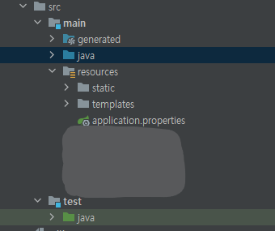

# Spring

### 스프링이란?
* application = component + component(일부 기능으로, 다른 애플리케이션 구성 요소와 협력해서 작업을 처리함.)
* Spring는 **스프링 애플리케이션 컨텍스트**(spring application context)라는 **컨테이너**(container)를 제공함
    * **스프링 애플리케이션 컨텍스트** : 애플리케이션 컴포넌트(빈)들을 생성하고 관리함.
    * 애플리케이션 컴포넌트 == **빈**(bean) : 스프링 애플리케이션 컨텍스트 내부에서 서로 연결되어 완전한 애플리케이션을 만듬.
* 빈들의 상호 연결 방법 : **의존성 주입 (DI = Dependency Injection)** 패턴
    * 의존성 주입 : 애플리케이션 컴포넌트에서 의존(사용)하는 다른 빈의 생성과 관리를 자체적으로 하는 대신 별도의 개체(컨테이너)가 해주며, 이 개체에서는 모든 컴포넌트를 생성, 관리하고 해당 컴포넌트를 필요로 하는 빈에 주입(연결)한다. 
    => 일반적으로 이것은 생성자 인자 또는 속성의 접근자 메서드를 통해 처리된다.
    * 사용방법
        ```java
        @Configuration // 각 빈을 스프링 애플리케이션 컨텍스트에 제공하는 구성 클래스라는 것을 스프링에게 알려준다.
        public class ServiceConfiguration{
            @Bean // 구성 클래스의 메서드에 지정하는 어노테이션 : 각 메서드에서 반환되는 객체가 애플리케이션 컨텍스트의 빈으로 추가되어야 한다는 것을 나타낸다.
            public InventoryService inventoryService(){
                return new InventoryService();
            }
            
            @Bean
            public ProductService productService(){
                return new ProductService(inventoryService);
            }
        }
        ```
    * XML 기반 구성 < 자바 기반 구성 : 더 강화된 타입 안전성, 향상된 리팩토링 기능 (수동으로 설정 시 장점이며, 스프링은 자동-구성 기능이 있음)
    * 자동-구성 : **자동 연결**과 **컴포넌트 검색**이라는 스프링 기법을 기반으로 함. <br>
    => 컴포넌트 검색을 사용하여 스프링은 자동으로 애플리케이션의 classpath에 지정된 컴포넌트를 찾은 후 스프링 애플리케이션 컨텍스트의 빈으로 생성할 수 있다. 또한, 스프링은 자동 연결을 사용하여 의존 관계가 있는 컴포넌트를 자동으로 다른 빈에 주입 한다.
<br><br>
* **스프링 부트** : 생산성 향상을 제공하는 스프링 프레임워크의 확장
    * 장점 :
        1. 향상된 **자동-구성** 기능에 의해 환경 변수인 classpath를 기준으로 어떤 컴포넌트가 구성되고 연결되어야 하는지 알 수 있다. 
        2. 애플리케이션을 빌드하는 데 필요한 별도의 구성 코드를 줄여준다.
<br><br>
---

### 스프링 애플리케이션 초기 설정하기
* 기반 : Spring Initializr 사용
    1. https://start.spring.io 사용 
    2. STS(Spring Tool Suite) 사용 : 이클립스를 기바능로 하는 스프링 IDEdlau, 다른 IDE에는 없는 스프링 부트 대시보드 기능도 제공한다.
        * STS는 https://spring.io/tools 에서 각 운영체제에 맞는 버전을 다운로드하고 설치 할 수 있다.(Spring Tools 4 for Eclipse)
    3. IntelliJ IDEA IDE 사용 
    4. NetBeans IDE 사용

* Packaging : WAR(Web application ARchive) VS JAR(Java ARchive)
    * WAR : 클라우드 플랫폼에는 잘 맞지 않음. 만일 기존의 자바 애플리케이션 서버에 우리 애플리케이션을 배포하고자 한다면 WAR 패키징을 선택하고 웹 초기 설정 클래스를 포함시켜야 한다.
    * JAR : 클라우드 플랫폼에 잘 맞음.

* 폴더 구조<br>
    
    * src/main/java : 애플리케이션 소스 코드
    * src/test/java : 테스트 코드
    * src/main/resources : 자바 리소스가 아닌 것
        * static : 브라우저에 제공할 정적인 콘텐츠(이미지, CSS, JS)
        * template : 브라우저에 콘텐츠를 보여줄 템플릿 파일을 두는 곳(Thymeleaf)

#### 애플리케이션의 구동
* @SpringBootApplication : 이 코드가 스프링 부트 애플리케이션임을 나타냄
    * @SpringBootApplication = @SpringBootConfiguration + @EnableAutoConfiguration + @ComponentScan
    * @SpringBootConfiguration : TitleApplication.java를 구성 클래스로 지정한다.
    * @EnableAutoConfiguration : 스프링 부트 자동-구성을 활성화한다. -> 컴포넌트들을 자동으로 구성하도록 알려준다.
    * @ComponentScan : 컴포넌트 검색을 활성화한다. 자동으로 지정 클래스를 찾아 스프링 애플리케이션 컨텍스트에 컴포넌트로 등록해준다.

* main() : 실제로 애플리케이션을 시작시키고 스프링 애플리케이션 컨텍스트를 생성하는 SpringApplication 클래스의 run() 메서드를 호출함.

#### 애플리케이션의 테스트
* 실행 코드가 없는 테스트 메서드로 스프링 애플리케이션 컨텍스트가 성공적으로 로드될 수 있는지 확인하는 검사를 수행함.
* @SpringBootTest : 스프링 부트 기능으로 테스트를 시작하라는 것을 JUnit에 알려준다. 
<br><br>
---

### 스프링 애플리케이션 작성하기
* 스프링 MVC(웹 프레임워크) = 컨트롤러(웹 요청과 응답을 처리하는 컴포넌트) 
    * @Controller : 컴포넌트 검색 시에 해당 클래스가 컴포넌트로 식별되게 하는 것이 주 목적
        ```java
        @Controller
        public class HomeController{
            @GetMapping("/")
            public String home(){
                return "home";
            }
        }
        ```
* <code>@{...}</code> : Thymeleaf 사용 시 컨텍스트의 상대적인 경로를 나타냄.
    * ex ) <code>@{'/images/a.png'}</code>의 위치 = <code>/src/main/resources/static/images/a.png</code>

#### 컨트롤러 테스트
* <code>@WebMvcTest</code> 사용
    ```java
    package com.hji.spring.controller;

    import org.junit.jupiter.api.Test;
    import org.springframework.beans.factory.annotation.Autowired;
    import org.springframework.boot.test.autoconfigure.web.servlet.WebMvcTest;
    import org.springframework.test.web.servlet.MockMvc;

    import static org.hamcrest.Matchers.containsString;
    import static org.springframework.test.web.servlet.result.MockMvcResultMatchers.content;
    import static org.springframework.test.web.servlet.result.MockMvcResultMatchers.status;
    import static org.springframework.test.web.servlet.result.MockMvcResultMatchers.view;
    import static org.springframework.test.web.servlet.request.MockMvcRequestBuilders.get;

    // 스프링 MVC 애플리케이션의 형태로 테스트가 실행되도록 한다 => HomeController가 스프링 MVC에 등록되므로 우리가 스프링 MVC에 웹 요청을 보낼 수 있다.
    @WebMvcTest(HomeController.class)
    public class HomeControllerTest {

        @Autowired
        private MockMvc mockMvc; // 실제서버를 시작하는 대신 스프링 MVC의 모의 테스트를 하기 위한 역할

        @Test
        public void testHomePage() throws Exception {
            mockMvc.perform(get("/")) // 루트 경로인 HTTP GET 요청
                    .andExpect(status().isOk()) // 응답은 HTTP 200 상태가 되어야 함
                    .andExpect(view().name("home")) // 뷰의 이름은 home이여야 함
                    .andExpect(content().string(containsString("Welcome to ..."))); // 브라우저에 보이는 뷰는 'Welcome to ...'라는 텍스트가 포함되어야 함
            // 세 가지 중 하나라도 충족하지 않으면 테스트는 실패함.
        }
    }
    ```

#### 스프링 부트의 DevTools
* DevTools 역할
    * 코드 변경 시 자동으로 애플리케이션을 다시 시작시킨다.
        * DevTools를 사용 중일 때 애플리케이션은 JVM에서 두 개의 클래스 로더(1. 자바코드, 속성파일, src/main 경로의 모든 것 + 2. 의존성 라이브러리)에 의해 로드된다.<br>
        => 변경 감지 시 1번 클래스 로더만 다시 로드하고 스프링 애플리케이션 컨텍스트를 다시 시작시킨다<br> => 애플리케이션 **시간 단축** 가능
        * 단점 : pom.xml, build.gradle에 의존성을 추가, 변경, 삭제할 때는 애플리케이션을 새로 시작해야 한다.
    * 브라우저로 전송되는 리소스(ex) 템플릿, JS, CSS)가 변경될 때 자동으로 브라우저를 새로고침한다.
    * 템플릿 캐시를 자동으로 비활성화한다.
        * 기본적으로 Thymeleaf, FreeMarker 같은 템플릿에서는 템플릿의 파싱(코드 분석) 결과를 캐시에 저장하고 사용하도록 구성된다.<br>
        => 템플릿이 사용되는 모든 웹 요청마다 매번 다시 파싱되지 않게 하기 위해서이며, **성능상의 이점**이 있다.
        * 개발 시에는 템플릿 캐싱이 유용하지 않기 때문에 이를 비활성화하여 해당 문제를 해결한다.
        * liveReload : 새로고침하지 않고 브라우저에 전달되는 거의 모든 것(ex) 템플릿, 이미지, CSS, JS)에 변경이 생길 때 브라우저가 자동으로 새로고침 된다. 
    * H2 DB 사용 중일 때, 자동으로 H2 콘솔을 활성화한다.
#### 리뷰하기
* 스프링(부트)을 사용한 애플리케이션 개발의 장점 : 프레임워크의 요구를 만족시키기 위한 코드보다는 우리 애플리케이션의 요구를 충족하는 코드에 집중할 수 있다.
* 스프링 부트 자동-구성에서 build.gradle에 작성된 의존성 라이브러리를 감지하고 자동으로 하는 일
    * 스프링 MVC를 활성화하기 위해 스프링 애플리케이션 컨텍스트에 관련된 빈들을 구성함.
    * 내장된 톰캣 서버를 스프링 애플이케이션 컨텍스트에 구성함.
    * Thymeleaf 템플릿을 사용하는 스프링 MVC 뷰를 나타내기 위해 Thymeleaf 뷰 리졸버를 구성함.
<br><br>
---

### 스프링 살펴보기
#### 핵심 스프링 프레임워크
* 핵심 스프링 프레임워크 : 스프링에 있는 모든 것의 기반
    * 핵심 컨테이너와 의존성 주입 프레임워크 제공
    * 스프링 MVC 웹 프레임워크 제공
    * 템플릿 기반의 JDBC 지원(JdbcTemplate)을 포함해서 기본적인 데이터 퍼시스텐스 지원도 제공
    * 리액티브 프로그래밍 지원 => 스프링 MVC 개념의 스프링 Webflux라는 새로운 리액티브 웹 프레임워크 포함
#### 스프링 부트
* 스프링 부트 : 스프링의 필수 요소
    * 스타터 의존성과 자동-구성 기능 제공
    * 액추에이터(Actuator) 기능 제공
        > Actuator : 애플리케이션의 내부 작동을 런타임 시에 살펴볼 수 있는 기능을 제공하며, 여기에 메트릭(metric), 스레드 덤프 정보, 애플리케이션의 상태, 애플리케이션에서 사용할 수 있는 환경 속성이 포함됨.
    * 환경 속성의 명세
    * 핵심 프레임워크에 추가되는 테스트 지원
    * 스프링 부트 CLI(command-line interface: 명령행 인터페이스)를 제공
        * 이를 사용하면, 애플리케이션 전체를 그루비 스크립트들로 작성하여 명령행에서 실행할 수 있다.
#### 스프링 데이터
* 스프링 데이터
    * 기본적인 데이터 퍼시스턴스 지원
    * 간단한 자바 인터페이스로 우리 애플리케이션의 데이터 리퍼지터리를 정의할 수 있다.
        * 이 때, 데이터를 저장하고 읽는 메서드를 작명 규칙을 사용해서 정의한다.
    * 스프링 데이터는 서로 다른 종류의 데이터베이스와 함께 사용될 수 있다.
        * ex) 관계형 DB : JPA, 문서형 DB : Mongo, 그래프형 DB : Neo4j
#### 스프링 시큐리티
* 스프링 시큐리티 : 스프링의 강력한 보안 프레임워크
    * 인증, 허가, API 보안을 포함하는 폭넓은 범위의 애플리케이션 보안 요구를 다룬다.
#### 스프링 통합과 배치
* 어떤 시점이든 대부분의 애플리케이션은 다른 애플리케이션 또는 같은 애플리케이션의 서로 다른 컴포넌트를 통합(Integration)할 필요가 생긴다. 이런 요구사항을 해결하기 위해 애플리케이션 통합 패턴이 존재함. <br>
=> 스프링 통합과 스프링 배치는 이런 패턴 구현을 제공함.
* 스프링 통합 : 데이터가 사용 가능한 즉시 처리되는 실시간 통합
* 스프링 배치 : 다량의 데이터가 처리되는 시점을 트리거(대개 시간을 기준하는 트리거)가 알려줄 때 데이터가 수집 처리되는 배치 통합
#### 스프링 클라우드
* 애플리케이션 개발의 새로운 시대 : 우리 애플리케이션을 거대한 하나의 단일체로 개발하는 대신 **마이크로 서비스**라는 여러 개의 개별적인 단위들로 합성하는 것
* 마이크로 서비스는 애플리케이션 개발과 실행에서 많은 관심을 받는 주제이며, 이렇게 하려면 도전이 필요하다. 
    * 스프링 클라우드 : 이 때, 스프링을 사용해서 클라우드 애플리케이션을 개발하기 위한 프로젝트들의 모음
<br><br><br>


## 요약
* 스프링의 목표 : 웹 애플리케이션 생성, DB 사용, 애플리케이션 보안, 마이크로 서비스 등에서 개발자의 노력을 덜어주는 것
* 스프링 부트 장점 : 손쉬운 의존성 관리, 자동-구성, 런타임 시의 애플리케이션 내부 작동 파악을 스프링에서 할 수 있게 함.
* 스프링 애플리케이션은 스프링 Initializr를 사용해서 초기 설정할 수 있음. => 웹 기반 + (대부분) 자바 개발 환경을 지원함.
* 빈(bean)이라고 하는 컴포넌트는 스프링 애플리케이션 컨텍스트에서 자바나 XML로 선언할 수 있으며, 컴포넌트 탐색으로 찾거나 스프링 부트 자동-구성에서 자동으로 구성할 수도 있다.