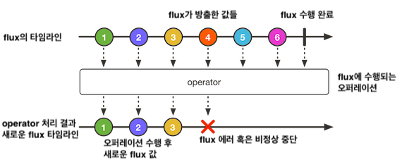
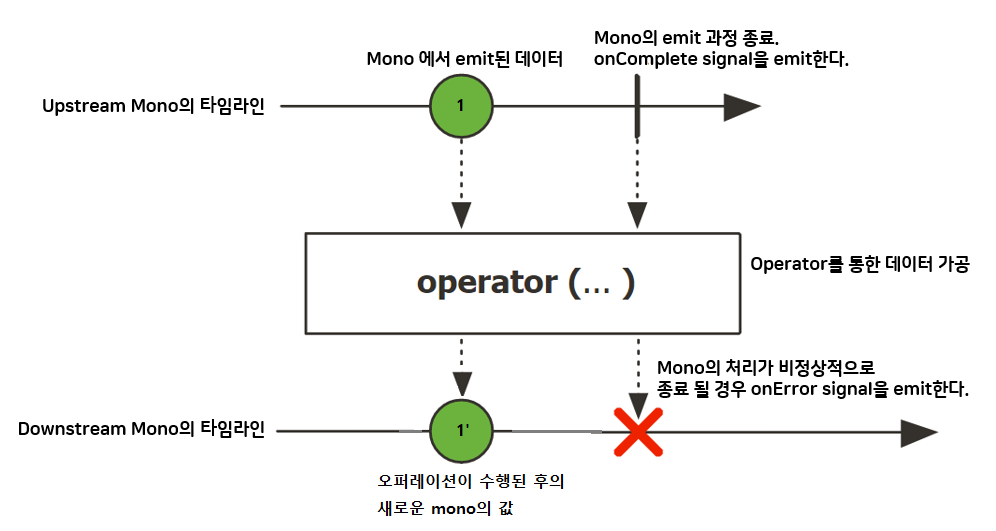
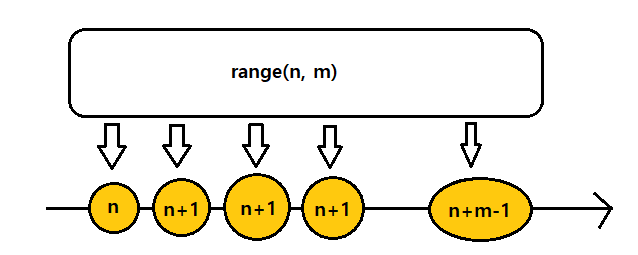

# 리액터 개요
* 애플리케이션 코드 개발 방법
    * 명령형(imperative) : 순차적으로 연속되는 작업. 한 번에 하나씩 + 이전 작업 다음에 실행. 데이터는 모아서 처리되고 이전 작업이 데이터 처리를 끝낸 후에 다음 작업으로 넘어갈 수 있음.
    * 리액티브 코드(reactive, 반응형) : 병렬 실행. 각 작업은 부분 집합의 데이터 처리 가능 + 처리가 끝난 데이터를 다음 작업에 넘겨주고 다른 부분 집합의 데이터로 계속 작업.
* 리액터 : 리액티브 프로그래밍 라이브러리(스프링 프로젝트의 일부분)
    * 스프링 5에서 리액티브 프로그래밍을 지원하는데 필요한 기반
<br><br>
---

### 리액티브 프로그래밍 이해하기
* 리액티브 프로그래밍 : 명령형 프로그래밍의 대안이 되는 패러다임 (why? 명령형의 한계를 해결할 수 있어서 => 한계: 작업이 완료될 때까지 아무것도 할 수 없음(스레드 차단 문제))
    * 함수적이면서 선언적임 = 순차적으로 수행되는 작업 단계를 나타낸 것이 아니라 <u>데이터가 흘러가는 파이프라인(pipeline)이나 스트림(stream)을 포함</u>
    * 리액티브 스트림은 데이터 전체를 사용할 수 있을 때까지 기다리지 않고 <u>사용 가능한 데이터가 있을 때만다 처리</u>됨(사실상 입력되는 데이터는 무한할 수 있음)
    * ex) 명령형 프로그래밍 : 물풍선 , 리액티브 프로그래밍 : 정원용 호스

* **리액티브 스트림**
    * 목적 : 차단되지 않는 백프레셔(backpressure)를 갖는 비동기 스트림 처리의 표준을 제공하는 것    
        > **백프레셔(backpressure)** : 데이터를 읽는(소비하는) 컨슈머가 처리할 수 있는만큼으로 전달 데이터를 제한함으로써 지나치게 빠른 데이터 소스로부터의 데이터 전달 폭주를 피할 수 있는 수단
    * 특성 : 동시에 여러 작업을 수행하여 더 큰 확장성을 얻게 해줌
    * 4개의 인터페이스 사용 : Publisher(발행자), Subscriber(구독자), Subscription(구독), Processor(프로세서)
        * Publisher : 하나의 구독 당 하나의 구독자에 전송(발행)하는 데이터를 생성
            ```java
            // 구독자가  발행자(Publisher)를 구독 신청할 수 있는 subscribe() 메서드
            public interface Publisher<T>{
                void subscribe(Subscriber<? super T> subscriber);
            }
            ```
        * Subscriber : 구독자가 구독 신청되면 Publisher로부터 이벤트를 수신할 수 있음
            ```java
            // 구독자가 이벤트를 받을 때 사용하는 메서드
            public interface Subscriber<T>{
                void onSubscribe(Subscription sub); // 데이터 요청 = 구독자가 수신할 1번째 이벤트는 onSubscribe()의 호출을 통해 이루어짐.
                void onNext(T item); //데이터 요청 후 데이터 스트림을 통해 전달될 때 onNext()가 호출되어 publisher가 보낸 데이터가 구독자에게 전달됨.
                void onError(Throwable ex);
                void onComplete(); // publisher에서 전송할 데이터가 없고 더 이상의 데이터를 생성하지 않는다면 onComplete를 통해 구독자에게 작업이 끝났다고 알려준다.
            }
            ```
        * Subscription : 구독은 구독자 객체를 통해서 구독을 관리할 수 있음.
            ```java
            // 구독자 객체를 통해서 구독을 관리할 수 있음
            public interface Subscription{
                void request(long n); // 구독자가 구독을 통해 전송되는 데이터 요청 시 사용, n:받고자하는 데이터 항목 수(=백프레셔)
                void cancel(); // 구독자가 구독의 데이터를 수신하지 않고 구독취소을 할 때 사용
            }
            ```
        * Processor : Publisher와 Subscriber을 결합한 것
            ```java
            public interface Processor<T,R> extends Subscriber<T>, Publisher<R> {}
            ```
            * Publisher로써의 역할 : 처리 결과를 자신의 구독자들에게 발행함.
            * Subscriber로써의 역할 : 데이터를 수신하고 처리함
    * 데이터 처리 파이프라인 : publisher로부터 0이상의 Processor을 토앻 데이터를 끌어온 뒤 최종 결과를 구독자에 전달함.

* 리액터 : 스프링 5의 리액티브 프로그래밍 모델의 기반
    * 리액티브 스트림 인터페이스는 스트림을 구성하는 기능이 없어 이것을 구성하는 API를 통해 리액티브 스트림 인터페이스를 구현할 수 있음.
    
> **자바 스트림 vs 리액티브 스트림**
> * 공통점 : Stream이라는 단어 포함함. 데이터로 작업하기 위한 API를 제공함. 다수의 똑같은 오퍼레이션을 공유함.
> * 차이점 
>   * 자바 스트림 : <u>동기화</u>되어 있고 한정된 데이터로 작업을 수행함.
>   * 리액티브 스트림 : 무한 데이터셋을 비롯해서 어떤 크기의 데이터셋이건 <u>비동기</u> 처리를 지원함. 실시간으로 데이터를 처리하며, 백프레셔를 사용해 데이터 전달 폭주를 막음.  


<br><br>
---

### 리액터 시작하기
* 명령형 프로그래밍 : 일련의 작업 단계를 기술하는 것 VS 리액티브 프로그래밍 : 데이터가 전달될 파이프라인을 구성(전달중 변경,사용 가능)
    * ex. 사람의 이름을 가져와 대문자로 변경 후 인사말 메시지로 만들어 출력하기
        * 명령형 프로그래밍
            ```java
            // 각 줄의 코드가 같은 스레드에서 한 단계씩 차례대로 실행됨
            // 각 단계가 완료될 때까지 다음 단계로 이동하지 못하게 실행 중인 스레드를 막음
            String name = "HJI";
            String capitalName = name.toUpperCase();
            String greeting = "Hello, " + capitalName + "!";
            System.out.println(greeting); 
            // Hello, HJI!
            ```
        * 리액티브 코드
            ```java
            // 데이터가 전달되는 파이프라인을 구성(파이프라인의 각 단계에서는 어떻게 하든 데이터가 변경됨)
            // 각 오퍼레이션은 같은 스레드로 실행되거나 다른 스레드로 실행될 수 있음.
            Mono.just("hji") // 1번째 오퍼레이션 : 생성
                .map(n -> n.toUpperCase()) // 2번째 오퍼레이션 : 대문자로 변경 + 다른 Mono 생성
                .map(cn -> "Hello, "+ cn + "!") // 3번째 : 문자열 결합 수행 + 다른 Mono 생성
                .subscribe(System.out::println); // 3번째에서 생성된 Mono를 구독하여 데이터를 수신하고 출력함.
            ```
            * Mono, Flux : 리액터의 2가지 핵심 타입 중 하나
                * Flux : 0,1 또는 <u>다수</u>의 데이터를 갖는 파이프라인
                * Mono : <u>하나</u>의 데이터 항목만 갖는 데이터셋에 최적화된 리액티브 타입
                * 리액티브 스트림의 Publisher 인터페이스를 구현한 것
            > **리액터 VS RxJava(ReactiveX)**
            > * Mono,Flux는 Observable, Single과 비슷함. (개념적으로 거의 같으며, 여러 동일한 오퍼레이션을 제공함.)
            > * 리액터와 RxJava 간의 타입 변환이 가능하다.
            > * 스프링은 RxJava 타입도 사용할 수 있다.

##### 리액티브 플로우의 다이어그램
* 리액티브 플로우 = 마블 다이어그램
* 구조
    * 제일 위 : Flux, Mono를 통해 전달되는 데이터의 타임라인
    * 중앙 : 오퍼레이션
    * 제일 밑 : 결과로 생성되는 Flux나 Mono의 타임라인
* Flux의 흐름 : 원래의 Flux를 통해 데이터가 지나가는 동안 오퍼레이션을 통해 처리되어 새로운 Flux가 생성됨.
    
* Mono의 흐름 : Flux와 달리 0 또는 하나의 데이터 항목과 에러를 갖는다
    

##### 리액터 의존성 추가하기
* 하위 의존성을 추가해 Mono와 Flux를 사용해 리액티브 파이프라인의 생성을 시작할 수 있음.
* build.gradle
    ```
    implementation 'io.projectreactor:reactor-core' // 리액터를 시작시키기 위해
    testImplementation 'io.projectreactor:reactor-test' // 리액터 테스트 지원 모듈
    ```

<br><br>
---

### 리액티브 오퍼레이션 적용하기
* 리액터가 제공하는 가장 핵심적인 구성 요소(리액티브 타입) : Flux, Mono
* Flux와 Mono가 제공하는 오퍼레이션 : 2타입을 함께 결합하여 데이터가 전달될 수 있는 파이프라인을 생성함
    1. 생성 오퍼레이션
    2. 조합 오퍼레이션
    3. 변환 오퍼레이션
    4. 로직 오퍼레이션

##### 리액티브 타입 생성하기
* 스프링에서 리액티브 타입을 사용 시 repository나 service로 부터 Flux나 Mono가 제공됨
    * 이것으로 우리의 리액티브 타입을 생성할 필요가 없지만 데이터를 발행하는 새로운 리액티브 publisher를 생성해야 할 수 있다.
* 리액터는 Flux나 Mono를 생성하는 오퍼레이션을 제공함

* **객체로부터 생성하기**
    * Flux, Mono의 just() : 리액티브 타입 생성 가능
        ```java
        // 5개의 String 객체로부터 Flux를 생성한다.
        // => 이 경우 Flux는 생성되지만 구독자가 없다.(구독자 없이는 데이터가 전달되지 x)
        // => 리액티브 타입을 구독=데이터가 흘러갈 수 있게 하는 것
        // => ex) 호스를 수도꼭지에 끼운 것(틀지는 않은 상태)
        @Test
        public void createAFlux_just(){
            Flux<String> fruitFlux = Flux
                .just("Apple", "Orange","Grape", "Banana", "Strawberry");
        }
        ```
    * Flux의 subscribe() : 구독자를 추가함
        ```java
        // subscribe()을 호출하는 즉시 데이터가 전달되기 시작함.
        // => 만약 중간에 다른 오퍼레이션이 없다면 데이터는 곧바로 Flux로부터 Subscriber로 전달됨
        fruitFlux.subscribe(
            f -> System.out.println("Here's some fruit: "+f); // f:java.util.Consumer = 리액티브 스트림의 Subscriber 객체를 생성하기 위해 사용됨.
        )
        ```
    * 리액터의 StepVerifier : Flux나 Mono를 테스트하는 좋은 방법
        * StepVerifier은 Flux나 Mono가 지정되면 해당 리액티브 타입을 구독한 다음에 스트림을 통해 전달되는 데이터에 대해 어서션(assertion)을 적용함. 그리고 해당 스트림이 기대한대로 완전하게 작동하는지 검사함.
        ```java
        // StepVerifier가 fruitFlux를 구독한 후 각 데이터 항목이 기대한 과일 이름과 일치하는지 어셔션을 적용함 + fruitFlux가 완전한지도 검사함.
        StepVerifier.create(fruitFlux)
            .expectNext("Apple")
            .expectNext("Orange")
            .expectNext("Grape")
            .expectNext("Banana")
            .expectNext("Strawberry")
            .verifyComplete();
        ```

* **컬렉션으로부터 생성하기**
    * Flux는 배열, Iterable 객체, 자바 Stream 객체로부터 생성될 수 있음
    ```java
    // 1. 배열 : fromArray() 사용
    @Test
    public void createAFlux_fromArray(){
        String[] fruits = new String[] {
            "Apple", "Orange", "Grape", "Banana", "Strawberry"
        };

        Flux<String> fruitFlux = Flux.fromArray(fruits); // 배열로부터 Flux 생성

        StepVerifier.create(fruitFlux)
            .expectNext("Apple")
            .expectNext("Orange")
            .expectNext("Grape")
            .expectNext("Banana")
            .expectNext("Strawberry")
            .verifyComplete();
    }

    // 2. Iterable 객체 : fromIterable() 사용
    @Test
    public void createAFlux_fromIterable(){
        List<String> fruits = new ArrayList<>();
        fruits.add("Apple");
        fruits.add("Orange");
        fruits.add("Grape");
        fruits.add("Banana");
        fruits.add("Strawberry");

        Flux<String> fruitFlux = Flux.fromIterable(fruits); // Iterable로부터 Flux 생성

        StepVerifier.create(fruitFlux)
            .expectNext("Apple")
            .expectNext("Orange")
            .expectNext("Grape")
            .expectNext("Banana")
            .expectNext("Strawberry")
            .verifyComplete();
    }

    // 3. Stream 객체 : fromStream() 사용
    @Test
    public void createAFlux_fromStream(){
        Stream<String> fruits = Stream.of(
            "Apple", "Orange", "Grape", "Banana", "Strawberry"
        );

        Flux<String> fruitFlux = Flux.fromStream(fruits); // Stream으로부터 Flux 생성

        StepVerifier.create(fruitFlux)
            .expectNext("Apple")
            .expectNext("Orange")
            .expectNext("Grape")
            .expectNext("Banana")
            .expectNext("Strawberry")
            .verifyComplete();
    }
    ```

* **Flux 데이터 생성하기**
    * 카운터 Flux : 데이터 없이 매번 새 값으로 증가하는 숫자를 방출하는 카운터 역할의 Flux => <u>range(), interval() 사용</u>
    
    ```java
    // 1. range()
    @Test
    public void createAFlux_range(){
        Flux<Integer> intervalFlux = Flux.range(1,5); // 1~5까지의 카운터 Flux

        StepVerifier.create(intervalFlux)
            .expectNext(1)
            .expectNext(2)
            .expectNext(3)
            .expectNext(4)
            .expectNext(5)
            .verifyComplete();
    }

    // 2. interval() : 0부터 시작, 최대값이 지정되지 x(무한정 실행됨), take()로 제한가능
    // => ex) 매초마다 값을 방출하는 Flux
    @Test
    public void createAFlux_range(){
        Flux<Long> intervalFlux = 
            Flux.interval(Duration.ofSeconds(1))
                .take(5); // 0~4까지의 카운터 Flux

        StepVerifier.create(intervalFlux)
            .expectNext(0L)
            .expectNext(1L)
            .expectNext(2L)
            .expectNext(3L)
            .expectNext(4L)
            .verifyComplete();
    }
    ```

##### 리액티브 타입 조합하기
* 2개의 리액티브 타입을 결합하거나, 하나의 Flux를 2개 이상의 리액티브 타입으로 분할하는 경우

* **리액티브 타입 결합하기**
    * mergeWith() : 2개의 Flux 스트림을 1개의 결과 Flux로 생성할 때 (2개의 Flux객체로부터 방출되는 시간에 맞춰 결정됨)
        ```java
        // 영화의 캐릭터 이름을 값으로 갖는 Flux + 해당 캐릭터들이 즐겨먹는 식품 이름의 Flux가 있을 때 결합코드
        @Test
        public void mergeFluxes(){
            Flux<String> characterFlux = Flux
                .just("Garfield", "Kojak", "Barbossa")
                .delayElements(Duration.ofMillis(500)); // 조금 느리게 방출되도록(500ms마다) 함. => why? Flux는 가능한 빨리 데이터를 방출해서
            Flux<String> foodFlux = Flux
                .just("Lasagna", "Lollipops", "Apples")
                .delaySubscription(Duration.ofMillis(250)) // characterFlux 다음에 foodFlux가 스트리밍을 시작하도록 250ms가 지난 후에 구독 및 데이터를 방출하도록 함.
                .delayElements(Duration.ofMillis(500));

            Flux<String> mergedFlux = characterFlux.mergeWith(foodFlux); //2개의 Flux객체가 결합되어 하나의 Flux가 새로 생성됨
            // mergedFlux의 방출 순서 : 2개의 Flux객체로부터 방출되는 시간에 맞춰 결정됨.
            StepVerifier.create(mergedFlux) // mergeFlux를 구독 시에는 2개의 Flux 스트림을 번갈아 구독하는 것처럼 나온다.
                .expectNext("Garfield")
                .expectNext("Lasagna")
                .expectNext("Kojak")
                .expectNext("Lollipops")
                .expectNext("Barbossa")
                .expectNext("Apples")
                .verifyComplete();
        }
        ```
    
    * zip() : 각 Flux 소스로부터 한 항목씩 번갈아 가져와 새로운 Flux를 생성함. (mergeWith()는 소스 Flux들의 값이 완벽하게 번갈아 방출되게 보장할 수 없음)
        * zip()은 정적인 생성 오퍼레이션
        ```java
        @Test
        public void zipFluxes(){
            Flux<String> characterFlux = Flux
                .just("Garfield", "Kojak", "Barbossa");
            Flux<String> foodFlux = Flux
                .just("Lasagna", "Lollipops", "Apples");

            // Tuple2 : 2개의 다른 객체를 전달하는 컨테이너 객체 => 이 타입이 아닌 다른 타입을 사용하고 싶을 경우 우리가 원하는 객체를 생성하는 함수를 zip()에 제공하면 됨.
            Flux<Tuple2<String,String>> zippedFlux = Flux.zip(characterFlux, foodFlux); // 캐릭터+캐릭터가 좋아하는 식품을 완벽하게 조합함.
            Flux<String> zippedFluxToObject = Flux.zip(characterFlux, foodFlux, (c,f) -> c+" eats "+f); // 두 Flux의 항목을 문자열로 결합함.
            
            StepVerifier.create(zippedFlux)
                .expectNextMatches(p -> 
                    p.getT1().equals("Garfield") &&
                    p.getT2().equals("Lasagna"))
                .expectNextMatches(p -> 
                    p.getT1().equals("Kojak") &&
                    p.getT2().equals("Lollipops"))    
                .expectNextMatches(p -> 
                    p.getT1().equals("Barbossa") &&
                    p.getT2().equals("Apples"))
                .verifyComplete();

            StepVerifier.create(zippedFluxToObject)
                .expectNext("Garfield eats Lasagna")
                .expectNext("Kojak eats Lollipops")
                .expectNext("Barbossa eats Apples")
                .verifyComplete();
        }
        ```

* **먼저 값을 방출하는 리액티브 타입 선택하기**
    * first() : 두 Flux 객체 중 먼저 값을 방출하는 Flux의 값을 선택해서 이 값을 발행함.
        ```java
        // 빠른 Flux와 느린 Flux(100ms 경과 후 구독이 신청되고 항목을 발행함.)에서 first() 사용 : 먼저 값을 방출하는 소스 Flux의 값만 발행함.
        @Test
        public void firstFlux(){
            Flux<String> slowFlux = Flux.just("tortoise", "snail", "sloth")
                .delaySubscription(Duration.ofMillis(100)); // 100ms가 경과한 후에 구독 신청과 발행을 시작함.
            Flux<String> fastFlux = Flux.just("hare", "cheetah", "squirrel");
            
            Flux<String> firstFlux = Flux.first(slowFlux, fastFlux); // firstFlux = fastFlux : 빠른 FLux의 값만 발행하게 됨.

            StepVerifier.create(firstFlux)
                .expectNext("hare")
                .expectNext("cheetah")
                .expectNext("squirrel")
                .verifyComplete();
        }
        ```

##### 리액티브 스트림의 변환과 필터링
* 리액티브 스트림을 통해 전달되는 데이터를 변환하거나 필터링하는 오퍼레이션

* **리액티브 타입으로부터 데이터 필터링하기**
    * skip() : 지정된 수 또는 지정된 시간 이후의 메시지를 건너뛴 후에 나머지 메시지를 결과 Flux로 전달함.
        ```java
        // 1. skip(개수) : 지정된 개수의 메시지를 건너뛴 후에 나머지 메시지를 결과 Flux로 전달함.
        @Test
        public void skipAFew(){
            Flux<String> skipFlux = Flux
                .just("one", "two", "skip a few", "ninety nine", "one hundred")
                .skip(3); // 처음 3개의 항목을 건너뛰고 마지막 2항목만 발행됨

            StepVerifier.create(skipFlux)
                .expectNext("ninety nine", "one hundred")
                .verifyComplete();
        }

        // 2. skip(시간) : 지정된 시간이 경과할 때까지 기다렸다가 결과 Flux로 메시지를 전달함
        @Test
        public void skipAFewSeconds(){
            Flux<String> skipFlux = Flux
                .just("one", "two", "skip a few", "ninety nine", "one hundred")
                .delayElements(Duration.ofSeconds(1))
                .skip(Duration.ofSeconds(4)); // 4초동안 기다렸다가 값을 방출하게 됨.(1초+"one"+1초+"two"+"1초"+"skip a few"+1초+"ninety nine"+... : 4초 이후에 들어오는 "ninety nine"과 "one hundred" 항목이 방출됨)

            StepVerifier.create(skipFlux)
                .expectNext("ninety nine", "one hundred")
                .verifyComplete();
        }
        ```
    * take() : 입력 Flux로부터 처음부터 지정된 수 또는 지정된 시간 이내의 항목만을 방출함.
        ```java
        // 1. take(개수) : 지정된 개수의 메시지를 결과 Flux로 전달함.
        @Test
        public void take(){
            Flux<String> nationalParkFlux = Flux
                .just("Yellowstone", "Yosemite", "Grand Canyon", "Zion", "Frand Tenton")
                .take(3); // 앞에서부터 3개만 가져온다.

            StepVerifier.create(nationalParkFlux)
                .expectNext("Yellowstone", "Yosemite", "Grand Canyon")
                .verifyComplete();
        }

        // 2. take(시간) : 지정된 시간 이내의 메시지를 결과 Flux로 전달함.
        @Test
        public void takeSeconds(){
            Flux<String> nationalParkFlux = Flux
                .just("Yellowstone", "Yosemite", "Grand Canyon", "Zion", "Frand Tenton")
                .delayElements(Duration.ofSeconds(1))
                .take(Duration.ofMillis(3500)); // 처음 3.5s동안만 항목을 방출함 (1초+"Yellowstone"+1초+"Yosemite"+1초+"Grand Canyon"+1초+"Zion"+.. : 3.5초 이내의 "Yellowstone", "Yosemite", "Grand Canyon" 가 방출됨)

            StepVerifier.create(nationalParkFlux)
                .expectNext("Yellowstone", "Yosemite", "Grand Canyon")
                .verifyComplete();
        }
        ```
    * filter() : 지정된 조건식에 일치되는 메시지만 결과 Flux가 수신하도록 한다.
        ```java
        @Test
        public void filter(){
            Flux<String> nationalParkFlux = Flux
                .just("Yellowstone", "Yosemite", "Grand Canyon", "Zion", "Frand Tenton")
                .filter(np -> !np.contains(" ")) // 공백이 없는 문자열 값만 받는다.
            
            StepVerifier.create(nationalParkFlux)
                .expectNext("Yellowstone", "Yosemite", "Zion")
                .verifyComplete();
        }
        ``` 
    * distinct() : 중복 메시지를 걸러냄.
        ```java
        @Test
        public void distinct(){
            Flux<String> animalFlux = Flux
                .just("dog", "cat", "bird", "dog", "bird", "anteater")
                .distinct(); // 중복 메시지를 걸러냄

            StepVerifier.create(nationalParkFlux)
                .expectNext("dog", "cat", "bird", "anteater")
                .verifyComplete();   
        }
        ```

* **리액티브 데이터 매핑하기** : 발행된 항목을 다른 형태나 타입으로 매핑(변환)하기
    * map() : 입력 메시지의 변환을 수행하여 결과 스트림의 새로운 메시지로 발행함.
        * map() : 동기적으로(각 항목을 순차적으로 처리) 매핑이 수행된다. (비동기를 원할 시 flatMap() 사용)
        ```java
        // 농구 선수 이름의 String으로 Player 객체를 발행하는 새로운 Flux 생성하기
        @Test
        public void map() {
            Flux<Player> playerFlux = Flux
                .just("Michael Jordan", "Scottie Pippen", "Steve Kerr") // String 객체를 발행
                .map(n -> { // 공백을 기준으로 분리하여 Player 객체를 발행함
                    String[] split = n.split("\\s");
                    return new Player(split[0], split[1])
                });
            
            StepVerifier.create(playerFlux)
                .expectNext(new Player("Michael", "Jordan"))
                .expectNext(new Player("Scottie", "Pippen"))
                .expectNext(new Player("Steve", "Kerr"))
                .verifyComplete();
        }
        ```
    * flatMap() : 각 객체를 새로운 Mono나 Flux로 매핑하여, 해당 Mono나 Flux들의 결과는 하나의 새로운 Flux가 됨.
        * flatMap()과 subscribeOn()과 함께 사용 시 리액터 타입의 변환을 비동기적으로 수행할 수 있음.
        * flatMap()은 수행 도중 생성되는 임시 Flux를 사용해서 변환을 수행하므로 비동기 변환이 가능함.
        * subscribeOn(Schedulers의 static 메서드 중 1개를 사용)
            * Schedulers의 동시성 모델
                <table>
                <tr><td>Schedulers 메서드</td><td>개요</td></tr>
                <tr><td>.immediate()</td><td>현재 스레드에서 구독을 실행한다.</td></tr>
                <tr><td>.single()</td><td>단일의 재사용 가능한 스레드에서 구독을 실행한다. 모든 호출자에 대해 동일한 스레드를 재사용한다.</td></tr>
                <tr><td>.newSingle()</td><td>매 호출마다 전용 스레드에서 구독을 실행한다.</td></tr>
                <tr><td>.elastic()</td><td>무한하고 신축성 있는 풀에서 가져온 작업 스레드에서 구독을 실행한다. 필요 시 새로운 작업 스레드가 생성되며, 유휴 스레드는 제거된다(기본적으로 60초 후에)</td></tr>
                <tr><td>.parallel()</td><td>고정된 크기의 풀에서 가져온 작업 그레드에서 구독을 실행하며, CPU 코어의 개수가 크기가 된다.</td></tr>
                </table>
        * flatMap() 이나 subscribeOn()을 사용할 때 장점 : 다수의 병행 스레드에 작업을 분할하여 스트림의 처리량을 증가시킬 수 있음. 하지만 작업이 병행으로 수행되어서 결과 Flux에서 방출되는 항목의 순서를 알 수 없다.
        ```java
        @Test
        public void flatMap() {
            Flux<Player> playerFlux = Flux
                .just("Michael Jordan", "Scottie Pippen", "Steve Kerr")
                .flatMap(n -> Mono.just(n) // String 타입의 입력 문자열을 String 타입의 Mono로 변환
                    .map(p -> { // String 객체를 Player 객체로 변환
                        String[] split = p.split("\\s");
                        return new Player(split[0], split[1])
                    }) // 여기까지 진행한다면 동기적
                    .subscribeOn(Schedulers.parallel()) // 비동기적으로 병행 수행되도록 함 : 각 구독이 병렬 스레드로 수행되어야 한다는 것을 나타냄.
                );

            List<Player> playerList = Arrays.asList(
                new Player("Michael", "Jordan"),
                new Player("Scottie", "Pippen"),
                new Player("Steve", "Kerr")
            )
            
            StepVerifier.create(playerFlux)
                .expectNext(p -> playerList.contains(p)) // 각 항목이 리스트에 존재하는지로 확인가능 => why? 병행으로 수행되어서 결과 Flux에서 방출되는 항목의 순서를 알 수 없다.
                .expectNext(p -> playerList.contains(p))
                .expectNext(p -> playerList.contains(p))
                .verifyComplete();
        }
        ```
        > * subscribe() : 동사형. 리액티브 플로우를 구독 요청하고 실제로 구독함.
        > * subscribeOn() : 이름이 더 서술적. 구독이 동시적으로 처리되어야 한다는 것을 지정함.

* **리액티브 스트림의 데이터 버퍼링하기**
    * buffer() : 데이터 스트림을 작은 덩어리로 분할하기
        ```java
        // 과일의 이름을 갖는 Flux에서 List 컬렉션 형태의 새로운 Flux를 생성할 수 있음.
        @Test
        public void buffer(){
            Flux<String> fruitFlux = Flux
                .just("apple", "orange", "banana", "kiwi", "strawberry");
            
            Flux<List<String>> bufferedFlux = fruitFlux.buffer(3); // List(각각 3개 이내의 항목을 포함) 컬렉션을 포함하는 새로운 Flux로 버퍼링함.

            StepVerifier.create(bufferedFlux)
                .expectNext(Arrays.asList("apple", "orange", "banana"))
                .expectNext(Arrays.asList("kiwi", "strawberry"))
                .verifyComplete();


            // buffer() + flatMap() => List 컬렉션을 병행으로 처리가능
            Flux.just("apple", "orange", "banana", "kiwi", "strawberry") // 1. Flux<String>
                .buffer(3) // 2. Flux<List<String>>
                .flatMap(x ->  // 각 List 버퍼를 가져오기 
                    Flux.fromIterable(x)
                        .map(y -> y.toUpperCase()) // 해당 List의 요소로 부터 새로운 Flux 생성
                        .subscribeOn(Schedulers.parallel()) // 별도의 스레드에서 병행으로 계속 처리될 수 있음.
                        .log() // 모든 리액티브 스트림 이벤트를 로깅함.
                ).subscribe();

            // 로깅 확인 : 2개의 버퍼가 서로 다른 스레드에서 병행 처리됨
            [main] INFO reactor.Flux.SubscribeOn.1 - onSubscribe(FluxSubscribeOn.SubscribeOnSubscriber)
            [main] INFO reactor.Flux.SubscribeOn.1 - request(32)
            [main] INFO reactor.Flux.SubscribeOn.2 - onSubscribe(FluxSubscribeOn.SubscribeOnSubscriber)
            [main] INFO reactor.Flux.SubscribeOn.2 - request(32)
            [parallel-1] INFO reactor.Flux.SubscribeOn.1 - onNext(APPLE)
            [parallel-2] INFO reactor.Flux.SubscribeOn.2 - onNext(KIWI)
            [parallel-1] INFO reactor.Flux.SubscribeOn.1 - onNext(ORANGE)
            [parallel-2] INFO reactor.Flux.SubscribeOn.2 - onNext(STRAWBERRY)
            [parallel-1] INFO reactor.Flux.SubscribeOn.1 - onNext(BANANA)
            [parallel-1] INFO reactor.Flux.SubscribeOn.1 - onComplete()
            [parallel-2] INFO reactor.Flux.SubscribeOn.2 - onComplete()
        } 
        ``` 
    * collectList() : Flux가 방출하는 모든 항목을 List로 모아야 할 때 (= 인자없는 buffer())
        * collectList()는 List를 발행하는 Flux 대신 Mono를 생성함.
        ```java
        @Test
        public void collectList(){
            Flux<String> fruitFlux = Flux.just("apple", "orange", "banana", "kiwi", "strawberry");
            Mono<List<String>> fruitListMono = fruitFlux.collectList();

            StepVerifier.create(fruitListMono)
                .expectNext(Arrays.asList("apple", "orange", "banana", "kiwi", "strawberry"))
                .verifyComplete();
        }
        ```
    * collectMap() : Map을 포함하는 Mono를 생성함. 이떄 해당 Map에는 지정된 함수로 산출된 키를 갖는 항목이 저장됨.
        ```java
        @Test
        public void collectMap(){
            Flux<String> animalFlux = Flux.just("aardvark", "elephant", "koala", "eagle", "kangaroo");
            Mono<Map<Character, String>> animalMapMono = animalFlux.collectMap(a -> a.charAt(0));

            StepVerifier.create(animalMapMono)
                .expectNextMatches(map -> {
                    return map.size() == 3 &&
                        map.get('a').equals("aardvark") &&
                        map.get('e').equals("eagle") && // 덮어씌어짐
                        map.get('k').equals("kangaroo"); // 덮어씌어짐
                })
                .verifyComplete()
        }
        ```

##### 리액티브 타입에 로직 오퍼레이션 수행하기
* Mono나 Flux가 발행한 항목이 어떤 조건과 일치하는지 알아야 할 경우
    * all() : 모든 메시지가 조건을 충족하느지 확인하기 위해
        ```java
        // Flux가 발행하는 모든 문자열이 문자 a나 k를 포함하는지 확인할 때
        @Test
        public void all(){
            Flux<String> animalFlux = Flux.just("aardvark", "elephant", "koala", "eagle", "kangaroo");
            
            Mono<Boolean> hasAMono = animalFlux.all(a -> a.contains("a")); // 모든 동물 이름에 문자 a가 포함되어 있는가
            StepVerifier.create(hasAMono)
                .expectNext(true)
                .verifyComplete();

            Mono<Boolean> hasKMono = animalFlux.all(a -> a.contains("k")); // 모든 동물 이름에 문자 k가 포함되어 있는가
            StepVerifier.create(hasKMono)
                .expectNext(false)
                .verifyComplete();

        }
        ```

    * any() : 최소한 하나의 메시지가 조건을 충족하는지
        ```java
        // 문자 t와 z가 있는지 검사
        @Test
        public void  any(){
            Flux<String> aninalFlux = Flux
                .just("aardvark", "elephant", "koala", "eagle", "kangaroo");
            
            Mono<Boolean> hasTMono = animalFlux.any(a -> a.contains("t"));
            StepVerifier.create(hasTMono)
                .expectNext(true) // 최소 1개에는 t가 들어가 있음
                .verifyComplete();

            Mono<Boolean> hasZMono = animalFlux.any(a -> a.contains("z"));
            StepVerifier.create(hasZMono)
                .expectNext(false) // z를 포함하는 동물이름이 하나도 없음
                .verifyComplete();            
        }
        ```


## 요약
* 리액티브 프로그래밍에서는 데이터가 흘러가는 파이프라인을 생성한다.
* 리액티브 스트림의 4가지 타입 : Publisher, Subscriber, Subscription, Transformer
* 프로젝트 리액터는 리액티브 스트림을 구현하며, 수많은 오퍼레이션을 제공하는 Flux와 Mono의 2가지 타입으로 스트림을 정의한다.
* 스프링 5 : 리액터를 사용해서 리액티브 컨트롤러, 리퍼지터리, Rest 클라이언트를 생성하고 다른 리액티브 프레임워크를 지원함.