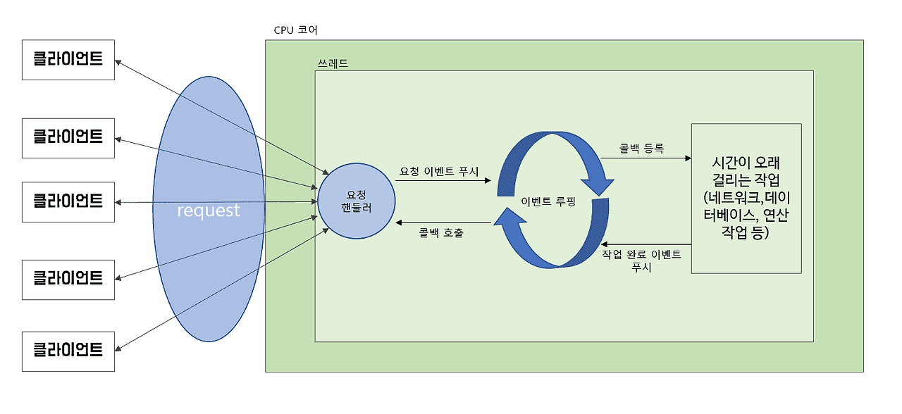
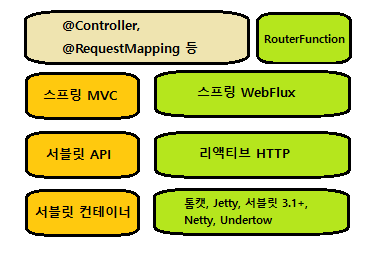

# 리액티브 API 개발하기
* 스프링 WebFlux는 스프링 MVC와 매우 유사하며, 적용하기 쉽다.

<br><br>
---

### 스프링 WebFlux 사용하기
* 서블릿 기반의 웹 프레임워크(= 스프링 MVC)
    * 매 연결마다 하나의 스레드를 사용함.
    * 스레드 블로킹(차단)과 다중 스레드로 수행됨.<br/>
    => 즉, 요청이 처리될 때 스레드 풀에서 작업 스레드를 가져와서 해당 요청을 처리하며, 작업 스레드가 종료될 때까지 요청 스레드는 블로킹된다.
    * 블로킹 웹 프레임워크 : 요청량의 증가에 따른 확장이 어려움. 처리가 느린 작업 스레드(해당 작업 스레드가 풀로 반환되어 또 다른 요청 처리를 준비하는데 더 많은 시간이 걸림)
* 비동기 웹 프레임워크(= 스프링 WebFlux)
    * 더 적은 수의 스레드(CPU 코어 당 하나)로 더 높은 확장성
    
    * 이벤트 루핑(event looping) 기법 적용 : 한 스레드당 많은 요청을 처리할 수 있어서 한 연결당 소요 비용이 더 경제적임.
    * 이벤트 루프에서는 모든 것이 이벤트로 처리됨 (집중적인 작업(ex)DB연결, 네트워크 작업)의 콜백&요청)
    * 비용이 드는 작업이 필요할 경우, 이벤트 루프는 해당 작업의 콜백(callback)을 등록하여 병행으로 수행되게 하고 다른 이벤트 처리로 넘어감. + 그리고 작업이 완료될 때 이것 역시 요청과 동일하게 이벤트로 처리됨.
    * 결과 : 비동기 웹 프레임워크는 소수의 스레드로 많은 요청을 처리할 수 있어서 스레드 관리 부담이 줄어들고 확장이 용이함.
    
##### 스프링 WebFlux 개요
* 스프링 WebFlux란 : 리액티브 프로그래밍 모델을 스프링 MVC에 억지로 집어넣는 대신 가능한 많은 것을 스프링 MVC로부터 가져와서 별도의 리액티브 웹 프레임워크를 만들기로 한것의 산물


* 스프링 MVC : 실행 시에 톰캣과 같은 서블릿 컨테이너가 필요한 자바 서블릿 API의 상위 계층에 위치함.
* 스프링 WebFlux : 새로운 웹 프레임워크로 리액티브 웹 애플리케이션을 지원함.(스프링 MVC의 많은 핵심 컴포넌트를 공유함.)
    * 서블릿 API와 연계되지 않음 => 따라서 리액티브 버전인 리액티브 HTTP API의 상위 계층에 위치함.
    * 서블릿 컨테이너를 필요로 하지 x : 대신에 블로킹이 없는 어떤 웹 컨테이너에서도 실행될 수 있다.
        * ex) Netty, Undertow, 톰캣, Jetty
    * 의존성 : <code>implementation 'org.springframework.boot:spring-boot-starter-webflux'</code>
    * 기본적인 내장 서버 : Netty
        * Netty : 비동기적인 이벤트 중심의 서버
    * 스프링 WebFlux의 컨트롤러 메서드는 도메인 타입이나 컬렉션 대신 **Mono나 Flux**같은 리액티브 타입을 인자로 받거나 반환한다. 또한, 스프링 WebFlux 컨트롤러는 Observable, Single, Completable과같은 RxJava 타입도 처리할 수 있음.
* @Controller, @RequestMapping : 스프링 MVC와 스프링 WebFlux 간의 공통적인 컴포넌트
* RouterFunction : 애노테이션을 사용하는 대신 **함수형 프로그래밍 패러다임**으로 컨트롤러를 정의하는 대안 프로그래밍 모델
> **리액티브 스프링 MVC**
> * 스프링 WebFlux 컨트롤러가 Mono나 Flux 같은 리액티브 타입을 반환함.
> * 스프링 MVC의 컨트롤러도 Mono나 Flux를 반환할 수 있음.
> * 차이점 : 그런 타입들이 사용되는 방법
>   * 스프링 WebFlux : 요청이 이벤트 루프로 처리되는 진정한 리액티브 웹 프레임워크
>   * 스프링 MVC : 다중 스레드에 의존하여 다수의 요청을 처리하는 서블릿 기반 웹 프레임워크

<br /><br />
**적용**
* 리액티브 웹 프레임워크의 장점을 극대화시키는 방법 : 엔드 - to - 엔드 리액티브 스택 구조
    * 클라이언트 <--(요청/응답)--> WebFlux 컨트롤러 <--(Flux/Mono)--> 서비스 <--(Flux/Mono)--> 리퍼지터리 <--(데이터 스트림)--> DB

```java
// 컨트롤러
    @GetMapping("/reactive/recent")
    public Flux<Order> recentOrdersReactive2(){
        return orderReactiveRepository.findAll().take(12);
    }

// 리퍼지터리
// => 리퍼지터리로부터 Flux<Order>와 같은 리액티브 타입을 받을 때 subscribe()을 프레임워크가 알아서 호출해주기 때문에 직접 호출할 필요 x
public interface OrderReactiveRepository extends ReactiveCrudRepository<Order, Long> {
}
```
```java
    /**
     * 스프링 WebFlux 사용한 방법 2 : repository에서 Flux 타입을 반환
     * */
    @GetMapping("/reactive/recent")
    public Flux<Order> recentOrdersReactive2(){
        return orderReactiveRepository.findAll().take(12);
    }

    // 단일값 반환
    @GetMapping("/reactive/{id}")
    public Mono<Order> orderByIdReactive(@PathVariable("id") Long id){
        return orderReactiveRepository.findById(id);
    }

        /**
     * 리액티브하게 입력 처리하기
     * * Mono<Order> order 를 인자로 받기
     * * saveAll()은 Flux<Order>를 반환하지만 .next()를 호출하여 Mono<Order>로 받을 수 있음.
     * */
    // 논블록킹 : Mono<Order> 를 인자로 받으므로 request 몸체로부터 Order 객체가 분석되는 것을 기다리지 않고 즉시 호출됨. + 라퍼지터리 또한 리액티브이므로 Mono를 받아 즉시 Flux<Order>를 반환함(이 Flux<Order>를 next()호출에서 Mono<Order>로 반환함.)
    @PostMapping(consumes = "application/json")
    @ResponseStatus(HttpStatus.CREATED)
    public Mono<Order> postOrderReactive(@RequestBody Mono<Order> order){
        return orderReactiveRepository.saveAll(order).next();
    }

```


<br><br>
---

### 함수형 요청 핸들러 정의하기
* 스프링 MVC의 애노테이션 기반 프로그래밍 모델의 단점
    * 애노테이션이 '무엇(what)'을 하는지와 '어떻게(how)'해야 하는지를 정의하는데 있는 괴리감.
        * '무엇' : 애노테이션 자체
        * '어떻게' : 프레임워크 코드 어딘가에 정의되어 있음.
        * 이로인해 프로그래밍 모델을 커스터마이징하거나 확장할 때 복잡해짐. => why? 이런 변경은 애노테이션 외부에 있는 코드로 작업해야 하기 때문에 (+ 중단점을 설정할 수 없다)
* WebFlux의 대안 : 스프링 5의 리액티브 API를 정의하기 위한 **새로운 함수형 프로그래밍 모델**. 프레임워크보다는 라이브러리 형태로 사용되며 애노테이션을 사용하지 않고 요청을 핸들러 코드에 연관 시킴
* 스프링 함수형 프로그래밍 모델을 사용한 API작성의 4가지 타입
    1. RequestPredicate : 처리될 요청의 종류 선언
    2. RouterFunction : 일치하는 요청이 어떻게 핸들러에게 전달되어야 하는지를 선언
    3. ServerRequest : HTTP 요청을 나타내며, 헤더와 몸체 정보를 사용할 수 있음.
    4. ServerResponse : HTTP 응답을 나타내며, 헤더와 몸체 정보를 포함함.

**적용**
```java
// 함수형 웹 프로그래밍 모델. OrderController과 동일한 기능을 함수형 방식으로 작성함.
@Configuration
@RequiredArgsConstructor
public class RouterFunctionConfig {

    private final OrderReactiveRepository orderReactiveRepository;

    @Bean
    public RouterFunction<?> routerFunction(){ // 요청 처리
        return route(GET("/order/recent"), this::recents) // 메서드 참조로 경로가 처리됨
                .andRoute(POST("/order"), this::postOrder);
    }

    public Mono<ServerResponse> recents(ServerRequest request){
        return ServerResponse.ok()
                .body(orderReactiveRepository.findAll().take(12), Order.class);
    }

    public Mono<ServerResponse> postOrder(ServerRequest request){
        Mono<Order> order = request.bodyToMono(Order.class);
        Mono<Order> savedOrder = orderReactiveRepository.saveAll(order).next();
        return ServerResponse
                .created(URI.create("http://localhost:8080/order/"+savedOrder.block().getId()))
                .body(savedOrder, Order.class);
    }
}

```


<br><br>
---

### 리액티브 컨트롤러 테스트하기
* WebTestClient : 스프링 WebFlux를 사용하는 리액티브 컨트롤러의 테스트를 쉽게 작성하게 해주는 새로운 테스트 유틸리티
* WebTestClient의 수용가능한 HTTP 메서드
    <table>
    <tr><td>HTTP 메서드</td><td>WebTestClient 메서드</td></tr>
    <tr><td>GET</td><td>.get()</td></tr>
    <tr><td>POST</td><td>.post()</td></tr>
    <tr><td>PUT</td><td>.put()</td></tr>
    <tr><td>PATCH</td><td>.patch()</td></tr>
    <tr><td>DELETE</td><td>.delete()</td></tr>
    <tr><td>HEAD</td><td>.head()</td></tr>
    </table>

**적용**
```java
    /**
     * GET 요청 테스트
     * */
    @Test
    public void shouldReturnRecentOrders(){
        Order[] orders = {
                testOrder(1L), testOrder(2L),
                testOrder(3L), testOrder(4L),
                testOrder(5L), testOrder(6L),
                testOrder(7L), testOrder(8L),
                testOrder(9L), testOrder(10L),
                testOrder(11L), testOrder(12L),
                testOrder(13L), testOrder(14L),
                testOrder(15L), testOrder(16L),
        };
        Flux<Order> orderFlux = Flux.just(orders); // 1. Flux 타입의 테스트 데이터 생성

        OrderRepository orderRepository = Mockito.mock(OrderRepository.class);
        OrderReactiveRepository orderReactiveRepository = Mockito.mock(OrderReactiveRepository.class);

        when(orderReactiveRepository.findAll()).thenReturn(orderFlux); // 2. 모의 OrderRepository의 반환값으로 Flux 제공

        WebTestClient testClient = WebTestClient // 3. WebTestClient 인스턴스가 생성됨.
                .bindToController(
                        new OrderController(orderRepository, orderReactiveRepository)
                )
                .build();

        testClient.get().uri("/order/recent") // WebTestClient를 생성함.
            .exchange() // 4. 가장 최근 order을 요청함
            .expectStatus().isOk() // 5. 우리가 기대한 응답인지 검사함.
            .expectBody()
                .jsonPath("$").isArray() // jsonPath() : 응답 몸체의 JSON이 기대한 값을 갖는지 검사함
                .jsonPath("$").isNotEmpty()
                .jsonPath("$[0].id").isEqualTo(orders[0].getId().toString())
                .jsonPath("$[0].name").isEqualTo("Order 1")
                .jsonPath("$[1].id").isEqualTo(orders[1].getId().toString())
                .jsonPath("$[1].name").isEqualTo("Order 2")
                // ...
                .jsonPath("$[12]").doesNotExist(); // doesNotExist() : 요소의 존재 여부 검사
    }

    public Order testOrder(Long id){
        return Order.builder().id(id).build();
    }


    /**
     * POST 요청 테스트
     * */
    @Test
    public void shouldSaveATaco(){
        OrderRepository orderRepository = Mockito.mock(OrderRepository.class);
        OrderReactiveRepository orderReactiveRepository = Mockito.mock(OrderReactiveRepository.class); // 1. 테스트 데이터 설정
        Mono<Order> unsavedOrderMono = Mono.just(testOrder(null));
        Order savedOrder = testOrder(null);
        savedOrder.updateId(1L);
        Mono<Order> savedOrderMono = Mono.just(savedOrder);

        when(orderReactiveRepository.save(any())).thenReturn(savedOrderMono); // 2. 모의 OrderRepository

        WebTestClient testClient = WebTestClient.bindToController(new OrderController(orderRepository,orderReactiveRepository)).build(); // WebTestClient를 생성함.

        testClient.post()
                .uri("/order")
                .contentType(MediaType.APPLICATION_JSON) // 3. 요청 타입 설정
                .body(unsavedOrderMono, Order.class)
                .exchange()
                .expectStatus().isCreated() // 4. 201(created) 상태 코드를 갖는지 확인
                .expectBody(Order.class)
                .isEqualTo(savedOrder);
    }
```

```java
/**
 * 실행 중인 서버로 테스트 하기
 * * Netty나 톰캣과 같은 서버 환경에서 리퍼지터리나 다른 의존성 모듈을 사용해서 WebFlux 컨트롤러를 테스트 필요 => WebTestClient의 통합 테스트
 * 
 * 
*/
// Netty나 톰캣과 같은 서버 환경에서 리퍼지터리나 다른 의존성 모듈을 사용해 WebFlux 컨트롤러 테스트 하기 => 통합 테스트
@RunWith(SpringRunner.class)
@SpringBootTest(webEnvironment = SpringBootTest.WebEnvironment.RANDOM_PORT) // 무작위 포트로 리스닝됨
public class OrderControllerTest_Server {

    @Autowired
    private WebTestClient testClient;

    @Test
    public void shouldReturnRecentOrders() throws IOException {
        testClient.get().uri("/order/recent")
                .accept(MediaType.APPLICATION_JSON).exchange()
                .expectStatus().isOk()
                .expectBody()
                    .jsonPath("$[?(@.id == 'TAC01')].name") // JSONPath 표현식 사용
                        .isEqualTo("Carnivore")
                    .jsonPath("$[?(@.id == 'TAC02')].name")
                        .isEqualTo("Bovine Bounty")
                    .jsonPath("$[?(@.id == 'TAC03')].name")
                        .isEqualTo("Veg-Out");

    }
}
```

<br><br>
---

### REST API를 리액티브하게 사용하기
* RestTemplate : 리액티브가 아닌 도메인 타입이나 컬렉션을 처리함.
    * 리액티브 방식으로 응답 데이터를 사용하고자 할 때, Flux나 Mono 타입으로 래핑해야 함.
    * 이미 Flux나 Mono 타입이 있으면 서 POST,PUT 요청으로 전송 시에는 요청 전에 리액티브가 아닌 타입으로 추출해야 함.
* WebClient : 리액티브 대안으로 <u>**외부 API로 요청할 때 리액티브 타입의 전송과 수신**</u>을 모두함.
    * 다수의 메서드로 서로 다른 종류의 요청 처리가 아닌, <u>WebClient는 요청을 나타내고 전송하게 해주는 빌더 방식의 인터페이스를 사용한다.</u>
    * WebClient를 사용하는 일반적인 패턴
        1. WebClient의 인스턴스를 생성(또는 WebClient 빈을 주입함)
        2. 요청을 전송할 HTTP 메서드를 지정함
        3. 요청에 필요한 URI와 헤더를 지정함.
        4. 요청 제출
        5. 응답을 사용(소비)함.


* WebClient 사용 방법
0. 기본 URI로 요청하기
    * WebClient 빈 생성 시 기본 URI를 포함하여 생성
    ```java
    @Bean
    public WebClient webClient() {
        return WebClient.create("http://localhost:8080");
    }

    @Autowired
    WebClient webClient;
    public Mono<Order> getOrderById(Long orderId){
        Mono<Order> orderMono = webClient
                .get()
                .uri("/orders/{id}", orderId)
                .retrieve()
                .bodyToMono(Order.class);

        orderMono.subscribe(i -> {
            //...
        });
        return null;
    }
    ```

0. 오래 실행되는 요청 타입아웃 시키기
    * 요청이 지체되는것을 방지하기 위해 Flux나 Mono의 timeout()을 사용해 데이터를 기다리는 시간을 제한하기
    ```java
    public void timeout(){
        Flux<Order> orderFlux = WebClient.create()
                .get()
                .uri("http://localhost:8080/orders")
                .retrieve()
                .bodyToFlux(Order.class);

        orderFlux
                .timeout(Duration.ofSeconds(1)) // 경과 시간 1초
                .subscribe(
                        i -> {
                            //...
                        },
                        e -> {
                            // handle timeout error
                        });
    }
    ```

1. 리소스 얻기(GET)
    ```java
    public void getMono(Long orderId){
        Mono<Order> orderMono = WebClient.create() // 1. create() : 새로운 WebClient 인스턴스 생성
                .get() // 2. 아래 uri에 대한 get요청 정의
                .uri("http://localhost:8080/orders/{id}", orderId)
                .retrieve() // 3. 해당 요청을 실행함.
                .bodyToMono(Order.class); // 4. 응답 몸체의 페이로드를 Mono<Order>로 추출함

        orderMono.subscribe(i -> { // 5. bodyToMono로부터 반환되는 Mono에 추가로 오퍼레이션 적용 시 해당 요청이 전송되기 전에 구독을 해야함
            //...
        });
    }
    ```

2. 리소스 전송하기
     * body()를 통해 요청 몸체에 넣는다.
     * body()를 통해 Mono나 Flux가 아닌 도메인 객체를 전송할 수 있다.
    ```java
    // post()
    public void postMono(){
        Mono<Order> orderMono = Mono.just(Order.builder().name("a").build());
        Mono<Order> result = webClient
                .post()
                .uri("/orders")
                .body(orderMono, Order.class)
                .retrieve()
                .bodyToMono(Order.class);

        result.subscribe(i -> {
            //...
        });
    }

    // 일반적으로 PUT 요청은 비어있는 응답 페이로드를 갖는다. 따라서 Void 타입의 Mono를 반환하도록 bodyToMono()에 요구해야 한다.
    public void putMono(Long orderId){
        Order order = Order.builder().name("a").build();
        Mono<Void> result = webClient
                .put()
                .uri("/orders/{id}", orderId)
                .body(order, Order.class)
                .retrieve()
                .bodyToMono(Void.class);

        result.subscribe(i -> {
            //...
        });
    }
    ```

3. 리소스 삭제하기
    ```java
    public void delete(Long orderId){
        Mono<Void> result = webClient
                .delete()
                .uri("/orders/{id}", orderId)
                .retrieve()
                .bodyToMono(Void.class);

        result.subscribe(i -> {
            //...
        });
    }
    ```

4. 에러 처리하기
    * 400번 대나 500번 대의 상태 코드를 갖는 응답 처리하기
    * onStatus() : 에러를 처리해야 할 때 호출하는 메서드 - 처리해야 할 HTTP 상태 코드를 지정할 수 있다.
    * onStatus(HTTP 상태와 일치시키는데 사용되는 조건 함수, Mono<Throwable>)
    ```java
        public void error(Long orderId){
        Mono<Order> orderMono = webClient
                .get()
                .uri("/orders/{id}", orderId)
                .retrieve()
                .bodyToMono(Order.class);

        orderMono.subscribe( //구독 필수
                order -> { /** orderId와 일치하는 식자재 리소스를 찾았을 때 */
                    // order 데이터 처리
                    // ...
                },
                error -> { /** orderId와 일치하는 식자재 리소스를 못 찾았을 때 : 404(NOT FOUND) */
                    // 에러를 처리 (default : WebClientResponseException 발생)
                    // ...

                }
        );
    }
    ```
    <br /><br />
    * **커스텀 에러 처리하기**
        * retrieve() 호출 후 onState() 호출
        * 커스텀 에러 핸들러 추가 시 HTTP 상태 코드를 우리가 선택한 Throwable로 변환하는 실행코드를 제공할 수 있음.
        * 응답으로 반환될 수 있는 다양한 HTTP 상태 코드 처리 시 onState() 호출을 여러 번 할 수 있다.
            *  ex ) order 리소스 요청에 실패 시 UnknownOrderException 에러를 포함하는 Mono로 생성하고 싶을 때
            *  ex ) HTTP 404 상태 코드를 검사하도록 onStatus()에서 확인하기
        ```java
            public void errorCustom(Long orderId){
            Mono<Order> orderMono = webClient
                    .get()
                    .uri("/orders/{id}", orderId)
                    .retrieve()
                    .onStatus(status -> status.is4xxClientError(), // true일 경우 하위 함수를 거쳐 Throwable 타입의 Mono를 반환함.
                            response -> Mono.just(new UnknownOrderException()))
                    .bodyToMono(Order.class);

            orderMono.subscribe( //구독 필수

            );
        }

        public void errorCustom2(Long orderId){
            Mono<Order> orderMono = webClient
                    .get()
                    .uri("/orders/{id}", orderId)
                    .retrieve()
                    .onStatus(status -> status == HttpStatus.NOT_FOUND,
                            response -> Mono.just(new UnknownOrderException()))
                    .bodyToMono(Order.class);

            orderMono.subscribe( //구독 필수

            );
        }
        ```

5. 요청 교환하기
    * retrieve() : ResponseSpec 타입의 객체를 반환함. => 간단한 상황에서는 좋지만 응답의 헤더나 쿠키값을 사용할 필요가 있을 떄는 처리할 수 없음.
    * exchangeToMono() : ClientResponse 타입의 Mono로 반환함. ClientResponse 타입은 리액티브 오페레이션을 적용할 수 있고, 응답의 모든 부분(페이로드, 헤더, 쿠키 등)에서 데이터를 사용할 수 있음.
    * 차이점
        * retrieve() : bodyToMono()를 사용해 Mono<Order>를 가져옴.
        * exchangeToMono() : exchangeToMono()를 사용해 ClientResponse를 통해 바로 Order클래스에 매칭함.
    ```java
    public void retrieveAndExchange(Long orderId){
        Mono<Order> orderMonoRetrieve = webClient
                .get()
                .uri("/orders/{id}", orderId)
                .retrieve()
                .bodyToMono(Order.class);

        Mono<Order> orderMonoExchange = webClient
                .get()
                .uri("/orders/{id}", orderId)
                .exchangeToMono(clientResponse -> clientResponse.bodyToMono(Order.class));

        // 구독 생략


        /**
         * * 요청의 응답에 true값을 갖는 X_UNAVAILABLE라는 이름의 헤더가 포함될 때
         */
        Mono<Order> orderMonoExchange2 = webClient
                .get()
                .uri("/orders/{id}", orderId)
                .exchangeToMono(clientResponse -> {
                    if(clientResponse.headers().header("X_UNVAILABLE").contains("true")){
                        return Mono.empty(); // 비어있는 Mono 반환
                    }
                    return clientResponse.bodyToMono(Order.class); // ClientResponse를 포함하는 새로운 Mono를 반환
                });
    }
    ```

<br><br>
---

### 리액티브 웹 API 보안
* 스프링 시큐리티의 웹 보안 모델 : 서블릿 필터를 중심으로 만들어짐.
    * 서블릿 필터의 사용 예제 : 요청자가 올바른 권한을 갖고 있는지 확인하기 위해 서블릿 기반 웹 프레임워크의 요청 바운드를 (클라이언트의 요청을 서블릿이 받기 전에) 가로채야 할 때
    * 스프링 WebFlux로 웹 애플리케이션을 작성 시 서블릿이 개입된다는 보장이 없음.
    * 실제로 리액티브 웹 애플리케이션은 Netty나 일부 다른 non-서블릿() 서버에 구축될 가능성이 많다.
* 스프링 WebFlux 애플리케이션의 보안에 서블릿 필터를 사용할 수 없는 것은 사실이다.
    * 하지만 5.0.0버전부터 스프링 시큐리티는 **서블릿 기반의 스프링 MVC**와 **리액티브 스프링 WebFlux** 애플케이션 모두의 보안에 사용될 수 있음.<br/>
    => 스프링의 WebFilter가 해당 역할을 함.
    * WebFilter : 서블릿 API에 의존하지 않는 스프링 특유의 서블릿 필터 같은 것
* 리액티브 스프링 시큐리티의 구성 모델은 스프링 시큐리티와 크게 다르지 않음.
    * 실제로 스프링 MVC와 다른 의존성을 갖는 스프링 WebFlux와는 다르게, <u>스프링 시큐리티는 스프링 MVC와 동일한 스프링 부트 보안 스타터에 사용</u>됨
    * 따라서, 스프링 MVC 웹 애플리케이션이나 스프링 WebFlux 애플리케이션 중 어디에 스프링 시큐리티를 사용하든 상관 x 
    ```java
    implementation 'org.springframework.boot:spring-boot-starter-security'
    ```
    * 스프링 시큐리티의 리액티브 구성 모델과 리액티브가 아닌 구성 모델 간에는 사소한 차이가 있음.

##### 리액티브 웹 보안 구성하기
* 스프링 MVC의 보안 구성 시 : 
    * WebSecurityConfigurerAdapter의 서브 클래스로 새로운 구성 클래스를 생성
    * 이 클래스에는 @EnableWebSecurity 애노테이션 지정.
    * 이 구성 클래스에서는 configuration() 메서드를 오버라이딩하여 요청 경로에 필요한 권한 등과 같은 웹 보안 명세를 지정함. 
    ```java
    // 리액티브가 아닌 스프링 MVC 애플리케이션의 보안 구성
    @Configuration
    @EnableWebSecurity
    public class SecurityConfig extends WebSecurityConfigurerAdapter {
        @Override
        protected void configure(HttpSecurity http) throws Exception {
            http
                .authorizeRequests()
                .antMatchers("/design", "/orders").hasAuthority("USER")
                .antMatchers("/**").permitAll();
        }
    }
    ```

* 스프링 WebFlux의 보안 구성 시 : 
    ```java
    // 스프링 WebFlux의 스프링 시큐리티 구성
    @Configuration
    @EnableWebFluxSecurity
    public class SecurityConfig {
        @Bean
        public SecurityWebFilterChain securityWebFilterChain(ServerHttpSecurity httpSecurity){
            httpSecurity
                .authorizeExchange(exchanges -> exchanges
                        .pathMatchers("/design","/orders").hasAuthority("USER")
                        .anyExchange().permitAll()
                );
            return httpSecurity.build();
        }
    }
    ```
    * <code>WebSecurityConfigurerAdapter</code>의 서브 클래스 x => configure() 오버라이딩 x
    * <code>SecurityWebFilterChain</code> 빈 선언
        * HttpSecurity 객체 대신 ServerHttpSecurity 객체를 사용해 구성을 선언함.<br/>
        => ServerHttpSecurity : HttpSecurity의 리액티브 버전
    
##### 리액티브 사용자 명세 서비스 구성하기
* 스프링 MVC의 보안 구성 시(명세 차이) :
    * 하나의 configure()메서드 : 오버라이딩하여 웹 보안 규칙 선언
    * 또 다른 configure() 메서드 : 오버라이딩하여 UserDetails 객체로 정의하는 인증 로직 구성 (=> 이 메서드 내부에서는 주입된 UserRepository 객체를 UserDetailsService에서 사용하여 사용자 이름으로 사용자를 찾는다.)
    ```java
    @Autowired 
    UserRepository userRepo;

    @Override
    protected void configure(AuthenticationManagerBuilder auth) throws Exception {
        auth
            .userDetailsService(new UserDetailsService(){
                @Override
                public UserDetails loadUserByUsername(String username) throws UsernameNotFoundException {
                    User user = userRepo.findByUsername(username);
                    if(user == null){
                        throw new UsernameNotFoundException(username + " not found");
                    }
                    return user.toUserDetails();
                }
            })
    }
    ```

* 스프링 WebFlux의 보안 구성 시(명세 차이) :
    * configure() 메서드를 오버라이딩하지 않고 대신 ReactiveUserDetailsService 빈을 선언함. <br/>
    => UserDetailssService의 리액티브 버전이며, UserDtailsService처럼 하나의 메서드만 구현하면 됨. <br/>
    => 특히, findByUsername() 메서드는 UserDetails 객체 대신 Mono&lt;userDetails&gt;를 반환함. <br/>
    => 따라서 Mono 타입에 사용 가능한 오퍼레이션들(ex.map())을 연쇄적으로 호출할 수 있음.
    ```java
    @Service
    public ReactiveUserDetailsService userDetailsService(UserRepository userRepository){
        return new ReactiveUserDetailsService() {
            @Override
            public Mono<UserDetails> findByUsername(String username) {
                return userRepository.findByUsername(username)
                        .map(user -> { // 람다로 전달하여 호출
                            return user.toUserDetails(); // 반환 타입 : Mono<UserDetails>
                        });
            }
        };
    }
    ```
    * 인자로 전달된 UserRepository를 사용하기 위해 ReactiveUserDetailsService 빈이 선언됨.


## 요약
* 스프링 WebFlux는 리액티브 웹 프레임워크를 제공함.
* 스프링 5는 스프링 WebFlux의 대안으로 함수형 프로그래밍 모델을 제공함.
* 리액티브 컨트롤러 테스트 : WebTestClient 사용
* 스프링 RestTemplate == 리액티브 버전의 WebClient
* 스프링 시큐리티 5는 리액티브 보안을 지원함 (스프링 MVC 애플리케이션의 프로그래밍 모델과 크게 다르지 않음.)


