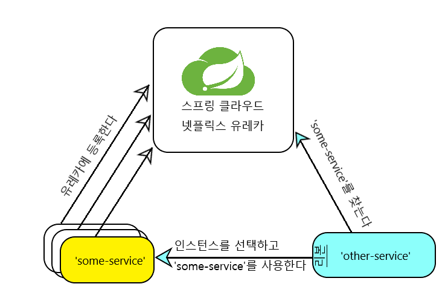
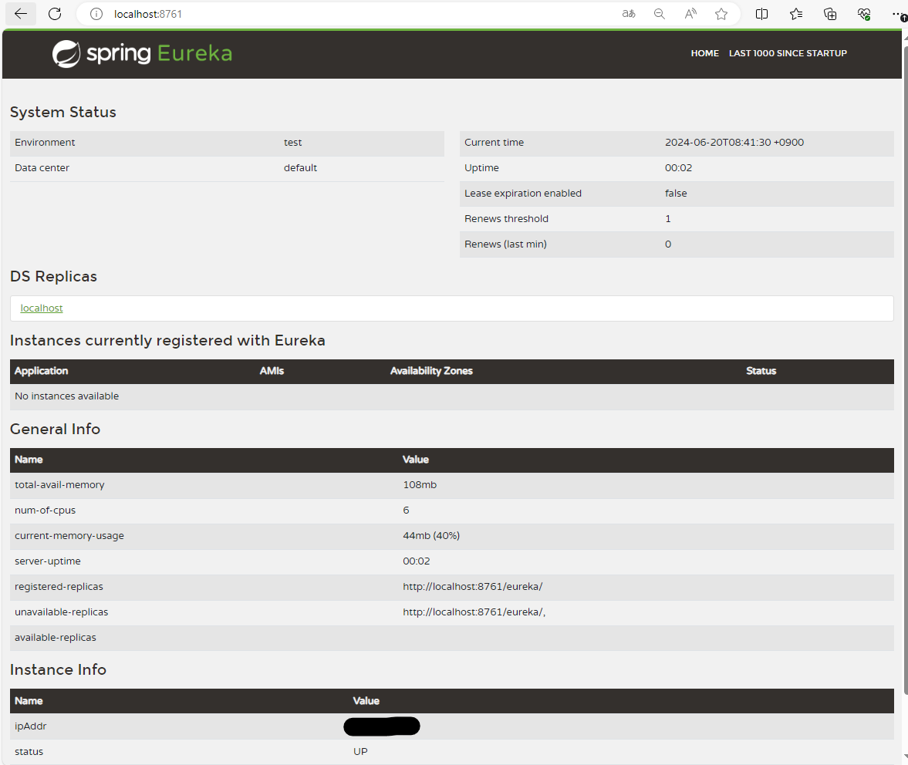
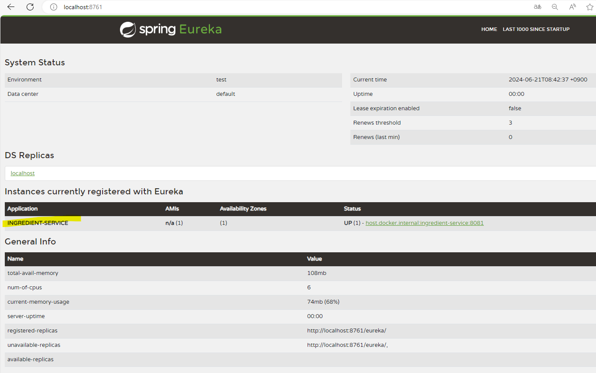
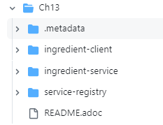

#  서비스 탐구하기
* 마이크로 서비스(micro service) : 하나의 완전한 애플리케이션 기능을 제공하기 위해 함께 동작하는 작고 독립적인 애플리케이션
* 스프링 클라우드의 가장 유용한 컴포넌트 : 유레카(Eureka), 리본(Ribbon)

<br><br>
---

### 마이크로 서비스 이해하기
* 단일 애플리케이션의 문제
    * 전체를 파악하기 어려움
    * 테스트가 더 어려움
    * 라이브러리 간의 충돌이 생기기 쉽다.
    * 확장 시에 비효율적이다.
    * 적용할 기술을 결정할 때도 애플리케이션 전체를 고려애햐 한다.
    * 프로덕션으로 이양하기 위해 많은 노력이 필요하다.

* 마이크로 서비스 아키텍처 : 개별적으로 개발되고 배포되는 소규모의 작은 애플리케이션들로 애플리케이션을 만드는 방법
    * 쉽게 이해할 수 있다 : 각 마이크로서비스는 작으면서 한정된 처리를 수행하며, 자신의 목적에만 집중하므로 더 이해하기 쉬워진다.
    * 테스트가 쉽다 : 크기가 작을 수록 테스트가 쉬움
    * 라이브러리 비호환성 문제가 생기지 않는다
    * 독자적인 규모를 조정할 수 있다 : 만약 특정 마이크로 서비스의 규모가 더 커야 한다면, 애플리케이션의 다른 마이크로 서비스에 영향을 주지 않고 메모리 할당이나 인스턴스의 수를 더 크게 조정할 수 있다.
    * 각 마이크로서비스에 적용할 기술을 다르게 선택할 수 있다. : 각 마이크로서비스에 사용할 프로그래밍 언어, 플랫폼, 프레임워크, 라이브러리를 서로 다르게 선택할 수 있다.
    * 마이크로 서비스는 언제든 프로덕션으로 이양할 수 있다 : 마이크로 서비스 아키텍처 기반으로 개발된 애플리케이션이 여러 개의 마이크로 서비스로 구성되었더라도 각 마이크로서비스를 따로 배포할 수 있다.

* 문제점
    * 마이크로서비스 아키텍처는 분산 아키텍처이므로 네트워크 지연과 같은 문제들이 발생할 수 있다.
    * 따라서 마이크로서비스 아키텍처를 고려할 때는 <u>마이크로 서비스로의 원격 호출이 많이 추가될수록 애플리케이션의 실행이 더 느려질 수 있다는 점</u>을 반드시 염두해 두어야 한다.

* 애플리케이션을 무조건 마이크로 서비스 아키텍처로 개발하는 것이 좋은 건 아니다.
* 마이크로서비스 아키텍처에서의 중요한 점 : 각 마이크로서비스가 자신과 같이 동작하는 다른 마이크로서비스를 어떻게 찾느냐
<br><br>
---

### 서비스 레지스트리 설정하기
* 서비스 레지스트리 : 이벤트 중심 및 API 아키텍처 전반에서 표준 이벤트 스키마 및 API 설계를 공유하기 위한 데이터 저장소
    * 레지스트리(Registry) : 공통으로 사용되는 이름 및 관련 정보들을 일원화해서 관리하는 조직
* 스프링 클라우드 : 마이크로 서비스 개발을 하는 데 필요한 여러 개의 부속 프로젝트들을 모음
* 스프링 넷플릭스 : 스프링 클라우드안의 한 프로젝트로, 이것은 넷플릭스 오픈 소스로부터 다수의 컴포넌트를 제공한다.
    * 이 컴포넌트 중에 넷플릭스 서비스 레지스트리인 유레카가 있음.

##### 유레카란?
* 유레카 : 마이크로서비스가 서로를 찾을 때 사용되는 서비스 레지스트리의 이름으로, <u>마이크로서비스 애플리케이션에 있는 모든 서비스의 중앙 집중 레지스트리</u>로 작동함.
    * 목적 : 유레카 자체도 마이크로서비스로 생각할 수 있으며, 더 큰 애플리케이션에서 서로 다른 서비스들이 서로를 찾는데 도움을 주는 것
    * 이러한 유레카의 역할 때문에 서비스를 등록하는 유레카 서비스 레지스트리를 가장 먼저 설정하는 것이 좋음.

* 유레카의 동작순서
    
    * 다른 서비스가 찾아서 사용할 수 있도록 각 서비스는 유레카 서비스 레지스트리에 자신을 등록함.
    1. 서비스 인스턴스가 시작될 때 해당 서비스는 자신의 이름을 유레카에 등록함("some-service"). => 해당 인스턴스는 여러 개 생성될 수 있지만 모두 같은 이름으로 유레카에 등록된다.
    2. 다른 서비스가 "some-service"를 사용해야 할 때, 유레카에서 "some-service"라는 이름을 찾으면 된다. "some-service"의 특정 호스트 이름과 포트 정보를 그대로 다른 서비스의 코드에 하드코딩하지 않는다. => 그러면 유레카는 모든 "some-service"인스턴스의 정보를 알려준다.
    * 다른 서비스는 여러 "some-service" 인스턴스 중 어떤 인스턴스를 사용할 지 결정해야 한다.
        * 이 때, 특정 인스턴스를 매번 선택하는 것을 피하기 위해 클라이언트 측에서 동작하는 로드 밸런싱(load-balancing) 알고리즘을 적용하는 것이 가장 좋다
        * 바로 이때 사용될 수 있는 것이 또 다른 넷플릭스 프로젝트인 리본이다.
    * "some-service"의 인스턴스를 찾고 선택하는 것은 다른 서비스가 해야 할 일이지만, 이것을 리본에게 맡길 수 있다.
        * 리본은 다른 서비스를 대신해 "some-service" 인스턴스를 선택하는 클라이언트 측의 로드 밸런서이다. 그리고 다른 서비스는 리본이 선택하는 인스턴스에 대해 필요한 요청을 하면 된다.

##### 클라이언트 측의 로드 밸런서를 사용하는 이유
* 로드 밸런서로는 주로 단일의 중앙 집중화된 서비스가 서버 측에서 사용됨.
* 리본 : 각 클라이언트에서 실행되는 클라이언트 측의 로드 밸런서
    * 장점
        * 각 클라이언트에 하나의 로컬 로드 밸런서가 있으므로 클라이언트 수에 비례하여 자연스럽게 로드 밸런서의 크기가 조정된다.
        * 서버에 연결된 모든 서비스에 획일적으로 같은 구성을 사용하는 대신, 로드밸런서는 각 클라이언트에 가장 적합한 로드 밸런싱 알고리즘을 사용하도록 구성할 수 있다.

##### 유레카 서버 생성하기
1. 유레카 스타터 의존성 추가
    ```gradle
    ext {
        set('springCloudVersion', "2023.0.2")
    }

    dependencies {
        implementation 'org.springframework.cloud:spring-cloud-starter-netflix-eureka-server'
        testImplementation 'org.springframework.boot:spring-boot-starter-test'
        testRuntimeOnly 'org.junit.platform:junit-platform-launcher'
    }

    dependencyManagement {
        imports {
            mavenBom "org.springframework.cloud:spring-cloud-dependencies:${springCloudVersion}"
        }
    }
    ```

2. 유레카 서버 활성화하기
    ```java
    @SpringBootApplication
    @EnableEurekaServer // 활성화 어노테이션
    public class ServiceRegistryApplication {

        public static void main(String[] args) {
            SpringApplication.run(ServiceRegistryApplication.class, args);
        }

    }
    ```

3. application.yml 설정
    ```yml
    eureka:
        client: # 현재 작업중인 서비스를 Eureka Client로 등록하지 않도록 설정 => Eureka Server 역할만 하도록 함
            register-with-eureka: false
            fetch-registry: false

    server:
        port: 8761
    ```

3. 유레카 웹 대시보드 : http://localhost:8080
    
    * 이 대시보드는 특히 어떤 서비스 인스턴스가 유레카에 등록되었는지 알려줌 => 확인용
    * 서비스가 등록되면 중앙의 Application에 메시지가 뜸 (현재는 아무 서비스도 등록이 안되어서 'No instances available' 메시지가 뜸) 
    * 유레카는 REST API도 제공하므로 서비스가 자신을 등록하거나 다른 서비스를 발견하기 위해 사용할 수 있다. (ex. 유레카 REST 엔드포인트로 접속하여 레지스트리의 모든 서비스 인스턴스 내역을 알 수 있음)
    * 유레카는 30초 정도에 한 번씩 각종 예외 메시지를 콘솔에 출력한다(잘 동작하고 있으니 개의치 말 것)

##### 유레카 구성하기
* 유레카 서버들이 클러스터(cluster)로 구성되어 하나보다는 여러 개의 유레카 서버가 함께 동작하는 것이 안전하다.
    * why? ) 여러 개의 유레카 서버가 있을 경우 그 중 하나에 문제가 발생하더라도 단일 장애점은 생기지 않기 때문에
    * 기본적으로 유레카는 다른 유레카 서비스로부터 서비스 레지스트리를 가져오거나 다른 유레카 서버의 서비스로 자신을 등록하기도 한다.
* 프로덕션(실무 환경) 설정에서는 유레카의 고가용성이 바람직함.
* 개발 시에는 유레카 서버가 1개만 있어도 충분하다.
    * 유레카 서버가 혼자임을 알도록 구성하는 법
        ```yml
        server:
            port: 8761 # 유레카가 실행되는 포트

        eureka:
            instance:
                hostname: localhost # 유레카가 실행되는 호스트 이름
            client:
                fetchRegistry: false # 유레카와 상호작용하는 방법을 알려주기 위해 다른 마이크로 서비스에 설정할 수 있는 속성들
                registerWithEureka: false # 유레카와 상호작용하는 방법을 알려주기 위해 다른 마이크로 서비스에 설정할 수 있는 속성들
                serviceUrl:
                    defaultZone: http://${eureka.instance.hostname}:${server.port}/eureka # 기본 유레카 url값
            server:
                enableSelfPreservation : false # 자체-보존 모드를 비활성화시키기
        ```
        * <code>eureka.client.fetchRegistry</code>, <code>eureka.client.registerWithEureka</code>(default : true) : 유레카와 상호작용하는 방법을 알려주기 위해 다른 마이크로 서비스에 설정할 수 있는 속성들
            * 즉, 해당 유레카 서버가 다른 유레카 서버로부터 레지스트리 정보를 가져오며, 다른 유레카 서버의 서비스로 자신을 등록해야한다는 것을 나타냄.
            * 예제에서는 다른 유레카 서버들이 필요 없기 때문에 두 속성의 값을 false로 설정한다. => 그래야지 해당 유레카가 다른 유레카 서버들과 통신하려고 하지 않기 때문에
        * <code>eureka.client.serviceUrl</code> : 영역(zone) 이름과 이 영역에 해당하는 하나 이상의 유레카 서버 URL을 포함하며, 이 값은 Map에 저장됨.
            * defaultZone : 클라이언트(ex. 유레카 자신)가 자신이 원하는 영역을 지정하지 않았을 때 사용됨.
        * <code>eureka.server.enableSelfPreservation</code> : <u>자체-보존 모드를 비활성화시키기</u>
            * 유레카 서버는 서비스 인스턴스가 자신을 등록하고 등록 갱신 요청을 30초마다 전송하기를 기대한다. (해당 서비스가 살아있어서 사용할 수 있는지 확인하기 위함.)
            * 일반적으로 3번의 갱신 기간(90초)동안 서비스 인스턴스로부터 등록 갱신 요청을 (유레가 서버가)받지 못하면 해당 서비스 인스턴스의 등록을 취소하게 된다. <br/>
            => 레지스트리에서 삭제되어 해당 서비스 인스턴스를 사용할 수 없게 됨.<br/>
            => 이렇게 중단되는 서비스의 수가 임계값(threshold)을 초과하면 유레카 서버는 네크워크 문제가 생긴 것으로 간주하고 레지스트리에 등록된 나머지 서비스 데이터를 보존하기 위해 자체-보존(self-preservation) 모드가 된다.<br/>
            => 따라서 추가적인 서비스 인스턴스의 등록 취소가 방지된다.
            * 상용에서는 자체-보존 모드를 true로 설정하는 것이 좋다 => why?) 실제로 네트워크 문제가 생겨서 유레카로의 갱신 요청이 중단되었을때 나머지 활성화된 서비스들의 등록 취소를 방지할 수 있기 때문에
                * 하지만 아직 어떤 서비스도 등록되지 않았을 때는 false로 설정해 해당 속성을 비활성화시킬 수 있다. 
            * 네트워크 문제 외에도 여러 가지 이유로 유레카가 갱신 요청을 받을 수 없는 개발 환경에서는 이 속성을 false로 설정하는 것이 유용하며, true로 설정 시 서비스 인스턴스들의 상태가 자주 변경될 수 있는 개발 환경이라서 중단된 서비스의 등록이 계속 유지되어 다른 서비스가 해당 서비스를 사용하려고 할 때 문제를 발생시킬 수 있다.

##### 유레카 확장하기
* 개발 시에는 단일 유레카 인스턴스가 더 편리하지만, 애플리케이션을 상용으로 배포할 때는 고가용성을 위해 최소한 2개의 유레카 인스턴스를 가져야 한다.

* 상용(production) 환경의 스프링 클라우드 서비스
    * 마이크로서비스를 상용 환경으로 배포할 경우 고려해야 할 것 : 유레카의 고가용성과 보안
    * 2개 이상의 유레카 인스턴스를 구성하는 방법 : application.yml에 <u>스프링 프로파일을 지정</u>하고 한 번에 하나씩 프로파일을 사용해서 <u>유레카를 2번 시작시키기</u>
        ```yml
        # 기본 프로파일
        eureka:
            client:
                serviceUrl:
                    defaultZone: http://${other.eureka.host}:${other.eureka.port}/eureka/

        ---
        # euraka-1 프로파일
        spring:
            profiles: eureka-1
            application:
                name: eureka-1

        server:
            port: 8761

        eureka:
            instance:
                hostname: eureka1.tacocloud.com

        other: # 다른 유레카 인스턴스를 참조하기 위해
            eureka:
                host: eureka2.tacocloud.com
                port: 8762

        ---
        # euraka-2 프로파일
        spring:
            profiles: eureka-2
            application:
                name: eureka-2

        server:
            port: 8762

        eureka:
            instance:
                hostname: eureka2.tacocloud.com

        other: # 다른 유레카 인스턴스를 참조하기 위해
            eureka:
                host: eureka1.tacocloud.com
                port: 8761
        ```
        * 참조하는 다른 유레카 인스턴스가 있을 경우에는 <code>eureka.client.fetchRegistry</code>, <code>eureka.client.registerWithEureka</code>를 설정하지 않는다 (default : true)<br/>
        => 따라서 각 유레카 서버가 다른 유레카 서버에 자신을 등록하고 레지스트리의 등록 정보를 가져온다.

<br><br>
---

### 서비스 등록하고 찾기 => client 쪽
* 마이크로 서비스가 유레카 서비스 레지스트리에 자신을 등록하고 다른 서비스를 찾아서 호출하는 방법
* 우리 서비스를 다른 서비스에서 찾아 사용하게 하려면, 유레카 서비스 레지스트리의 클라이언트로 활성화시켜야 한다. => 즉, 애플리케이션을 서비스 레지스트리 클라이언트로 활성화시키기 위해서는 유레카 클라이언트 스타터 의존성을 추가해야 한다.
    * 유레카 클라이언트 스타터 의존성 추가하기
        ```gradle
        ext {
            set('springCloudVersion', "2023.0.2")
        }

        dependencies {
            implementation 'org.springframework.boot:spring-boot-starter-web'
            implementation 'org.springframework.cloud:spring-cloud-starter-netflix-eureka-client'
            testImplementation 'org.springframework.boot:spring-boot-starter-test'
            testRuntimeOnly 'org.junit.platform:junit-platform-launcher'
        }

        dependencyManagement {
            imports {
                mavenBom "org.springframework.cloud:spring-cloud-dependencies:${springCloudVersion}"
            }
        }
        ```
        * 해당 의존성 지정 시 유레카를 이용해 서비스를 찾는데 필요한 모든 것이 자동으로 추가됨. (ex. 유레카의 클라이언트 라이브러리, 리본 로드 밸런서..)<br/>
        => 따라서 우리 애플리케이션을 유레카 서비스 레지스트리의 클라이언트로 활성화 시킬 수 있다.<br/>
        => 즉, 애플리케이션이 시작되면 8761포트로 서비스하는 유레카 서버에 연결하고, UNKNOWN이라는 이름으로 유레카에 애플리케이션 자신을 등록한다.

##### 유레카 클라이언트 속성 구성하기
* 서비스의 기본 이름은 UNKNOWN을 그대로 두면 유레카 서버에 등록되는 모든 서비스 이름이 같게 되므로 <code>spring.application.name</code>을 이용해 변경하기
    ```yml
    spring:
        application:
            name: ingredient-service # 이 값으로 유레카 서버에 등록된다.

    server:
        port: 0 # 서비스의 포트 충돌을 막기 위한 무작위 포트 번호 선택
    eureka:
        client:
            serviceUrl:
                defaultZone: http://localhost:8761/eureka/ # 개발 시에는 유용함. but 상용에서는 좋지 않다.
                defaultZone: http://eureka1.tacocloud.com:8761/eureka/,
                            http://eureka2.tacocloud.com:8762/eureka/ # 상용 시 : 유레카 서버의 중단으로 인해 클라이언트 서비스가 등록되지 않도록 2개 이상의 유레카 서버를 사용하도록 클라이언트 서비스를 구성하는게 좋음
                            # 2개 이상일 경우 첫번째 유레카 서버에 등록 시도 -> 등록 실패 시 두번째 피어(peer)로 지정된 유레카 서버의 레지스트리에 등록을 시도 -> 이후에 등록에 실패했던 유레카 서버가 다시 온라인 상태가 되면 해당 서비스의 등록 정보가 포함된 피어 서버 레지스트리가 복제됨.
    ```
    

##### 서비스 사용하기 (사용하는 쪽 : consumer)
* 서비스를 사용하는 컨슈머(consumer) 코드에 해당 서비스 인스턴스의 URL을 하드코딩하면 x
    * why? 1) 사용되는 서비스의 특정 인스턴스와 해당 컨슈머가 밀접하게 결합됨
    * why? 2) 사용되는 서비스의 호스트나 포트가 변경될 경우 해당 컨슈머의 실행 중단을 초래할 수 있음
* 유레카 서버에서 서비스를 찾을 때 컨슈머 애플리케이션의 할 일 : 
    * ex) 같은 서비스의 인스턴스가 여러개일 때도 유레카 서버는 서비스 검색에 응답하는데 이 때, 6개 정도의 서비스 인스턴스가 반환된다면 적합한 서비스의 선택은 어떻게 진행되는가?
    * 컨슈머 애플리케이션은 자신이 서비스 인스턴스를 선택하지 않아도 되며, 특정 서비스 인스턴스를 명시적으로 찾을 필요도 없다.<br>
    => why? ) 리본 클라이언트 로드 밸런서를 사용하여 서비스 인스턴스를 쉽게 찾아 선택하고 사용할 수 있기 때문에

* 유레카 서버에서 찾은 서비스를 선택 및 사용하는 방법
    * 로드 밸런싱된 RestTemplate : [이동](#RestTemplate-사용해서-서비스-사용하기)
    * 로드 밸런싱된 WebClient : [이동](#WebClient로-서비스-사용하기)
    * Feign에서 생성된 클라이언트 인터페이스 : [이동](#Feign-클라이언트-인터페이스-정의하기)
    
###### **RestTemplate 사용해서 서비스 사용하기**
* GET 요청
    * 일반적인 예제
        ```java
        public Ingredient getIngredientById(String ingredientId){
            return rest.getForObject("http://localhost:8080/ingredients/{id}", Ingredient.class, ingredientId);
        }
        ```
    * 유레카 클라이언트로 애플리케이션을 활성화 시 RestTemplate 빈을 선언
        ```java
        @Bean
        @LoadBalanced // 목적 1 : 현재의 RestTemplate이 리본을 통해서만 서비스를 찾는다는 것을 스프링 클라우드에 알려준다.
        // 목적 2 : 주입 식별자(서비스 이름)로 동작함 - getForObject() 메서드의 HTTP요청에서 호스트와 포트 대신 사용할 수 있음.
        public RestTemplate restTemplate(){
            return new RestTemplate();
        }
        ```
        ```java
        // ex) 식자재를 찾기 위해 로드 밸런싱된 RestTemplate을 사용하기 (service명 : ingredient-service)
        @Component
        public class IngredientServiceClient{
            private RestTemplate rest;

            public IngredientServiceClient(@LoadBalanced RestTemplate rest){ // 로드밸런싱된 RestTemplate을 필요로 하는 빈에 주입하기
                this.rest = rest;
            }

            public Ingredient getIngredientById(String ingredientId){
                return rest.getForObject(
                    "http://ingredient-service/ingredients/{id}", // 해당 서비스의 등록된 이름 사용
                    Ingredient.class, ingredientId); 
            }

        }
        ```
        * 일반적인 경우와의 차이점 : URL에 특정 호드트 이름과 포트를 사용하지 않는다.<br>
        => 즉, 호스트 이름과 포트 대신 서비스 이름인 ingredient-service가 사용됨.<br>
        => 흐름 : RestTemplate이 리본에 'ingredient-service'라는 서비스 이름을 찾아 인스턴스를 선택하도록 요청함. -> 그리고 선택된 서비스 인스턴스의 호스트와 포트 정보를 포함하도록 리본이 URL을 변경한 후 원래대로 RestTemplate이 사용됨.

* 로드 밸런싱된 RestTemplate을 사용하는 방법의 차이 : 클라이언트 코드에서 호스트 이름과 포트 대신 서비스 이름으로 처리할 수 있다는 것뿐
    
###### **WebClient로 서비스 사용하기**
* Flux와 Mono같은 reactive 타입과 함 께 동작하여 HTTP 클라이언트를 제공하는 방법
* 로드밸런싱된 WebClient 사용하기
    1. <code>@LoadBalanced</code>이 지정된 WebClient.Builder 빈 메서드 선언
        ```java
        @Bean
        @LoadBalanced
        public WebClient.Builder webClientBuilder(){
            return WebClient.builder();
        }
        ```
    2. 로드 밸런싱된 WebClientBuilder를 필요로 하는 빈에 주입 + 유레카에 등록된 서비스 이름(ingredient-service)을 사용해 요청
        ```java
        @Component
        public class IngredientServiceClient{
            private WebClient.Builder wcBuilder;

            public IngredientServiceClient(@LoadBalanced WebClient.Builder wcBuilder){
                this.wcBuilder = wcBuilder;
            }

            public Mono<Ingredient> getIngredientById(String ingredientId){
                return wcBuilder.build()
                    .get()
                    .uri("http://ingredient-service/ingredients/{id}", ingredientId)
                    .retrieve().bodyToMono(Ingredient.class);
            }
        }
        ```
        * 호스트나 포트를 정할 필요가 없음<br>
        => 즉, 해당 서비스 이름이 URL에서 추출되어 유레카에서 서비스를 찾는데 사용되고, 리본이 해당 서비스의 인스턴스를 선택한 후 선택된 인스턴스의 호스트와 포트로 URL이 변경되어 요청이 수행된다.

###### **Feign 클라이언트 인터페이스 정의하기**
* Feign을 사용해서 인터페이스 기반의 서비스 클라이언트를 생성하는 방법
* Feign : REST 클라이언트 라이브러리이며, 인터페이스를 기반으로 하는 방법을 사용해서 REST 클라이언트를 정의한다. (스프링 데이터가 repository 인터페이스를 자동으로 구현하는 것과 유사함)
* 사용하는 법
    1. 의존성 추가
        ```gradle
        implementation 'org.springframework.cloud:spring-cloud-starter-openfeign'
        ```
    2. <code>@EnableFeignClients</code> 애노테이션 추가
        ```java
        @Configuration
        @EnableFeignClients
        public RestClientConfiguration{

        }
        ```
    3. Feign 사용 => ex) 'ingredient-service'라는 이름으로 유레카에 등록된 서비스를 사용해서 식자재를 가져오는 클라이언트를 작성하고 싶을 때 : 인터페이스만 정의하면 됨.
        ```java
        package tacos.ingredientclient.feign;

        import org.springframework.cloud.openfeign.FeignClient;
        import org.springframework.web.bind.annotation.GetMapping;
        import org.springframework.web.bind.annotation.PathVariable;

        import tacos.ingredientclient.Ingredient;

        @FeignClient("ingredient-service") // 하위 메소드들은 모두 해당 서비스에 대한 요청을 나타낸다. 내부적으로 'ingredient-service'는 리본을 통해 찾게 된다.
        public interface IngredientClient {

            @GetMapping("/ingredients/{id}") // 컨트롤러 대신 클라이언트에 지정되는 것 => 즉, getIngredient()를 호출하면 리본이 선택한 호스트와 포트의 '/ingredients/{id}'경로로 HTTP GET 요청을 수행하는 것을 나타냄
            Ingredient getIngredient(@PathVariable("id") String id);

            @GetMapping("/ingredients")
            Iterable<Ingredient> getAllIngredients();

        }
        ```
        * 구현 코드가 없는 간단한 인터페이스지만 런타임 시에 Feign이 이 인터페이스를 찾으므로 아무 문제가 없다. 그리고 Feign이 자동으로 구현 클래스를 생성한 후 스프링 애플리케이션 컨텍스트에 빈으로 노출시킨다.

    4. 3의 직접 정의하고 Feign을 구현한 IngredientClient 인터페이스를 필요로 하는 곳에 주입 및 사용하기
        ```java
        @Controller
        @RequestMapping("/ingredients")
        @Profile("feign")
        @Slf4j
        public class IngredientController {

            private IngredientClient client;

            public IngredientController(IngredientClient client) {
                this.client = client;
            }
            
            @GetMapping
            public String ingredientList(Model model) {
                log.info("Fetched all ingredients from a Feign client.");
                model.addAttribute("ingredients", client.getAllIngredients());
                return "ingredientList";
            }
            
            @GetMapping("/{id}")
            public String ingredientDetailPage(@PathVariable("id") String id, Model model) {
                log.info("Fetched an ingredient from a Feign client.");
                model.addAttribute("ingredient", client.getIngredient(id));
                return "ingredientDetail";
            }
        
        }
        ```
* Feign에는 자신의 어노테이션인 <code>@RequestLine</code>과 <code>@Param</code>이 있다.

* RestTemplate, WebClient, Feign의 공통점 : 특정 호스트 이름이나 포트를 하드코딩하지 않고 유레카에 등록된 서비스를 이름으로 사용함. => 3개 중에 어느 것이 가장 좋을지 결정하기는 어려움


<br><br>
---

### 마이크로 서비스 관련 프로젝트의 빌드 및 실행하기
1. 작업 영역 디렉터리에 생성한 .metatdata 서브 디렉터리 삭제<br>
    
    * ingredient-service : 식자재 CRUD 마이크로서비스 application
    * servicer-registry : 유레카 서버를 사용해 마이크로서비스를 등록하고 찾아주는 서비스 레지스트리
    * ingredient-client : ingredient-service를 사용하는 클라이언트 application
2. 각각 따로 빌드하고 실행하기
    1. 'service-registry'의 clean + bootjar(jar)
    2. 'ingredient-service'의 clean + bootjar(jar)
    3. 'ingredient-client'의 clean + bootjar(jar)
    4. <code>java -jar build/libs/service-registry-0.0.1-SNAPSHOT.jar</code> => 8761 포트
    4. <code>java -jar build/libs/ingredient-service-0.0.1-SNAPSHOT.jar</code> => 무작위 포트
    4. <code>java -jar build/libs/ingredient-client-0.0.1-SNAPSHOT.jar</code> => 8080 포트


## 요약
* 스프링 클라우드 넷플릭스는 자동-구성과 <code>@EnableEurekaServer</code>를 사용해 넷플릭스 유레카 서비스 레지스트리를 쉽게 생성할 수 있다.
* 마이크로서비스는 이름을 사용해서 자신을 유레카 서버에 등록하여 다른 서비스가 찾을 수 있도록 한다.
* 리본은 클라이언트 측의 로드 밸런서로 동작하면서, 서비스 이름으로 서비스 인스턴스를 찾아 선택한다.
* 리본 로드 밸런싱으로 처리되는 RestTemplate나 Feign에 의해 자동으로 구현되는 인터페이스를 사용해서 클라이언트 코드는 자신의 REST 클라이언트를 정의할 수 있다.
* 로드 밸런싱된 RestTemplate, WebClient, Feign 클라이언트 인터페이스 중 어느 것을 사용하더라도 서비스의 위치(호스트 이름+포트)가 클라이언트 코드에 하드코딩되지 않는다.