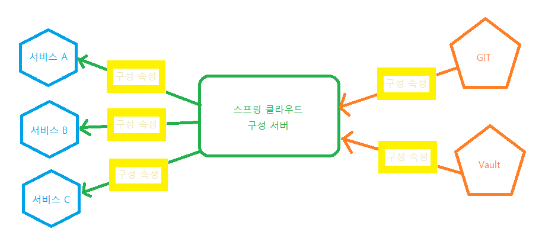
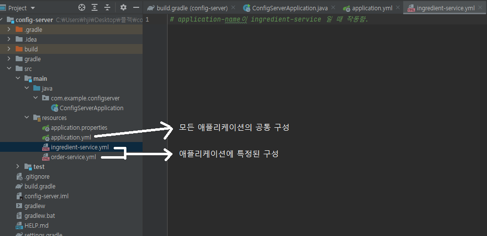
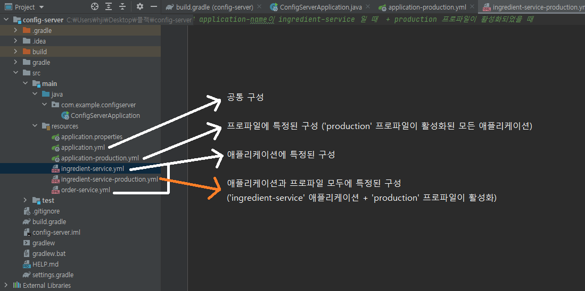
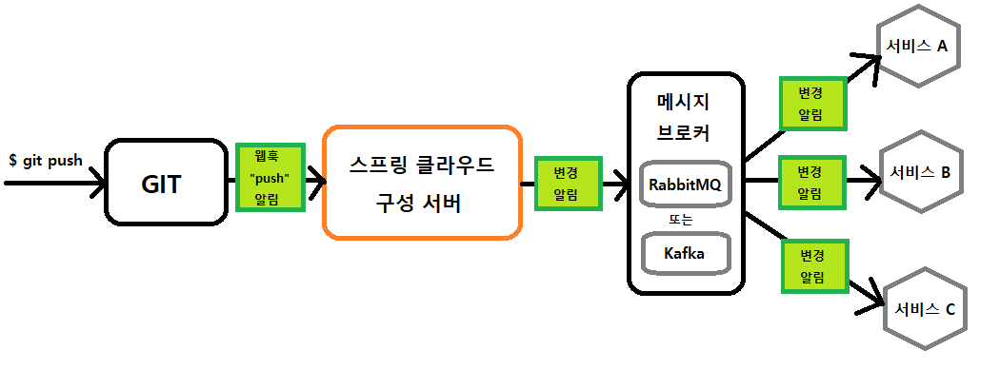
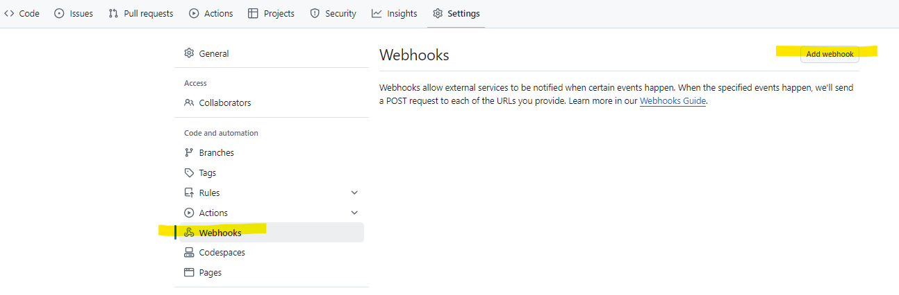
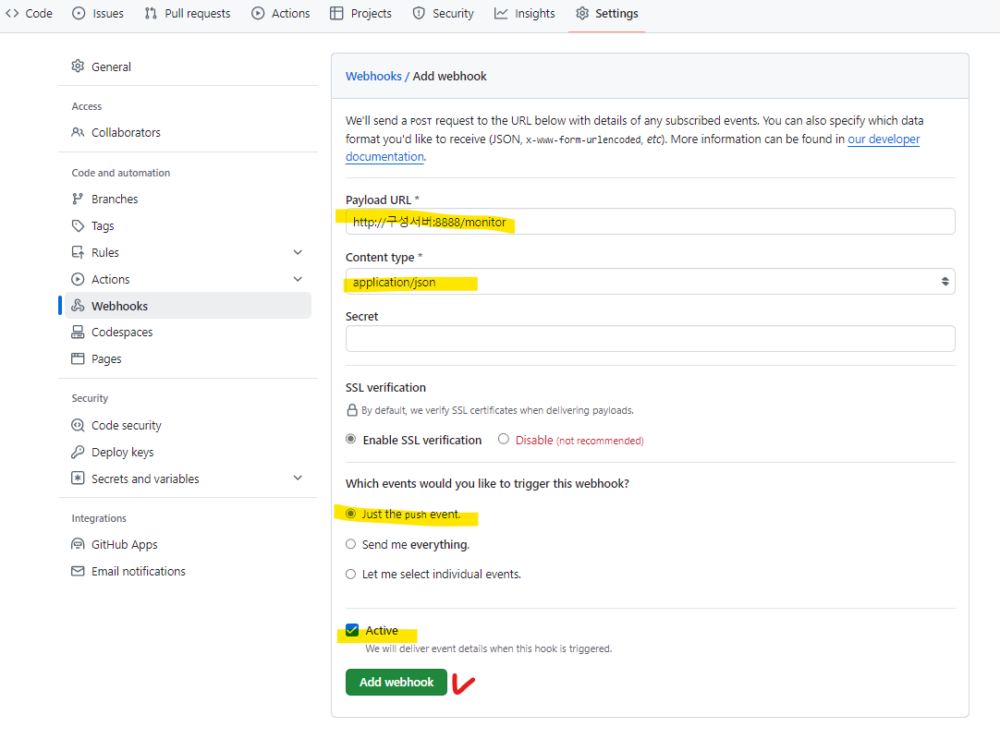

#  클라우드 구성관리
* 스프링 부트 애플리케이션의 구성 속성은 application.yml 파일에 구성 속성을 지정하면 됨.
* 하지만 마이크로서비스로 애플리케이션을 구축할 때는 여러 마이크로서비스에 걸쳐 동일한 구성 속성이 적용되므로 문제가 될 수 있다.
* 스프링 클라우드의 구성 서버(Config Server) : 애플리케이션의 모든 마이크로서비스에 대해 중앙 집중식의 구성을 제공함. => 따라서 <u>구성 서버를 사용하면 애플리케이션의 모든 구성을 한 곳에서 관리할 수 있음.</u>

* 구성 서버 : application.yml이 있는 1대의 서버
* 클라이언트 : 구성서버를 사용하는 개별 서버

<br><br>
---

###  구성 공유하기
* 간단한 애플리케이션의 경우 : 구성 속성이 런타임 환경을 변경하거나 런타임 환경에 고유한 것이어야 한다면, <u>자바 시스템 속성이나 운영체제의 환경 변수</u>를 구성 속성으로 사용하는 것이 좋음. 그 외에 값이 변경될 가능성이 거의 없고 애플리케이션에 특정되는 속성의 경우는 application.yml이나 application.properties 사용하기. 
<br>=> 단점 : 해당 속성의 변경으로 인해 재시작하여 다시 빌드 후 배포해야 한다.

* 중앙 집중식 구성으로 관리 시
    * 구성이 애플리케이션 코드에 패키징되어 패포되지 않음. => 따라서, 애플리케이션을 다시 빌드하거나 배포하지 않고 구성을 변경하거나 원래 값으로 환원할 수 있다. 그리고 애플리케이션을 다시 시작하기 않아도 실행 중에 구성을 변경할 수 있다.
    * 공통적인 구성을 공유하는 마이크로서비스가 자신의 속성 설정으로 유지&관리하지 않고도 동일한 속성들을 공유할 수 있다. => 속성 변경 필요 시 한 곳에서 한번만 변경해도 모든 마이크로 서비스에 적용할 수 있음
    * 보안에 민감한 구성 속성은 애플리케이션 코드와는 별도로 암호화하고 유지&관리할 수 있음. 그리고 복호화된 속성 값을 언제든지 애플리케이션에서 사용할 수 있으므로 복호화를 하는 코드가 애플리케이션에 없어도 됨

* 스프링 클라우드 구성 서버는 애플리케이션의 모든 마이크로 서비스가 구성에 의존할 수 있는 서버를 사용해서 중앙 집중식 구성을 제공한다.<br>
=> <u>따라서 모든 서비스에 공통된 구성은 물론이고, 특정 서비스에 국한된 구성도 한 곳에서 관리할 수 있다.</u> 

<br><br>
---

### 구성 서버 실행하기
* 스프링 클라우드 구성 서버 : 집중화된 구성 데이터 소스를 제공함
    * 유레카처럼 더 큰 애플리케이션의 마이크로서비스로, <u>같은 애플리케이션에 있는 다른 서비스들의 구성 데이터를 제공</u>하는 역할
        * 구성 서버를 통헤 제공되는 구성 데이터는 구성 서버의 외부(Git)에 저장됨.<br/>
        => Git(소스 코드 제어 시스템)에 구성 속성을 저장함으로써 애플리케이션 소스 코드처럼 구성 속성의 버전, 분기 등을 관리할 수 있다.<br/>
        => But, 구성 속성을 사용하는 애플리케이션과 별도로 구성 속성을 유지&관리하므로 <u>애플리케이션과 독립적으로 버전을 관리</u>할 수 있음.
    * 클라이언트가 되는 <u>다른 서비스들이 구성 속성을 사용할 수 있도록 REST API 제공</u>

* 스프링 클라우드 구성 서버는 Git 이나 Vault(볼트)를 백엔드로 사용해서 구성 속성을 제공함.
    
    * Vault(from 해시코프) : 보안 처리된 구성 속성을 유지&관리할 때 특히 유용함

##### 구성 서버 활성화하기
* 구성 서버는 별개의 애플리케이션으로 개발되어 배포된다.
* 설정 방법
    1. 의존성 추가
        ```gradle
        plugins {
            id 'java'
            id 'org.springframework.boot' version '3.0.13'
            id 'io.spring.dependency-management' version '1.1.6'
        }
        ...
        ext {
        //    set('springCloudVersion', "2023.0.3")
            set('springCloudVersion', "Hoxton.SR3")
        }

        dependencies {
            implementation 'org.springframework.cloud:spring-cloud-config-server'
            testImplementation 'org.springframework.boot:spring-boot-starter-test'
            testRuntimeOnly 'org.junit.platform:junit-platform-launcher'
        }

        dependencyManagement {
            imports {
                mavenBom "org.springframework.cloud:spring-cloud-dependencies:${springCloudVersion}"
            }
        }
        ...
        ```

    2. 활성화 애노테이션 추가 : <code>@EnableConfigServer</code>
        ```java
        @SpringBootApplication
        @EnableConfigServer
        public class ConfigServerApplication {
            ...
        }
        ```

    3. 구성 속성들이 있는곳(구성 리퍼지터리)을 알려주기
        * 2개 다 설정해 놓아야함
        * github의 경우 : 중앙 저장소의 경우
        ```yml
        # github의 경우(중앙 저장소)
        spring:
            cloud:
                config:
                    server:
                        git:
                            uri: https://github.com/habuma/tacocloud-config.git

        server:
        port: 8888 # 구성 서버의 클라이언트가 구성 서버로부터 구성 데이터를 가져올 때 사용하는 기본 포트 번호
        # 구성 서버의 클라이언트 서비스에서도 같은 번호 사용해야함
        # 구성 서버가 클라이언트에 제공하는 구성 속성은 Git이나 Vault의 리퍼지터리에서 가져옴
        ```

        * <b>Git 하위 경로로 구성 속성 저장하기</b>
        ```yml
        spring:
            cloud:
                config:
                    server:
                        git:
                            uri: http://localhost:10080/tacocloud/tacocloud-config
                            search-paths: config # config라는 서브 디렉토리에 구성 속성을 저장할 때

                            # search-paths: config, moreConfig # 복수 가능
                            # search-paths: config, more* # 와일드 카드 사용 가능
        ```

        * <b>Git 리포지토리의 분기나 라벨에 구성 속성 저장하고 제공하기</b>
        ```yml
        # 기본적으로는 master 분기에서 구성 속성을 가져옴
        spring:
            cloud:
                config:
                    server:
                        git:
                            uri: http://localhost:10080/tacocloud/tacocloud-config
                            default-label: sidework # sidework로 기본 라벨이나 분기가 변경됨

        ```

        * <b>Git 백엔드를 사용한 인증</b>
        ```yml
        # 구성 서버가 읽는 백엔드 Git 리포지토리는 사용자 이름과 비밀번호로 인증될 수 있음.
        spring:
            cloud:
                config:
                    server:
                        git:
                            uri: http://localhost:10080/tacocloud/tacocloud-config
                            username: username
                            password: 123456

        ```

    4. 구성 서버 실행 후 테스트
    * 구성 서버는 REST API를 통해서 구성 속성을 제공한다.
    * 구성 서버의 클라이이언트가 작성되지 않았을 때 테스트 방법
    * <code>curl localhost:8888/application/default</code>
        1. localhost:8888 : 구성 서버의 호스트 이름과 포트
        2. application : 애플리케이션 이름(spring.application.name)
        3. default : 활성화된 스프링 프로파일
        4. master : Git 라벨/분기 (생략 가능)
    * 결과
        ```json
        C:\Users\hji>curl localhost:8888/application/default
        {
         "name":"application",
         "profiles":["default"],
         "label":null,
         "version":"551620858a658c9f2696c7f543f1d7effbadaef4",
         "state":null,
         "propertySources":[{
                "name":"https://github.com/habuma/tacocloud-config.git/application.yml",
                "source":{
                    "server.port":0,
                    "eureka.client.service-url.defaultZone":"http://localhost:8761/eureka/",
                    "invalid.spring.data.mongodb.password":"<n/a>"
                    }
            }]
         }
        ```

##### Git 리퍼지터리에 구성 속성 저장하기 (구성 서버 x, 클라이언트 서버 o)
* 구성 서버가 가져올 속성을 준비하는 방법 : Git 리포지토리의 루트 경로로 application.properties 나 application.yml 파일을 커밋하는 것
* 예시 yml
```yml
server:
    port: 0 # 무작위 포트 사용

eureka:
    client:
        service-url:
            defaultZone: http://eureka1:8761/eureka/
```


<br><br>
---

### 공유되는 구성 데이터 사용하기
* 스프링 클라우드 구성 서버는 <u>중앙 집중식 구성 서버를 제공</u>하며, <u>클라이언트 라이브러리도 제공</u>한다.

1. 의존성 추가
    ```gradle
    implementation 'org.springframework.cloud:spring-cloud-starter-config'
    ```
2. 속성 설정
    ```yml
    # 구성 서버의 위치
    # => 보통 이 속성을 클라이언트가 되는 애플리케이션 자체 내부 application.yml에 설정되어야 함
    # => 하지만 중앙 집중식 구성 서버가 있을 때는 "구성 서버"가 제공하기 때문에 각 마이크로 서비스가 자신의 구성을 가질 필요가 없으며, spring.cloud.config.uri(구성서버의 위치)와 spring.application.name(구성 서버에 애플리케이션을 알려주는) 속성만 각 마이크로 서비스에 설정하면 됨.
    spring:
        cloud:
            config:
                uri: http://config.tacocloud.com:8888
    ```
    * 순서 : 애플리케이션 시작 -> 구성 서버 클라이언트가 구성 서버에 속성값 요청 -> 받은 후 각 애플리케이션의 환경에서 이 속성들을 사용할 수 o
    * 게다가 이 속성들은 효과적으로 캐싱되므로 구성 서버의 실행이 중단되더라도 사용할 수 있다.

<br><br>
---

### 애플리케이션이나 프로파일에 특정된 속성 제공하기
* 구성 서버 클라이언트 시작 : 애플리케이션의 이름 + 활성 프로파일로 요청
    * <u>애플리케이션의 이름 설정</u> : <code>spring.application.name</code>
    * <u>활성 프로파일 설정</u> : <code>spring.profiles.active</code> 

##### 애플리케이션에 특정된 속성 제공하기
* 구성 서버 : 특정 애플리케이션을 대상으로 하는 구성 속성을 관리할 수 있음.
    * => 모든 마이크로서비스가 공유할 필요 없는 속성들이 있을 때가 있음.

1. <code>spring.application.name</code>을 사용한 마이크로 서비스의 이름 지정
2. 구성 서버의 Git 백엔드에 ingredient-service.yml , order-service.yml , taco-service.yml , user-service.yml 라는 1번에서 설정한 이름의 yml 구성 파일들을 생성하면 됨.

    * 우선 순위 : 특정한 구성 파일의 속성(order-service.yml) > 공통 속성(application.yml)

##### 프로파일로부터 속성 제공하기
* 프로파일에 특정된 속성들을 지원함

* <여러개의 yml로 여러개의 프로파일 구성하기>
    1. application-production.yml 형식의 이름으로 구성 파일을 명명

* <하나의 yml 파일 내부에 여러개의 프로파일 구성 그룹을 포함하는 방법>
    1. 3개의 하이픈(---) + spring.profiles 속성 지정
        ```yml
        spring.profiles: dev # 이름 명명
        spring.profiles.include: devdb,devmq
        ---
        spring.profiles: prod # 이름 명명
        spring.profiles.include: proddb,prodmq
        ```




* 프로파일 활성화
    ```yml
    spring:
        profiles:
            active: dev
    ```

<br><br>
---

### 구성 속성들의 보안 유지하기
* 보안 구성 속성 사용 시 구성 서버가 제공하는 2가지 옵션
    * Git 백엔드 리포지토리에 저장된 구성 파일에 암호화된 값 쓰기
    * Git 백엔드 리포지토리에 추가(또는 대신)하여 구성 서버의 백엔드 저장소로 해시코프의 Vault 사용하기

##### Git 백엔드의 속성들 암호화하기
* 구성 서버는 Git 리포지토리에 저장된 구성 파일에 쓰는 암호화된 값들도 제공할 수 있음.<br/>
=> 핵심 : <b><u>암호화 키</u></b>
    * 암호화 키를 사용해서 구성 서버를 구성해야 함.
    * 대칭 키, 비대칭 키 모두 지원함.
    * <대칭 키 설정>
        1. 구성 서버 자체 구성의 <code>encrypt.key</code>에 키 설정
            ```yml
            # bootstrap.yml에 설정되어야 함. => why? 그래야 자동-구성이 구성 서버를 활성화시키기 전에 로드되어 사용할 수 있기 때문에
            encrypt:
                key: s3cr3t
            ```
    * <비대칭 키 설정> : 더 강력한 보안으로, 구성 서버가 한 쌍의 비대칭 RSA 키나 키스토어의 참조를 사용하도록 구성할 수 있음.
        1. keytool 명령행 도구를 사용해 키를 생성함.
            ```
            keytool -genkeypair -alias tacokey -ketalg RSA \
            -dname "CN=Web Server,OU=Unit,O=Organization,L=City,S=State,C=US" \
            -keypass s3cr3t -keystore keystore.jks -storepass l3tm31n
            ```
            * 결과로 생성되는 키스토어는 keystore.jks라는 이름으로 저장되며, 파일 시스템의 키스토어 파일로 유지하거나 애플리케이션 자체에 둘 수 있음.
        2. 해당 키스토어 위치와 인증 정보를 <u>구성 서버의 bootstrap.yml 파일</u>에 구성함. - 1번의 해당 키스토어를 사용할 수 있도록 하기 위해 
            ```yml
            encrypt:
                key-store:
                    alias: tacokey
                    location: classpath:/keystore.jks
                    password: l3tm31n
                    secret: s3cr3t
            ```
        3. 암호화될 데이터를 갖는 POST 요청을 /encrypt 엔드포인트에 하기 (구성 서버가 /encrypt 엔드포인트 제공)
            * ex) 몽고DB의 비밀번호("s3cr3tP455w0rd")를 암호화
            ```
            $ curl localhost:8888/encrypt -d "s3cr3tP455w0rd"
            e9d90d9...
            ```
            * 암호화된 값을 복사하여 Git 리포지토리에 저장된 구성 파일에 붙여넣기
            ```yml
            spring:
                data:
                    mongodb:
                        password: '{ciper}e9d90d9...' # '{ciper}암호화값' : 해당 값이 암호화된 값이라는 것을 알려주는 것
            ```
        4. 위의 작업들을  구성 서버의 Git 리포지토리에 commit 후 push : 암호화된 속성들을 구성 서버가 제공할 준비 완료
        5. 구성 서버의 클라이언트로 curl을 사용해서 실제로 잘 되는지 확인하기
            ```
            $ curl localhost:8888/application/default | jq
            {
                "name": "app",
                "profiles": [
                    "prof"
                ],
                "label": null,
                "version": "asfr",
                "state": null,
                "propertySources": [
                    {
                        "name": "http://localhost:10080/tacocloud/tacocloudconfig/application.yml",
                        "source": {
                            "spring.data.mongodb.password": "s3cr3tP455w0rd"
                        }
                    }
                ]
            }
            ```
            * mongodb.password를 복호화된 형태로 제공함
            * 구성 서버가 제공하는 암호화된 값은 백엔드 Git 리포지토리에 저장되어있을 때만 암호화되어 있으며, 구성 서버에 의해 복호화된 후에 제공된다.
            => 따라서, 해당 구성을 사용하는 클라이언트 애플리케이션은 Git리포지터리의 암호화된 속성들을 받기 위해 어떤 특별한 코드는 구성도 가질 필요 X
            * 만약 구성 서버가 암호화된 속성의 값을 있는 그대로(복호화하지 않고) 제공하기 원한다면 <code>spring.cloud.config.server.encrypt.enabled : false</code>로 설정
                ```yml
                spring:
                    cloud:
                        config:
                            server:
                                git:
                                    uri: http://localhost:10080/tacocloud/tacocloud-config
                                encrypt:
                                    enabled: false # 이 경우의 구성 서버는 암호화된 속성 값을 비롯해 모든 속성 값을 Git 리포지터리에 설정된 그대로 제공함.
                ```
                * curl로 다시 확인 시
                ```
                $ curl localhost:8888/application/default | jq
                {
                    ...
                    "propertySources": [
                        {
                            "name": "http://localhost:10080/tacocloud/tacocloudconfig/application.yml",
                            "source": {
                                "spring.data.mongodb.password": "{cipher}sa34ra3wa..."
                            }
                        }
                    ]
                }
                ```
                * 이때는 암호화된 속성 값을 받으므로 클라이언트가 복호화해야 함.

* 위와 같이, 암호화된 속성 값을 구성 서버가 제공하도록 Git 리포지터리에 저장할 수 있음.
* 하지만 암호화는 Git 리포지터리의 본래 기능이 아니라 데이터를 암호화해서 저장하려면 별도의 노력이 필요함. + 보안이 필요한 속성은 누가 요청하든 구성 서버 API를 통해 복호화되어 제공함.


##### Vault에 보안 속성 저장하기
* 해시코프의 Vault : 보안 관리 도구 - Vault가 보안 정보를 자체적으로 처리함
    * 보안에 민감한 구성 데이터의 경우 : Vault > Git
* Vault 시작&적용 방법 참고 : https://developer.hashicorp.com/vault/tutorials/getting-started/getting-started-install

<br><br>
---

### 실시간으로 구성 속성 리프레시 하기
* 스프링 클라우드 구성 서버는 실행 중인 애플리케이션을 중단시키지 않고 실시간으로 구성 속성을 리프레시 할 수 있다.
* 즉, 백엔드 Git 리포지터리나 Vault 보안 서버에 변경 데이터가 푸시되면 애플리케이션의 각 마이크로서비스는 새로운 구성으로 즉시 리프레시된다.
* 리프레시 방법
    * 수동식 : 구성 서버 클라이언트는 <code>/actuator/refresh</code>의 특별한 액추에이터 엔드포인트 활성화함. 그리고 각 서비스에서 이 엔트포인트로 HTTP POST 요청 시 구성 클라이언트가 가장 최근의 구성을 백엔드로부터 가져옴.
        * 장점 : 서비스가 리프레시되는 구성으로 업데이트 시점을 더 정확하게 제어할 수 있음.
        * 단점 : 마이크로 서비스의 인스턴스에 대해 개별적인 HTTP 요청이 수행되어야 함.
    * 자동식 : 리포지터리의 커밋 후크(commit hook)가 모든 서비스의 리프레시를 촉발할 수 있음. 이 때, 구성 서버와 이것의 클라이언트 간의 통신을 위해 스프링 클라우드 버스(spring cloud bus)라는 스프링 클라우드 프로젝트가 개입함.
        * 장점 : 애플리케이션의 모든 마이크로서비스에 대해 즉시로 변경 구성을 적용함.
        * 단점 : 구성 리퍼지터리에 커밋을 할 때 수행되므로 프로젝트에 따라서는 큰 부담이 됨.

##### 구성 속성을 수동으로 리프레시하기
* 스프링 부트 액추에이터 : 런타임 파악 및 로깅 수준과 같은 런타임 상태의 일부 제한적인 제어를 가능하게 함.
    * 스프링 클라우드 구성 서버 클라이언트로 구성된 애플리케이션에서만 사용할 수 있는 액추에이터의 특정 기능을 알아볼 것이다

1. 의존성 추가
    ```gradle
    implementation 'org.springframework.boot:spring-boot-starter-actuator'
    ```
    * 구성 서버의 클라이언트로 애플리케이션을 활성화하면, 구성 속성들을 리프레시하기 위해 자동-구성이 액추에이터 엔드포인트를 구성함.
    * 실행 중인 구성 클라이언트 애플리케이션에 액추에이터가 활성화되므로, <code>/actuator</code> refresh에 대한 HTTP POST 요청을 제출하여 언제든 우리가 원할 때 백엔드 리퍼지터리로부터 구성 속성을 리프레시 할 수 있다.

2. url을 통한 리프레시
    * 클라이언트 애플리케이션
        ```java
        // controller
        @RestController
        public class GreetingController {
        
            private final GreetingProps props;

            public GreetingController(GreetingProps props) {
                this.props = props;
            }

            @GetMapping("/hello")
            public String message() {
                return props.getMessage();
            }
        
        }

        // GreetingProps
        @ConfigurationProperties(prefix = "greeting") // application.yml에서 greeting으로 되어있는 항목 가져오기
        @Component
        public class GreetingProps {
            private String message;

            public String getMessage() {
                return message;
            }

            public void setMessage(String message) {
                this.message = message;
            }
        }
        ```
    * 구성 서버의 application.yml
        ```yml
        greeting:
            message: Hello World!
        ```
    * 테스트 : <code>/hello</code> api 호출
        ```
        $ curl localhost:8080/hello
        Hello World!
        ```

    1. 구성 서버의 application.yml 수정 후 push
        ```yml
        greeting:
            message: Hiya folks!
        ```
        * 테스트 : <code>/hello</code> api 호출
            ```
            $ curl localhost:8080/hello
            Hello World!
            ```
            => 클라이언트 쪽에서는 속성이 변경된 것을 모르기 때문에 기존 그대로 나옴
    2. 액추에이터 리프레시 엔드포인트로 POST 요청
        ```
        $ curl localhost:8080/actuator/refresh -X POST
        ["config.client.version","greeting.message"]
        ```
        * 테스트 : <code>/hello</code> api 호출
            ```
            $ curl localhost:8080/hello
            Hiya folks!
            ```
            => 클라이언트 애플리케이션이나 구성 서버를 다시 시작시키지 않고 새로운 값을 제공함.

* <code>/actuator/refresh</code> 엔드포인트의 장점 : 구성 속성이 변경이 생기는 시점을 완전하게 제어하기 원할할 때 아주 좋음.
* <code>/actuator/refresh</code> 엔드포인트의 단점 : 클라이언트 애플리케이션이 다수의 마이크로서비스로 구성된다면 그것들 모두의 구성을 리프레시하는 것을 매우 번거로움


##### 구성 속성을 자동으로 리프레시하기
* 구성 서버는 모든 클라이언트에게 자동으로 구성 변경을 알려줄 수 있다.<br/>
    => <u>스프링 클라우드 버스</u> 사용

* 자동 리프레시 절차
    <br/>
    1. 웹훅(webhook)이 Git 리퍼지터리에 생성되어 Git 리퍼지터리에 대한 변경(ex.push)이 생겼음을 구성 서버에 알린다.
        * webhook 지원 : GitHub, GitLab, Bitbucket, Gogs ...
    2. 구성 서버는 RabbitMQ나 카프카(Kafka)와 같은 메시지 브로커를 통해 변경 관련 메시지를 전파함으로써 웹훅의 POST요청에 반응함.
    3. 알림(notifacation)을 구독하는 구성 서버 클라이언트 애플리케이션은 구성 서버로부터 받은 새로운 속성 값으로 자신의 속성을 리프레시하여 알림 메시지에 반응함.

* 자동 리프레시 시 고려할 사항
    * 구성 서버와 이것의 클라이언트 간의 메시지 처리에 사용할 수 있는 메시지 브로커가 있어야함 (rabbitMQ 또는 Kafka)
    * 구성 서버에 변경을 알려주기 위해 웹훅이 백엔드 Git 리퍼지터리에 생성되어야함.
    * 구성 서버는 구성 서버 모니터 의존성(Git 리퍼지터리로부터의 웹훅 요청을 처리하는 엔드포인트를 제공) 및 RabbitMQ나 카프카 스프링 클라우드 스트림 의존성(속성 변경 메시지를 브로커에게 전송하기 위함)과 함께 활성화되어야함.
    * 메시지 브로커가 기본 설정으로 로컬에서 실행되는 것이 아니라면, 브로커에 연결하기 위한 세부 정보를 구성 서버와 이것의 모든 클라이언트에 구성해야함.
    * 각 구성 서버 <u>클라이언트 애플리케이션에 스프링 클라우드 버스 의존성이 추가</u>되어야함

* 적용 방법
    1. MQ 실행중 + 속성 변경 메시지 전달 준비 완료
    2. 웹훅 생성
        * 구성 서버의 git repository -> setting -> 'Webhooks' -> 'add webhook'
            
        * URL : <code>/monitor</code>, content-type : <code>application/json</code> 
            <br/>
            * 구성 리퍼지터리에 대한 푸시 요청에만 웹훅이 작동하도록 "Just the Push Event" 버튼 클릭 + 웹훅을 활성화하기 위한 Active 체크박스 선택
            * 보안 필드의 값 설정 시 웹훅 POST 요청에 <code>X-Hub-Signature</code>라는 헤더가 포함됨.
            * <b>결과</b> : <u>이후로 리퍼지터리에 푸시가 발생할 때마다 구성 서버에 POST 요청을 전송함.</u> <u>(필수! : 이런 요청을 처리하기 위해 구성 서버의 /monitor 엔드포인트를 활성화하기)</u>
    3. 구성 서버에서 웹훅 처리하기 => <u>구성 서버의 /monitor 엔드포인트 활성화 하기</u>
        * 구성 서버에서
        1. 의존성 추가
            ```gradle
            // 자동으로 <code>/monitor</code> 엔드포인트 활성화
            implementation 'org.springframework.cloud:spring-cloud-config-monitor' 

            // 변경 알림을 전파하는 수단 - rabbitMQ
            implementation 'org.springframework.cloud:spring-cloud-starter-stream-rabbit' 

            // 변경 알림을 전파하는 수단 - kafka
            implementation 'org.springframework.cloud:spring-cloud-starter-stream-kafka' 
            ```
            * 스프링 클라우드 스트림 : RabbitMQ 또는 Kafka를 통해 통신하는 서비스들을 생성할 수 있음. => 이 서비스들은 스트림으로부터 처리할 데이터를 받으며, 하위 스트림 서비스가 처리하도록 스트림으로 데이터를 반환함.
            * /monitor 엔드포인트는 스프링 클라우드 스트림을 사용해서 구성 서버 클라이언트에 알림 메세지를 전송한다.
        2. application.yml 설정
            ```yml
            # rabbitMQ 사용 시
            spring:
                rabbitmq:
                    host: rabbit.tacocloud.com
                    port: 5672
                    username: tacocloud
                    password: s3cr3t

            # kafka 사용 시
            spring:
                kafka:
                    bootstrap-servers:
                    - kafka.tacocloud.com:9092
                    - kafka.tacocloud.com:9093
                    - kafka.tacocloud.com:9094
            ```
    4. Gogs 알림 추출기 생성하기
        * 웹훅의 POST 요청을 처리할 때 서로 다른 데이터 형식을 <code>/monitor</code>엔드포인트가 알 수 있어야 함.
        * <code>/monitor</code> 엔드포인트 내부 : POST 요청을 조사하고, 어떤 종류의 Git 서버로부터 온 요청인지 판단한 후, 각 클라이언트에 전송될 알림 타입으로 요청 데이터를 변환함.
    5. 구성 서버 클라이언트에 속성의 자동 리프레시 활성화하기
        * 클라이언트에서
        * 의존성 추가
            ```gradle
            // AMQP(ex.RabbitMQ) 스프링 클라우드 버스 스타터를 빌드에 추가함.
            implementation 'org.springframework.cloud:spring-cloud-starter-bus-amqp'

            // 카프카 사용 시
            implementation 'org.springframework.cloud:spring-cloud-starter-bus-kafka'
            ```
        * 적합한 스프링 클라우드 버스 스타터 추가 시, 로컬에서 실행되는 RabbitMQ 브로커나 카프카 클러스터에 자동으로 바인딩 됨.
        * 만약 RabbitMQ나 카프카가 로컬이 아닌 다른 곳에서 실행 중이라면 구성 서버 자체에 했던 것처럼 각 클라이언트 애플리케이션에 그것에 관한 정보를 구성해야 함.
    6. 구성 서버와 클라이언트가 모두 자동 리프레시되도록 구성함
        * test - 구성 서버의 application.yml 속성을 변경 후 push 시 그 즉시 클라이언트 애플리케이션에 변경이 적용됨.


## 요약
* 스프링 클라우드 구성 서버는 중앙 집중화된 <u>구성 데이터 소스</u>를 마이크로서비스 기반의 더 큰 애플리케이션을 구성하는 <u>모든 마이크로 서비스에 제공</u>함.
* 구성 서버가 제공하는 속성들은 백엔드 Git이나 Vault 리퍼지터리에서 유지&관리 됨.
* 모든 구성 서버 클라이언트에 제공되는 <u>전역적인 속성들</u>에 추가하여 구성 서버는 프로파일에 <u>특정된 속성</u>과 애플리케이션에 특정된 속성도 제공할 수 있음.
* 보안에 민감한 속성들은 백엔드 Git 리퍼지터리에 암호화하여 저장하거나 Vault 백엔드의 보안 속성으로 저장하여 보안을 유지할 수 있음.
* 구성 서버 클라이언트는 새로운 속성으로 리프레시 할 수 있음.
    * 수동으로 리프레시 : 액추에이터 엔드포인트를 통해 수동으로 리프레시 가능
    * 자동으로 리프레시 : 스프링 클라우드 버스와 Git 웹훅을 사용해서 자동으로 리프레시 가능
* 최대 장점 : Spring Cloud Config 을 사용하면 사용자가 외부 설정 저장소의 설정 정보를 최신화 했을 때, Config Server을 다시 빌드 및 배포할 필요가 없다 🔥


#### 참조
* 추가 설명 : https://velog.io/@choidongkuen/Spring-Cloud-Spring-Cloud-Config-%EC%97%90-%EB%8C%80%ED%95%B4
* 설정 방법 : https://medium.com/@boskyjoseph/spring-cloud-config-with-spring-boot-3-a94bb4a48fd