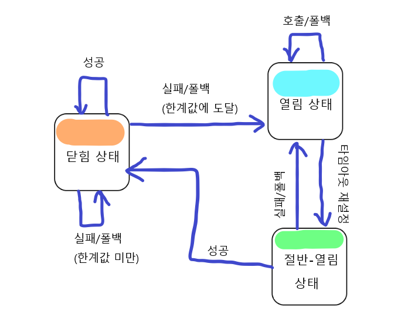

#  실패와 지연 처리하기

### 서킷 브레이커 이해하기
* 서킷 브레이커(circuit breaker) 패턴 : 코드의 실행에 실패하는 경우에 안전하게 처리되도록 함. 마이크로 서비스 컨텍스트에서 중요함(: 한 마이크로서비스의 실패가 다른 마이크로서비스의 연쇄적인 실패로 확산되는 것을 방지해야 하기 때문에)
    * ex ) 전기 회로 차단기 : 문제가 생겼을 때, 화재가 일어나기 전에 회로 차단기가 개방되어 전기의 흐름을 차단하는 것
    * 이와 유사하게 SW 서킷 브레이커는 메서드의 호출을 허용하며, 서킷은 닫힘 상태에서 시작된다. 그리고 메서드의 실행이 실패하면 서킷 브레이커가 개방되고 실패한 메서드에 대해 더 이상 호출이 수행되지 않는다.
    * 하지만 폴백(fallback)을 제공하여 자체적으로 실패를 처리함. 

* 흐름
    
    * 서킷 브레이커로 보호되는 메서드가 실행에 성공 시 : 
        1. 서킷은 닫힘 상태가 유지 + 
        2. 이후에도 해당 메서드가 실행됨.
    * 서킷 브레이커로 보호되는 메서드가 실행에 실패 시 : 
        1. 서킷은 열림 상태로 되고 + 
        2. 이후에는 실패한 메서드 대신 폴백 메서드가 호출됨. + 
        3. 그러다가 때때로(ex)지정된 시간간격) 서킷이 절반-열림 상태로 바뀌면서 실패했던 메서드의 호출을 서킷 브레이커가 다시 시도함.
        4. 1. 이 때, 여전히 실패 시 서킷은 다시 열림 상태 + 폴백 메서드 호출
            2. 이 때, 성공 시 문제가 해결된 것으로 간주하여 서킷은 닫힘 상태가 됨.

* 서킷 브레이커를 더 강력한 형태의 <code>try/catch</code>라고 생각하면 도움이 됨.
    * 닫힘 상태 : try 블록
    * 폴백 메서드 : catch
    * 차이점 : 서킷 브레이커는 원래 호출하려던 메서드가 너무 자주 실패하면(정의된 한계값을 초과하면) 폴백 메서드를 호출한다. 

* 서킷 브레이커는 메서드에 적용됨. => 따라서 하나의 마이크로서비스에 많은 서킷 브레이커가 있을 수 있음.
    * 서킷 브레이커를 선언할 후보들 = 서킷 브레이커로 실패를 보호할 후보들
        * **REST를 호출하는 메서드** : 사용할 수 없거나 HTTP 500 응답을 반환하는 원격 서비스로 인해 실패할 수 있는 메서드.
            * 서킷 브레이커의 실패 처리로 해결 가능
        * **데이터베이스 쿼리를 수행하는 메서드** : 어떤 이유로든 데이터베이스가 무반응 상태가 되거나, 애플리케이션을 중단시킬 수 있는 스키마의 변경이 생기면 실패할 수 있는 메서드.
            * 서킷 브레이커의 실패 처리로 해결 가능
        * **느리게 실행될 가능성이 있는 메서드** : 반드시 실패하는 메서드가 아님. 그러나 너무 오랫동안 실행된다면 비정상적인 상태를 고려할 수 있다. 
            * 실패보다는 지연(latency)이 문제되는 경우 : 지나치게 느린 메서드가 상위 서비스에 연쇄적인 지연을 유발하여 마이크로 서비스의 성능을 저하하지 않게 하는 것이 중요함.
* 서킷 브레이커 패턴 : 코드의 실패와 지연을 처리하는 강력한 수단.
* 서킷 브레이커 적용 방법 : **Netflix 오픈 소스 프로젝트의 Hystrix 라이브러리** 사용
    * Netflix Hystrix : 서킷 브레이커 패턴을 자바로 구현한 라이브러리로, **Hystrix 서킷 브레이커**는 <u>대상 메서드가 실패할 때 폴백 메서드를 호출하는 어스펙트(aspect)</u>로 구현됨.
    * 그리고 서킷 브레이커 패턴을 제대로 구현하기 위해 어스펙트는 대상 메서드가 얼마나 자주 실패하는지도 추적한다. 그 다음에 실패율이 한계값을 초과하면 모든 대상 메서드 호출을 폴백 메서드 호출로 전달한다.

> Hystrix 이름의 유래
> * 회복력, 방어력, 장애 허용 능력 등의 의미를 담은 이름
> * Hystrix(호저 : 고슴도치) : 긴 가시가 있어서 자신을 방어할 능력을 가진 것이 특징 

<br><br>
---

### 서킷 브레이커 선언하기
1. 의존성 추가
    ```gradle
    // 스프링 클라우드 버전 지정
    plugins {
        id 'org.springframework.cloud' version 'Hoxton.SR3'
    }

    dependencies {
        // Netflix Hystrix 스타터 추가
        implementation 'org.springframework.cloud:spring-cloud-starter-netflix-hystrix'
    }
    ```
2. Hystrix 활성화
    ```java
    @SpringBootApplication
    @EnableHystrix // Hystrix 활성화 코드
    public class IngredientServiceApplication {
        ...
    }
    ```
3. @HystrixCommand를 통해 서킷 브레이커 적용
    ```java
    // 어노테이션 + 폴백 메서드 제공
    // => 서킷 브레이커가 실패로부터 보호해줌으로 getAllIngredients()메서드는 안전 장치가 됨. => 따라서 어떤 이유로든 unchecked 예외가 발생하여 getAllIngredients()로부터 벗어나면 서킷 브레이커가 해당 예외를 잡아서 폴백 메서드인 getDefaultIngredients()를 호출해준다.
    @HystrixCommand(fallbackMethod="getDefaultIngredients")
    public Iterable<Ingredient> getAllIngredients() {
        ParameterizedTypeReference<List<Ingredient>> stringList = new ParameterizedTypeReference<List<Ingredient>>(){};
        return rest.exchange(
            "https://ingredient-service/ingredients", HttpMethod.GET,
            HttpEntity.EMPTY, stringList).getBody();
    }

    // 폴백 메서드는 매개변수 타입 & return 타입이 같아야함.
    private Iterable<Ingredient> getDefaultIngredients(){
        List<Ingredient> ingredients = new ArrayList<>();
        ingredients.add(new Ingredient("FLTO", "Flour Tortilla", Ingredient.Type.WRAP));
        ingredients.add(new Ingredient("GRBF", "Ground Beef", Ingredient.Type.PROTEIN));
        ingredients.add(new Ingredient("CHED", "Shredded Cheddar", Ingredient.Type.CHEESE));
        return ingredients;
    }

    ```
    * exchange의 호출이 문제를 유발할 수 있는 잠재적인 원인 : 만약 해당 api가 없거나, 실패하면 RestClientException(unchecked 예외)가 발생 -> exchange() 메서드에서는 try/catch가 없어 상위 호출자로 계속 예외가 전달될 것임. 그러다가 어떤 호출자도 예외를 처리하지 않는다면 최상위 호출자(마이크로 서비스 or 클라이언트)에서 에러로 처리될 것이다. 
    * 장애가 생기면 베가스 규칙(Vegas Rule)을 적용해야 함 : 마이크로서비스에서 생긴 에러는 다른 곳에 전파하지 않고 마이크로서비스에 남긴다. => 해당 메서드에 서킷 브레이커를 선언하면 이런 규칙을 충족시킴.
    * 폴백 메서드는 우리가 원하는 어떤 것도 할 수 있지만, 원래 의도했던 메서드가 실행이 불가능할 때에 대비하는 의도로 사용한다. 단, 폴백 메서드는 원래의 메서드와 시그니처가 같아야 한다.(메서드 이름만 다름, 매개변수 타입 & return 타입이 같아야함.)
    <br><br>
    * <참고> 폴백 메서드 자신도 서킷 브레이커(<code>@HystrixCommand</code>)를 가져 또 다른 폴백 메서드를 제공할 수 있다.
        * 한 가지 제약 사항 : 폴백 스택의 제일 밑에는 실행에 실패하지 않아서 서킷 브레이커가 필요없는 메서드가 있어야 함!

##### 지연 시간 줄이기
* 메서드의 실행이 끝나고 복귀하는 시간이 너무 오래 걸릴 경우 타임아웃을 사용해 지연 시간을 줄일 수 있다.
    * @HystrixCommand가 지정된 모든 메서드의 default : 1초 후에 타임아웃되고 이 메서드의 폴백메서드가 호출됨.
    * ex) getAllIngredients()에 대한 호출이 1초 후에 타임아웃되면, getDefaultIngredients()가 대신 호출됨.
* 타임아웃 설정
    ```java
    // 방법 1. 타임아웃 시간 설정하기
    @HystrixCommand(
        fallbackMethod="getDefaultIngredients",
        commandProperties={
            @HystrixProperty(
                name="execution.isolation.thread.timeoutInMilliseconds",
                value="500" // 메서드의 타임아웃 시간 설정(500 = 0.5초)
            )
        }
    )
    public Iterable<Ingredient> getAllIngredients(){
        ...
    }

    // 방법 2. 타임아웃 설정 해제하기
    @HystrixCommand(
        fallbackMethod="getDefaultIngredients",
        commandProperties={
            @HystrixProperty(
                name="execution.timeout.enabled",
                value="false" // 타임아웃 없애기 => 연쇄 지연 효과가 발행할 수 있으므로 실행 타임아웃을 비활성화할 때는 조심하기
            )
        }
    )
    public Iterable<Ingredient> getAllIngredients(){
        ...
    }
    ```

##### 서킷 브레이커 한계값 관리하기
* 서킷 브레이커로 보호되는 메서드가 10초동안 20번 호출되고, 이 중 50% 이상 실패 시 => 열림 상태가 됨. : 이후의 모든 호출은 폴백 메서드에 의해 처리됨. => 그리고 5초 후에 이 서킷은 절반-열림 상태가 되어 원래의 메서드 호출이 다시 시도됨.
* Hystrix의 명령 속성 중 실패와 재시도 한계값 설정
    * circuitBreaker.requestVolumeThreshold : 지정된 시간 내에 메서드가 호출되어야 하는 횟수
    * circuitBreaker.errorThresholdPercentage : 지정된 시간 내에 실패한 메서드 호출의 비율(%)
    * metrics.rollingStats.timeInMilliseconds : 요청 횟수와 에러 비율이 고려되는 시간
        * 만일 여기서 지정된 시간 이내에 circuitBreaker.requestVolumeThreshold와 circuitBreaker.errorThresholdPercentage 모두가 초과된다면, 서킷은 열림 상태로 진입한다. => 그리고 circuitBreaker.sleepWindowInMilliseconds에 지정된 시간동안 열림 상태에 머무른다. 그다음에 절반-얄림 상태가 되는 시점에 원래의 실패 메서드에 대한 호출이 다시 시도된다.
    * circuitBreaker.sleepWindowInMilliseconds : 절반-열림 상태로 진입하여 실패한 메서드가 다시 시도되기 전에 열림 상태의 서킷이 유지되는 시간
    * 설정 예시 
        * 20초 이내에 메서드가 30번 이상 호출되어 이 중 25% 이상이 실패할 경우를 조정할 때 + 절반-열림 상태가 되기 전에 1분까지 열림 상태에 머물러야 할 때
        ```java
        @HystrixCommand( 
            fallbackMethod="getDefaultIngredients",
            commandProperties={
                @HystrixProperty(
                    name="circuitBreaker.requestVolumeThreshold",
                    value="30" // 30번 이상 호출
                ),
                @HystrixProperty(
                    name="circuitBreaker.errorThresholdPercentage",
                    value="25" // 25% 이상 실패한 호출
                ),
                @HystrixProperty(
                    name="metrics.rollingStats.timeInMilliseconds",
                    value="20000" // 20초 이내에
                ),
                @HystrixProperty(
                    name="circuitBreaker.sleepWindowInMilliseconds",
                    value="60000" // 절반-열림 상태가 되기 전에 1분까지 열림 상태에 머물러야 할 때
            }
        )
        public Iterable<Ingredient> getAllIngredients(){
            ...
        }
        ```

<br><br>
---

### 실패 모니터링하기
* 서킷 브레이커로 보호되는 메서드가 매번 호출될 때마다 해당 호출에 관한 여러 데이터가 수집되어 Hystrix 스트림으로 발행된다.
* 각 서킷 브레이커의 메트릭도 스트림(stream)으로 발행한다. => 건강상태를 Hystrix 스트림으로 통해 모니터링 할 수 있음.
* Hystrix 스트림이 제공하는 데이터
    * 메서드가 몇 번 호출되는지
    * 성공적으로 몇 번 호출되는지
    * 폴백 메서드가 몇 번 호출되는지
    * 메서드가 몇 번 타임아웃되는지

* Hystrix 스트림 설정 및 적용하기
    * Hystrix 스트림은 액추에이터 엔트포인트로 제공됨으로 액추에이터 의존성을 추가해야함.
    1. 의존성 추가
        ```
        implementation 'org.springframework.boot:spring-boot-starter-actuator'
        ```
    2. 구성 속성 추가
        * Hystrix 스트림 엔드포인트는 /actuator/hystrix.stream 경로로 노출되어 있음.
        * 대부분의 액추에이터 엔드포인트는 기본적으로 비활성화 되어있지만 yml에 추가 시 활성화 가능함.
        ```yml
        management:
            endpoints:
                web:
                    exposure:
                        include: hystrix.stream
        ```
    * Hystrix 스트림의 각 항목은 온갖 JSON 데이터로 가득 차 있으므로 이 데이터를 해석하기 위해서는 클라이언트 측의 작업이 많이 필요함. => Hystrix 대시보드의 사용을 고려할 수 있음.

##### Hystrix 대시보드 개요
* 사용법
    1. 의존성 추가
        ```
        implementation 'org.springframework.cloud:spring-cloud-starter-netflix-hystrix-dashboard'
        ```
    2. <code>@EnableHystrixDashboard</code> 설정으로 활성화하기
        ```java
        @SpringbootApplication
        @EnableHystrixDashboard
        public class HystrixDashboardApplication {
            public static void main(String[] args){
                SpringApplication.run(HystrixDashboardApplication.class, args);
            }
        }
        ```
    3. 포트 설정 : 다른 서비스와의 포트 충돌을 막기 위해
        ```yml
        server:
            port: 7979
        ```
    4. http://localhost:7979/hystrix 로 접속 후 URL에는 서킷 브레이커로 보호된 메서드가 있는 애플리케이션을 리스닝하기 => URL : http://localhost:8080/actuator/hystrix.stream
        * Hystrix 스트림 모니터에 보여주기 위한 Delay(폴링 간격 시간(2초))와 Title도 설정하기 => 즉, hystrix.stream 엔드포인트로부터 2초에 한 번씩 Hystrix 스트림을 받는다.
TODO

##### Hystrix 스레드 풀 이해하기
* Hystrix 스레드 풀 사용 이유 (예제로 이해하기) 
    1. 어떤 메서드가 자신의 일(HTTP 요청)을 수행하는데 너무 오래 걸릴 때, 해당 서비스가 응답할 때까지 Hystrix는 응답을 기다리면서 관련 스레드를 블로킹한다.
    2. 1의 메서드가 호출자와 같은 스레드의 컨텍스트에서 실행 중이라면 호출자는 오래 실행되는 메서드로부터 벗어날 기회가 없다. 게다가 블로킹된 스레드가 제한된 수의 스레드(ex.톰캣의 요청 처리 스레드) 중 하나인데 문제가 계속 생길 경우, 사용 가능한 모든 스레드가 포화 상태가 되어 응답을 기다리게 된다.
    * => 이런 상황을 방지하기 위해 Hystrix는 각 의존성 모듈의 스레드 풀을 할당함(ex. 하나 이상의 Hystrix 명령 메서드를 갖는 각 스프링 빈을 위해).
    * 그리고 Hystrix 명령 메서드 중 하나가 호출될 때 이 메서드는 Hystrix가 관리하는 스레드 풀의 스레드(호출 스레드와 분리된)에서 실행됨. <br>
    => 따라서 이 메서드가 너무 오래걸린다면 호출 스레드는 해당 호출을 포기하고 벗어날 수 있으므로 잠재적인 스레드 포화를 Hystrix가 관리하는 스레드 풀에 고립시킬 수 있다.

* 서킷 브레이커 모니터 + Thread Pools(스레드 풀) 모니터 추가 가능
    * 원 크기&색상 : 해당 스레드 풀이 현재 얼마나 활성적인지, 건강 상태
    * 활성 스레드 카운트 : 활성 스레드의 현재 개수
    * 큐 스레드 카운트 : 현재 큐에 있는 스레드 개수. 기본적으로 큐가 비활성화되어 있으므로 이 값은 항상 0이다.
    * 풀 크기 : 스레드 풀에 있는 스레드 개수
    * 최대 활성 스레드 카운트 : 샘플링 시간 동안의 최대 활성 스레드 개수
    * 실행 횟수 : Hystrix 명령의 실행을 처리하기 위해 스레드 풀의 스레드가 호출된 횟수
    * 큐 크기 : 스레드 풀 큐의 크기, 스레드 큐는 기본적으로 비활성화되어 있으므로 이 값은 의미가 없음.

* 스레드 풀의 대안 : semaphore isolation(세마포어 격리)의 사용을 고려함.

<br><br>
---

### 다수의 Hystrix 스트림 종합하기
* Hystrix 대시보드는 한 번에 하나의 Hystrix 스트림만 모니터링 할 수 있다. => MSA 구조에서 애플리케이션 전체의 건강 상태 정보를 얻는 것은 불가능함.
* Turbine : Netflix 프로젝트로, 모든 마이크로 서비스로부터 모든 Hystrix 스트림을 Hystrix 대시보드가 모니터링할 수 있는 하나의 스트림으로 종합하는 방법을 제공함.
    * 스프링 클라우드 Netflix는 다른 스프링 클라우드 서비스 생성과 유사한 방법을 사용해 Turbine 서비스의 생성을 지원함.
* 적용 방법
    * Turbine 서비스를 생성하려면 새로운 스프링 부트를 생성하고 Turbine 스타터 의존성을 빌드에 포함시켜야 함.
    1. 의존성 추가
        ```
        implementation 'org.springframework.cloud:spring-cloud-starter-netflix-turbine'
        ```
    2. <code>@EnableTurbine</code>으로 Turbine 활성화 하기
        ```java
        @SpringBootApplication
        @EnableTurbine
        public class TurbineServerApplication {
            public static void main(String[] args){
                SpringApplication.run(TurbineServerApplication.class, args);
            }
        }
        ```
    3. 서버 포트 변경
        ```yml
        server:
            port: 8989
        ```
    * 그러면 다수의 마이크로서비스로부터 Hystrix 스트림이 소비되면 서킷 브레이커 메트릭들이 Turbine에 의해 하나의 Hystrix 스트림으로 종합된다.
* <u>turbine.app-config 속성</u> : Hystrix 스트림을 종합하기 위해 유레카에서 찾을 서비스 이름들을 설정함.
    * Turbine은 유레카의 클라이언트로 작동하므로 Hystrix 스트림을 종합할 서비스들을 유레카에서 찾음. <br>
        => 하지만 유레카에 등록된 모든 서비스의 Hystrix 스트림을 종합하지는 않는다. <br>
        => 따라서 Hystrix 스트림을 종합할 서비스들을 알 수 있게 <u>turbine.app-config 속성</u>을 설정하여 Turbine을 구성해야 함
    * 설정하는 법
        ```yml
        turbine:
            app-config: ingredient-service, taco-service, order-service, user-service # 유레카에서 찾을 서비스 이름들 설정
            cluster-name-expression: "'default'" # 이름이 default인 클러스터에 있는 모든 종합될 스트림을 Turbine이 수집해야한다는 의미
        ```
        * 클러스터 이름 설정은 중요함! : 설정하지 않으면 지정된 애플리케이션(마이크로 서비스)들로부터 종합될 어떤 스트림 데이터도 Turbine 스트림에 포함되지 않기 때문이다.
* Turbine 서버 애플리케이션을 빌드하고 실행한 후 Hystrix 대시보드 홈페이지에서 http://localhost:8989/turbine.stream을 텍스트 상자에 입력하고 Monitor Stream 버튼 클릭 시 지정된 모든 애플리케이션의 모든 서킷 브레이커가 서킷 브레이커 대시보드에 나타남. 
   

## 요약
* 서킷 브레이커 패턴은 유연한 실패 처리를 할 수 있음
* Hystrix는 메서드가 실패하거나 너무 느릴 때 폴백 처리를 활성화하는 서킷 브레이커 패턴을 구현함.
* Hystrix가 제공하는 각 서킷 브레이커는 애플리케이션의 건강 상태를 모니터링할 목적으로 Hystrix 스트림의 메트릭을 발행함.
* Hystrix 스트림은 Hystrix 대시보드가 소비할 수 있고, 이는 서킷 브레이커 메트릭을 보여주는 웹 애플리케이션이다.
* Turbine은 여러 애플리케이션의 Hystrix 스트림들을 하나의 Hystrix 스트림으로 종합하며, 종합된 Hystrix 스트림은 Hystrix 대시보드에서 볼 수 있음.