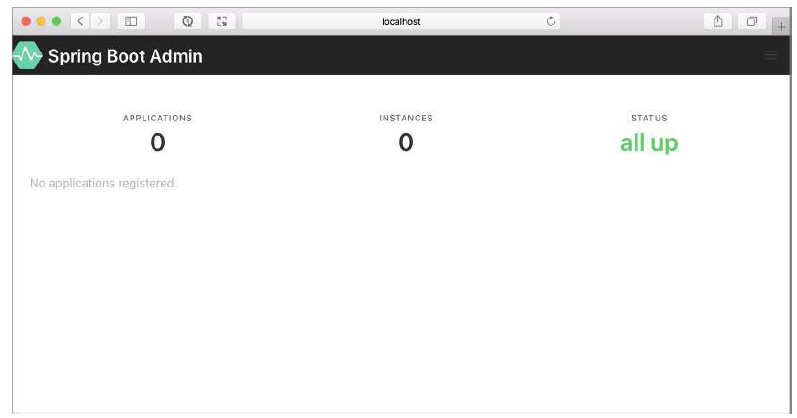

# 스프링 관리하기

### 스프링 부트 Admin 사용하기
* 스프링 부트 Admin : 관리용 프론트엔드 웹 애플리케이션으로, 액추에이터 엔드포인트를 사람들이 더 많이 소비할 수 있게 함.
* 구성 요소
    * Server : Spring Boot Actuator를 표시하고 상호 작용하기 위한 사용자 인터페이스를 제공하는 서버
    * Client : 서버에 등록하고 actuator 엔드포인트에 액세스하는데 사용되는 클라이언트
* 모니터링 시스템을 구축하기 위해서는 최소한 두 개의 스프링 프로젝트가 필요함.
    * 한 개 이상의 클라이언트로부터 actuator 정보를 받아와 UI에 보여주는 **서버**
    * actuator 엔드포인트 액세스를 제공하는 **클라이언트**


##### Admin 서버 생성하기
1. 의존성 추가
    ```
    dependencies {
        implementation 'org.springframework.boot:spring-boot-starter-security'
        implementation 'org.springframework.boot:spring-boot-starter-web'

        implementation 'de.codecentric:spring-boot-admin-starter-server:3.1.0' // Spring Boot와 Spring Boot Admin의 메이저와 마이너 버전이 일치하는 것이 좋다
        ...
    }
    ```
2. 로그인 정보에 대한 환경 변수 설정
    ```yml
    # application.yml
    spring:
        security:
            user:
                name: ${ADMIN_SERVER_USERNAME}
                password: ${ADMIN_SERVER_PASSWORD}
        boot:
            admin:
                ui:
                    poll-timer:
                        logfile: 30000 # logfile 갱신 주기. 30초로 설정함(default:1000(1초))

    server:
        port: 9090 # 고유하면서 접근이 쉬운 포트를 선택                    
    ```
3. ```@EnableAdminServer``` 사용
    ```java
    @SpringBootApplication
    @EnableAdminServer
    public class Application {
        public static void main(String[] args) {
            SpringApplication.run(Application.class, args);
        }
    }
    ```
4. localhost:9090 접속 시
    


##### Admin 클라이언트 등록하기
* 스프링 부트 Admin 클라이언트를 Admin 서버에 등록하는 방법
    * 각 애플리케이션이 자신을 Admin 서버에 등록한다.
    * Admin 서버가 유레카 서비스 레지스트리를 통해서 서비스를 찾는다.

* Spring Boot Admin Client-side 구현 (클라이언트가 될 애플리케이션 쪽에)
    1. 의존성 추가
        ```
        dependencies {
            implementation 'de.codecentric:spring-boot-admin-starter-client:3.1.0' # admin server와 동일한 버전으로 맞추기
            ...
        }
        ```
    2. yml 설정
        ```yml
        spring:
            # spring boot admin client 관련 설정
            boot:
                admin:
                client:
                    instance:
                        # Client display name
                        name: Client Server
                        # 현재 돌아가고 있는 서버, 즉 spring boot admin client의 주소
                        service-url: "http://localhost:8080"
                    # spring boot admin server의 주소
                    url: "http://localhost:9090"
                    # true로 설정하면 애플리케이션을 등록하는 주기적인 작업이 애플리케이션이 준비된 후 자동으로 예약됨
                    auto-registration: true
                    username: ${ADMIN_SERVER_USERNAME}
                    password: ${ADMIN_SERVER_PASSWORD}

        management:
            endpoints:
                web:
                exposure:
                    include: refresh, health, metrics, logfile, env
            endpoint:
                health:
                show-details: always

        logging:
            file:
                name: ./logs/application.log
        ```

## 요약
* 스프링 부트 Admin 서버는 하나 이상의 스프링 부트 애플리케이션으로부터 액추에이터 엔드포인트를 소비하고 사용자 친화적인 웹 애플리케이션에서 데이터를 보여줌.
* 스프링 부트 애플리케이션은 자신을 클라이언트로 Admin 서버에 등록 할 수 있고, Admin 서버가 유레카를 통해 클라이언트 애플리케이션을 찾게 할 수 있음.
* 애플리케이션 상태의 스냅샷을 캡쳐하는 액추에이터 엔드포인트와 다르게, Admin 서버는 애플리케이션의 내부 작업에 관한 실시간 뷰를 보여줄 수 있음.
* Admin 서버는 액추에이터 엔드포인트의 결과를 쉽게 필터링해주며, 경에 따라 그래프로 데이터를 보여줌.
* Admin 서버는 스프링 부트 애플리케이션이므로 스프링 시큐리티를 통해 보안을 처리할 수 있음.


##### 출처 : https://velog.io/@ncookie/Spring-Boot-Admin-%EC%A0%81%EC%9A%A9%ED%95%98%EA%B8%B0