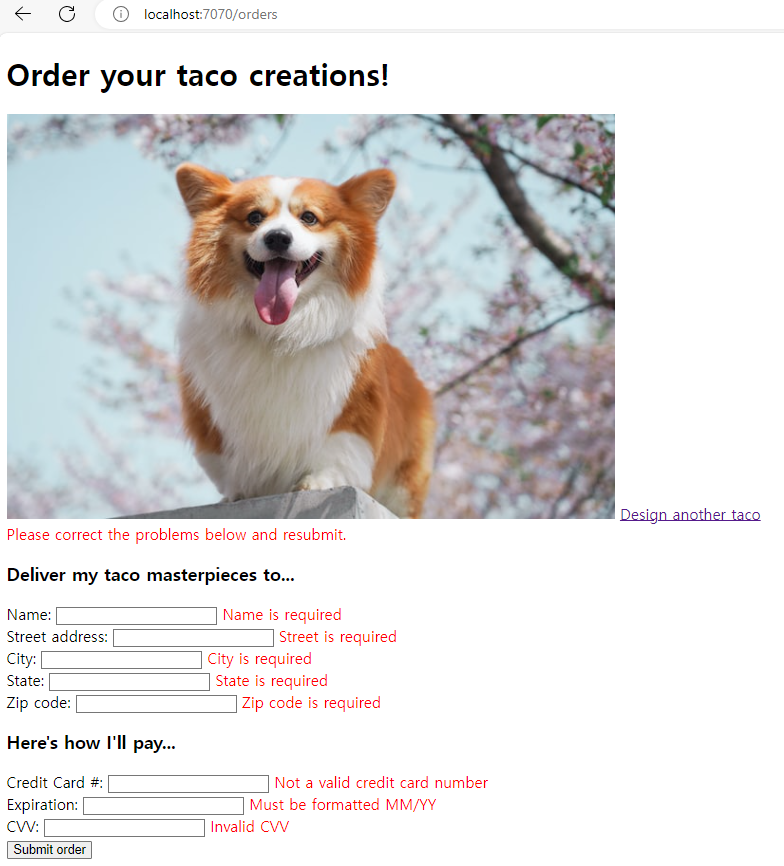

# 웹 애플리케이션 개발하기
* 스프링으로 구축할 애플리케이션이 하는 일 : 데이터 처리, DB로부터 정보를 읽고 다른 애플리케이션과 상호 작용, UI(사용자 인터페이스)
<br><br>
---

### 정보 보여주기
* 모델
    ```java
    package com.hji.spring.model;

    import lombok.Data;
    import lombok.RequiredArgsConstructor;

    @Data // 런타임 시에 getter(), setter() 등의 메소드를 자동으로 생성
    @RequiredArgsConstructor // final이 붙은 필드들의 초기화하는 생성자 생성
    public class Ingredient {
        private final String id;
        private final String name;
        private final Type type;

        public static enum Type {
            WRAP, PROTEIN, VEGGIES, CHEESE, SAUCE
        }
    }
    ```
* 컨트롤러 : **스프링 MVC 프레임워크의 중심적인 역할**
    * 데이터를 가져오고 처리하는 것
    * HTTP 요청을 처리하고, 브라우저에 보여줄 HTML을 뷰에 요청하거나, REST 형태의 응답 몸체에 직접 데이터를 추가함. 
    * @RequestMapping, @GetMapping, @PostMapping, @PutMapping, @DeleteMapping, @PatchMapping
    ```java
    package com.hji.spring.controller;

    import java.util.Arrays;
    import java.util.List;
    import java.util.stream.Collectors;

    import org.springframework.stereotype.Controller;
    import org.springframework.ui.Model;
    import org.springframework.web.bind.annotation.GetMapping;
    import org.springframework.web.bind.annotation.RequestMapping;

    import com.hji.spring.model.Ingredient;
    import com.hji.spring.model.Taco;
    import com.hji.spring.model.Ingredient.Type;

    import lombok.extern.slf4j.Slf4j;

    @Slf4j // 컴파일 시에 Lombok에 제공됨 => log 사용 가능
    @Controller // 컨트롤러로 식별되게 함, 스프링 애플리케이션 컨텍스트의 빈으로 이 클래스의 인스턴스를 자동 생성한다.
    @RequestMapping("/design") // 해당 경로의 요청을 처리함.
    public class DesignTacoController {

        @GetMapping
        public String showDesignForm(Model model) { // Model : 컨트롤러와 뷰 사이에서 데이터를 운반하는 객체 -> Model 객체의 속성에 있는 데이터는 뷰가 알 수 있는 서블릿 요청 속성들로 복사된다.

            List<Ingredient> list = Arrays.asList(
                    new Ingredient("FLTO", "Flour Tortilla", Type.WRAP),
                    new Ingredient("COTO", "Corn Tortilla", Type.WRAP));

            Type[] types = Ingredient.Type.values();
            for (Type type : types) {
                model.addAttribute(type.toString().toLowerCase(), filterByType(list, type));
            }

            model.addAttribute("taco", new Taco());
            return "design";

        }

        private List<Ingredient> filterByType(List<Ingredient> ingredients, Type type) {
            return ingredients
                    .stream()
                    .filter(x -> x.getType().equals(type))
                    .collect(Collectors.toList());
        }
    }
    ```
* 뷰 : 브라우저에 보여주는 데이터를 HTML로 나타내는 것 
    * ex ) JSP, Thymeleaf, FreeMarker, Mustache, 그루비 기반의 템플릿
    * 이러한 뷰 라이브러리들은 어떤 웹 프레임워크와도 사용 가능하도록 설계되었으며, 이로 인해 스프링의 추상화 모델을 알지 못한다. 그리고 컨트롤러가 데이터를 넣는 Model 대신 서블릿 요청 속성들을 사용한다.
<br><br>
---

### 폼 제출 처리 및 유효성 검사하기
* controller : html에서 POST로 넘어온 form 처리 
    ```java
    @Slf4j
    @Controller
    @RequestMapping("/orders")
    public class OrderController {
        
        @GetMapping("/current")
        public String orderForm(Model model){
            model.addAttribute("order", new Order());
            return "orderForm";
        }

        @PostMapping
        public String processOrder(Order order){
            log.info("Order submitted: "+ order);
            return "redirect:/";
        }
    }
    ```
* 결과
    ```
    2024-03-06T08:15:43.491+09:00  INFO 2760 --- [nio-7070-exec-5] c.hji.spring.controller.OrderController  : Order submitted: Order(deliveryName=1, deliveryStreet=1, deliveryCity=1, deliveryState=1, deliveryZip=1, ccNumber=1, ccExpiration=1, ccCVV=1)
    ```

* 유효성 검사
    * 적용 : <code>	implementation 'org.hibernate.validator:hibernate-validator'</code> => spring boot 3.2 기준
    * 적용 방법
        1. 유효성을 검사할 클래스(domain 클래스)에 검사 규칙을 선언한다.
            ```java
            package com.hji.spring.model;

            import org.hibernate.validator.constraints.CreditCardNumber;

            import jakarta.validation.constraints.Digits;
            import jakarta.validation.constraints.NotBlank;
            import jakarta.validation.constraints.Pattern;
            import lombok.Data;

            @Data
            public class Order {
                
                @NotBlank(message="Name is required")
                private String deliveryName;
                
                @NotBlank(message="Street is required")
                private String deliveryStreet;
                
                @NotBlank(message="City is required")
                private String deliveryCity;
                
                @NotBlank(message="State is required")
                private String deliveryState;
                
                @NotBlank(message="Zip code is required")
                private String deliveryZip;
                
                @CreditCardNumber(message="Not a valid credit card number")
                private String ccNumber;
                
                @Pattern(regexp="^(0[1-9]|1[0-2])([\\/])([1-9][0-9])$",
                        message="Must be formatted MM/YY")
                private String ccExpiration;
                
                @Digits(integer=3, fraction=0, message="Invalid CVV")
                private String ccCVV;
            }

            ```
        2. 유효성 검사를 해야 하는 컨트롤러 메서드에 검사를 수행한다는 것을 지정한다.
            ```java
            import jakarta.validation.Valid;
            import lombok.extern.slf4j.Slf4j;

            @Slf4j
            @Controller
            @RequestMapping("/orders")
            public class OrderController {
                ...
                @PostMapping
                public String processOrder(@Valid Order order, Errors errors){
                    if(errors.hasErrors()){
                        return "design";
                    }
                    log.info("Order submitted: "+ order);
                    return "redirect:/";
                }
            }
            ```
        3. 검사 에러를 보여주도록 form 뷰를 수정한다.
            ```html
            <form method="POST" th:action="@{/orders}" th:object="${order}">
                <h1>Order your taco creations!</h1>
                
                 <a th:href="@{/design}"
                    id="another">Design another taco</a><br />
                
                <div th:if="${#fields.hasErrors()}">
                    <span class="validationError"> Please correct the problems
                        below and resubmit. </span>
                </div>
                
                <h3>Deliver my taco masterpieces to...</h3>
                
                <label for=" deliveryName">Name: </label> 
                <input type="text" th:field="*{deliveryName}" /> 
                <span class="validationError"
                    th:if="${#fields.hasErrors('deliveryName')}"
                    th:errors="*{deliveryName}">Name Error</span>
                <br /> 
                    
                <label for="deliveryStreet">Street address: </label> 
                <input type="text" th:field="*{deliveryStreet}" /> 
                <span class="validationError"
                    th:if="${#fields.hasErrors('deliveryStreet')}"
                    th:errors="*{deliveryStreet}">Street Error</span>
                <br /> 
                ...
                <input type="submit" value="Submit order" />
            </form>
            ```
    * 결과<br>
<br><br>
---

### 뷰 컨트롤러로 작업하기
* 뷰 컨트롤러 : HomeController와 같은 모델 데이터나 사용자 입력을 처리하지 않고 **뷰에 요청을 전달하는 일만** 하는 컨트롤러
    ```java
    // HomeController
    @Controller
    public class HomeController{
        @GetMapping("/")
        public String home(){
            return "home";
        }
    }
    ```
    * 뷰 컨트롤러 선언 방법
        ```java
        package com.hji.spring.config;

        import org.springframework.context.annotation.Configuration;
        import org.springframework.web.servlet.config.annotation.ViewControllerRegistry;
        import org.springframework.web.servlet.config.annotation.WebMvcConfigurer;

        @Configuration
        public class WebConfig implements WebMvcConfigurer{ // 뷰 컨트롤러의 역할을 수행하는 구성 클래스이다. WebMvcConfigurer 인터페이스는 스프링 MVC를 구성하는 메서드를 정의한다.
            
            @Override
            public void addViewControllers(ViewControllerRegistry registry){ // ViewControllerRegistry : 하나 이상의 뷰 컨트롤러를 등록하기 위해 사용할 수 있다.
                registry.addViewController("/").setViewName("home"); // "/"경로의 요청이 전달되어야 하는 뷰로 "home"을 지정한다.
            }
        }

        ```
<br><br>
---

### 뷰 템플릿 라이브러리의 종류
* 스프링 부트 자동-구성에 지원되는 뷰 템플릿
    * FreeMarker : <code>spring-boot-starter-freemarker</code>
    * Groovy 템플릿 : <code>spring-boot-starter-groovy-templates</code>
    * JavaServer Pages(JSP) : 없음(톰캣(Tomcat)이나 제티(Jetty) 서블릿 컨테이너 자체에서 제공됨)
        * 의존성 지정이 없는 이유 : 서블릿 컨테이너(Tomcat) 자신이 JSP 명세를 구현하므로 스프링 부트의 스타터로 지정할 필요 x
        * 하지만 JSP 선택 시, 서블릿 컨테이너(내장 톰캣, 제티 컨테이너)는 /WEB-INF 밑에서 JSP 코드를 찾기 때문에, WAR로 배포할 때만 JSP를 선택하고 실행가능한 JAR로 배포할 때는 JSP를 제외한 나머지 중 하나를 선택해야 한다. 
    * Mustache : <code>spring-boot-starter-mustache</code>
    * Thymeleaf : <code>spring-boot-starter-thymeleaf</code>
* 템플릿 캐싱 : 기본적으로 템플릿은 최초 사용될 때 한 번만 파싱(코드 분석)되며, 이 파싱된 결과는 향후 사용을 위해 캐시에 저장된다. => **성능 향상**
    * 템플릿 캐싱을 활성화/비활성화 하는 속성 (application.properties) (default : true)
        * FreeMarker : <code>spring.freemarker.cache</code>
        * Groovy 템플릿 : <code>spring.groovy.template.cache</code>
        * Mustache : <code>spring.mustache.cache</code>
        * Thymeleaf : <code>spring.thymeleaf.cache</code>

## 요약
* 스프링 : 스프링 MVC라는 웹 프레임워크를 제공함. 그리고 다양한 뷰 템플릿을 지원함.
* 스프링 MVC : 애노테이션을 기반으로 HTTP 요청 처리 메서드를 선언할 수 있음.
* 요청 처리 메서드는 모델 데이터와 함께 Thymeleaf 템플릿과 같은 뷰 이름을 반환함.
* 스프링 MVC는 자바 빈 유효성 검사 API와 Hibernate Validator 등의 유효성 검사 API 구현 컴포넌트를 통해 유효성 검사를 지원함
    * 스프링 부트 3.x 시 <code>org.hibernate.validator:hibernate-validator</code>를 통해 지원함.
* 모델 데이터가 없거나 처리할 필요가 없는 HTTP GET 요청을 처리할 때는 뷰 컨트롤러를 사용할 수 있다.